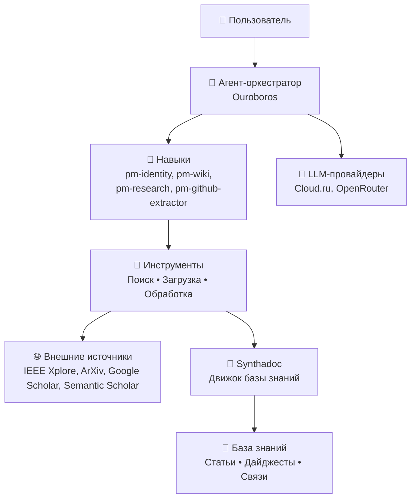

# Knowledge Mining Agent


**Автономный ИИ-агент для управления базой знаний.**

**Knowledge Mining Agent** -  это самосовершенствующийся ИИ-агент со специализацией в Process Mining. Он самостоятельно ищет, анализирует и сохраняет академические статьи, GitHub-репозитории и знания по процессному анализу в структурированную базу знаний (wiki).  
Этот агент переводит управление корпоративной базой знаний из ручного режима в режим постоянного агентного сопровождения. 

---

## 1. 🚀 Быстрый старт

### Шаг 0: Настройте ключ API
Агент поддерживает провайдеров Cloud.ru Foundational Models и OpenRouter. Независимо от выбранного провайдера, ключ указывается в переменной OPENAI_API_KEY:

```bash
export OPENAI_API_KEY="<ключ>"    # Для Windows: set OPENAI_API_KEY="<ключ>"
```

### Шаг 1: Клонируйте репозиторий
```bash
git clone https://github.com/netwise-team/knowledge_mining_agent.git
cd knowledge_mining_agent
```

### Шаг 2: Настройте виртуальное окружение и зависимости
```bash
python -m venv .venv          # Python >= 3.10
source .venv/bin/activate     # Для Windows: .venv\Scripts\activate

python -m pip install --upgrade pip setuptools wheel
python -m pip install -r requirements.txt
python -m pip install -e . --no-deps
```

### Шаг 3: Установите и запустите Synthadoc
```bash
cd synthadoc
pip install -e ".[dev]"
synthadoc --version     # проверка
```

> `-e` важно: без него запускается копия из `site-packages`, и наши правки
> (в т.ч. русский язык) работать не будут. Проверить, откуда грузится код:
> `python -c "import synthadoc; print(synthadoc.__file__)"` — путь должен вести
> в клонированный репозиторий, а не в `site-packages`.

### Шаг 4: Запустите агента и пройдите предварительную настройку агента в UI
```bash
ouroboros server
```
Затем откройте в браузере адрес: http://127.0.0.1:8765 и выполните первичную настройку:  

1. **Провайдеры и модели** — выберите провайдера (Cloud.ru/OpenRouter) и модель
2. **Безопасность и бюджет** — установите лимит на количество запросов (опционально)
3. **Навыки** — активируйте необходимые навыки
4. **Telegram-бот** — укажите токен бота для уведомлений (опционально)

### Шаг 5. Запустите скрипт настройки

```bash
python bootstrap.py
```

Скрипт проведет вас через запуск и соединение Synthadoc с моделями, включения MCP-клиента, настройки его на сервер Synthadoc и установки и верификации поставляемых навыков.

---

## 2. 🎯 Основные навыки (Skills)

| Навык | Назначение | Что делает |
|-------|------------|------------|
| **pm-wiki** | Интерактивный поиск по базе знаний Process Mining с рейтингованием | Выполняет семантический поиск по вики-базе знаний, ранжирует результаты по релевантности, возвращает выдержки из статей с указанием источника, авторов и года публикации. |
| **pm-research** | Пакетный поиск и загрузка статей из IEEE Xplore, ArXiv, Google Scholar, Semantic Scholar | Принимает поисковый запрос, загружает полные тексты статей в формате PDF, проверяет их на дубликаты и сохраняет в базу знаний через синтаксический анализ (synthadoc_ingest). Поддерживает ограничение по количеству результатов и глубине поиска. |
| **pm-identity** | Представление агента и проверка подключения к базе знаний | Отвечает на вопросы о самом агенте: его специализации, версии, доступных навыках, текущем состоянии базы знаний (количество статей, репозиториев, дата последнего обновления). Используется как точка входа для новых пользователей. |
| **pm-github-knowledge-extractor** | Автоматическое извлечение GitHub-репозиториев из статей и создание wiki-страниц в формате Markdown-таблицы | Сканирует текст загруженной статьи на наличие ссылок на GitHub-репозитории, извлекает README через curl, парсит информацию об архитектуре, ключевых алгоритмах, зависимостях, лицензии и авторе. |

---

## 3. 👥 Пользовательские сценарии

Агент работает в двух режимах: **интерактивном** (команды через чат) и **автономном** (по расписанию или триггерам).  

| Сценарий | Шаги пользователя |
|----------|-------------------|
| Поиск в базе знаний | 1. Открыть чат с агентом<br>2. Написать: `Найди в вики информацию о conformance checking`<br>3. Получить список релевантных статей с аннотациями<br>4. Перейти по ссылке на нужную wiki-страницу |
| Загрузка новых статей | 1. Открыть чат с агентом<br>2. Написать: `Найди и загрузи статьи по process mining в банковской сфере за 2024 год`<br>3. Дождаться завершения поиска и загрузки<br>4. Проверить отчёт о добавленных статьях |
| Исследование GitHub-репозиториев | 1. Найти статью в базе знаний<br>2. Написать: `Покажи репозитории, связанные со статьей "Process Mining with Python"`<br>3. Получить структурированную информацию о репозитории<br>4. Перейти в созданную wiki-страницу |
| Саммари статьи | 1. Найти статью в базе знаний<br>2. Написать: `Сделай краткий пересказ статьи "Process Mining with Python"`<br>3. Получить сжатый саммари с ключевыми тезисами<br>4. При необходимости запросить более детальный разбор |
| Диагностика базы знаний | 1. Открыть чат с агентом<br>2. Написать: `Проверь состояние базы знаний`<br>3. Изучить статистику и список проблем<br>4. Исправить выявленные нарушения |
| Автоматическое обновление БЗ | 1. Настроить расписание в интерфейсе агента<br>2. Указать ключевые слова для поиска<br>3. Указать получателей отчёта<br>4. Агент работает в фоне, пользователь получает отчёт |
| Мониторинг новых публикаций | 1. Подписаться на RSS-ленты в настройках агента<br>2. Указать тему мониторинга<br>3. Указать способ уведомления (email, Telegram)<br>4. Получать уведомления о новых статьях |
| Аудит качества знаний | 1. Настроить расписание аудита в интерфейсе<br>2. Дождаться отчёта<br>3. Изучить выявленные противоречия и проблемы<br>4. Устранить проблемы в базе знаний |
| Генерация дайджестов | 1. Настроить расписание в интерфейсе<br>2. Указать канал для отправки (Slack, Telegram)<br>3. Указать получателей<br>4. Получать еженедельный дайджест новых материалов |

---

## 4. ⚙️ Архитектура  

**Как это работает:**
1. Пользователь отправляет запрос через чат-интерфейс
2. Агент-оркестратор (Ouroboros) выбирает подходящий навык
3. Навык использует внешние инструменты (поиск, загрузка) или обращается к базе знаний Synthadoc
4. Результат возвращается пользователю



---

## 5. 📊 Бенчмарк и оценка качества агента  

Для проверки работы агента подготовлены демонстрационные данные (wikis).  
Описание сценария проверки на функционирование расположено в devtools/benchmarks/pm_wiki/Script.md.

---

## 6. 🤝 Участие в разработке
Мы приветствуем вклад в проект!

Сделайте Fork репозитория.  
Создайте ветку для вашей фичи: git checkout -b feature/new-tool.  
Внесите изменения и закоммитьте их: git commit -m 'Add some feature'.  
Запушьте ветку: git push origin feature/new-tool.  
Откройте Pull Request в ветку main.  
Пожалуйста, убедитесь, что ваш код соответствует стилю проекта (используйте flake8 и black) и покрыт тестами.  

---

## 📝 Changelog

| Version | Changes |
|---------|---------|
| 6.56.4 | Enable all 6 skills (pm-identity, telegram-bridge, pm-github-knowledge-extractor, pm-wiki, pm-research, unix_computer_use). Fix pm-research urllib.parse.quote crash, PDF validation in deduplicate, remove overbroad fs permission. Bump pm-research to 0.2.2. |
| 6.56.3 | Fix skill review blockers: unix_computer_use missing `runtime` field, pm-research path confinement + externalIds crash fix + OPENROUTER_API_KEY env declaration. Bump both skill versions to 0.2.1. |
| 6.56.2 | Prior release. |

---

## 📄 Лицензия
Распространяется под лицензией MIT. Подробности в файле LICENSE.

---

## 🙏 Благодарности

**Knowledge Mining Agent** — превращает хаос информации в упорядоченные и актуальные знания.

---
