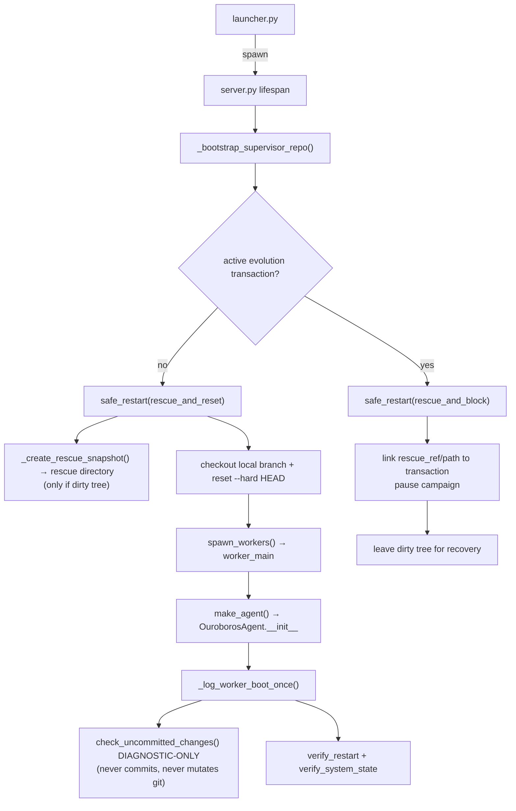

# Ouroboros v6.56.0 — Architecture & Reference

This file is NOT a changelog. Version history lives in README.md, git tags, and commit log.

This document is the current operational map of Ouroboros: structure, data flows, APIs, protected boundaries, and the rationale for non-obvious architectural choices. Rationale must be self-contained here; future maintainers should not need to open old commits to understand why a guard, review gate, or lifecycle exists.

---

## 1. High-Level Architecture

```
User
  │
  ▼
launcher.py (PyWebView)       ← desktop window, immutable outer shell (tracked in git; bundled as packaged entry point)
  │
  │  spawns subprocess
  ▼
server.py (Starlette+uvicorn) ← HTTP + WebSocket on configurable host:port (default localhost:8765; Docker/non-loopback supported via OUROBOROS_SERVER_HOST=0.0.0.0)
  │
  ├── web/                     ← Web UI (SPA with ES modules in web/modules/)
  │
  ├── supervisor/              ← Background thread inside server.py
  │   ├── message_bus.py       ← Queue-based local message bus (Web UI + reviewed transport skills)
  │   ├── workers.py           ← Multiprocessing worker pool (fork/spawn by platform)
  │   ├── state.py             ← Persistent state (state.json) with file locking
  │   ├── queue.py             ← Task queue management (PENDING/RUNNING lists) + activity-based timeout enforcement
  │   ├── task_reaper.py       ← (v6.38.0) Variant A off-loop worker reaper (extracted from queue.py): kill/join/archive/respawn a timed-out worker on a single-owner background thread, off the loop critical path. (v6.38.1) STRICT fail-closed: if the worker will not confirm dead, it holds the slot `reaping` and leaves the task RUNNING (no terminal/task_done/retry/respawn while it may be alive), emits `task_reaper_wedged` + an owner /restart hint, and lets the custody reaper end the orphan on the next generation
  │   ├── schedule_time.py     ← Cron/timezone schedule time parsing helpers
  │   ├── evolution_lifecycle.py ← Evolution campaign state + transaction lifecycle (moved from queue.py in v6.30.0): campaign file IO, start/pause, begin/update transaction, cycle-outcome recording, deterministic no_op/abandoned worktree cleanup, owner cycle reports, supervisor auto-restart request
  │   ├── events.py            ← Event dispatcher (worker→supervisor events) + managed-update assisted-merge orphan watchdog hook
  │   ├── git_ops.py           ← Git operations (clone, checkout, rescue, rollback, push, credential helper)
  │   ├── update_merge.py      ← (v6.41.0) Managed-update merge engine: real 3-way merge plan, the AUTOMATED assisted live-worktree materialize + native-MERGE_HEAD commit helpers + 4-phase tx, fail-closed lock, apply/rollback/smoke, non-destructive boot recovery (RELEASE_INVARIANT-protected)
  │   └── update_merge_policy.py ← (v6.41.0) Per-path conflict classification (clean/doc_reconcile/conflicting; protected docs) for managed updates (RELEASE_INVARIANT-protected)
  │
  └── ouroboros/               ← Agent core (runs inside worker processes)
      ├── config.py            ← SSOT: paths, settings defaults, load/save, PID lock
      ├── colab_bootstrap.py   ← Google Colab source-mode bootstrap helpers, driven by the `notebooks/colab_quickstart.py` cell script: Drive-backed data/settings, fork-safe env, personal origin provisioning, no-UI server command assembly, and loopback install/enable/full_access of the Telegram bridge
      ├── cli.py               ← Source/headless CLI over gateway tasks, logs, settings, skills, marketplace, local-model, and MCP wrappers
      ├── packaged_cli.py      ← Packaged desktop CLI bridge: resolves bundle roots, bootstraps the launcher-managed repo, and delegates to cli.py
      ├── packaged_cli_install.py ← Packaged CLI installer planning/execution for user-local command shims
      ├── agent.py             ← Task orchestrator
      ├── agent_startup_checks.py ← Startup verification and health checks
      ├── agent_task_pipeline.py  ← Task execution pipeline orchestration; emits a per-task `swarm_efficiency` rollup (subagent_count/wave_count/Σ inter-wave latency/lanes_used) for fan-out tasks only
      ├── extension_companion.py ← Host-supervised companion processes for transport skills
      ├── extension_reconcile_queue.py ← Durable worker→server extension reconcile markers and server pickup loop
      ├── event_bus.py         ← Typed in-process event bus for skill subscriptions
      ├── evolution_checkpoints.py ← Append-only campaign/eval checkpoint ledger for evolution progress
      ├── improvement_backlog.py ← Durable advisory improvement backlog: recurrence-counted dedup (bump count/last_seen, never drop), priority+recurrence+recency ranking, close-on-commit (`close_backlog_items`), and size-triggered non-error-gated LLM grooming (`groom_backlog`); parser-safe locked writer; entries carry priority/kind (bug/improvement/capability_idea)
      ├── loop.py              ← High-level LLM tool loop; one-shot no-op-attempt finalization nudge (declared expected_output + zero effects + no FINAL ANSWER); (v6.51.0) a one-shot ADVISORY red-verification finalization nudge (ordered before the receipt-absent nudge) when the latest host-attested verify receipt is unreconciled-RED (`outcomes.latest_unreconciled_failed_verification`) — re-check / explain / fix; (v6.52.2) a one-shot ADVISORY masked-verification nudge (ordered after the red nudge) when the latest PASSing verify check can launder its exit code (`outcomes.latest_unreconciled_masked_verification`) — re-ground without the masking pipe or explain; (v6.53.0) continuous explicit `FINAL ANSWER:` latching captures the latest typed candidate every round (tool-count-stamped, no prose mining) so review/nudge/forced-finalization paths do not erase a structured answer, and intrinsic no-deadline pacing asks for a salvageable current answer on long tasks
      ├── loop_llm_call.py     ← Single-round LLM call + usage accounting
      ├── task_pacing.py       ← (v6.54.4) Task-pacing SSOT: the ONE urgency system — deadline 50/25/10% TIME BUDGET milestone content + intrinsic no-deadline pacing (moved from loop.py; loop keeps transport only), the finalization reserve (max(grace, budget_profile.reserve_finalization_pct×total)), BudgetSnapshot, and the acceptance-review gates (review launches only above the reserve; improvement passes bounded by BOTH a pass counter and the time-above-reserve window; policies fixed/adaptive/until_deadline from task_contract.budget_profile). (v6.56.0) adds the COST axis: `resolve_cost_ceiling_usd` (the in-task hard-stop from `budget_profile.cost_hard_stop_pct` × start-of-task remaining budget; None→50%, 0→no ceiling — never $0) and `build_cost_budget_note` (latched 50/25/10%-remaining milestones + one-shot ~80%-spent wrap-up; informational against the start snapshot on uncapped runs; silent when budget_remaining is None) — replacing loop.py's old round-gated `[INFO]` budget nudge
      ├── vision_routing.py    ← (v6.45) Send-time image routing SSOT: inline vision vs generic captions vs placeholders on a per-send message copy, controlled by `OUROBOROS_IMAGE_INPUT_MODE` and `OUROBOROS_MODEL_VISION`
      ├── fallback_cooldown.py ← (v6.39) Per-process 429-aware cooldown for the `OUROBOROS_MODEL_FALLBACKS` cross-model chain: a transiently-failed model (429/5xx/overloaded) is parked for a short window so a task's own fallback walk and repeated rounds skip it instead of re-hammering. PER-PROCESS only (not a swarm-wide governor — each worker has its own map; cross-worker coordination is Phase 3). Advisory, default-on, fail-soft, passive (timestamp) heal
      ├── model_concurrency.py ← (v6.40) Per-(model,use_local)-route `threading.BoundedSemaphore` capping CONCURRENT provider calls (`OUROBOROS_MODEL_MAX_CONCURRENCY`, default 3) so a task's main loop + its in-process subagent threads + status pings cannot self-DoS one model's rate limit — excess threads WAIT (deadline-bounded) instead of all firing 429s. PER-PROCESS only (like `fallback_cooldown`; heavy workers are separate processes, so this is not a swarm-wide governor — cross-worker admission is future work). Wraps ONLY the provider call in `loop_llm_call.call_llm_with_retry` (not the retry/backoff chain). Default-on, fail-soft
      ├── project_naming.py    ← (v6.40) SSOT for LLM-first project naming: a bounded LIGHT-model title with a deterministic heuristic fallback (P5, no keyword gates, fail-soft), shared by the proactive card namer (`supervisor/workers.py`), turn-into-project conversion (`gateway/projects.py`), and `ensure_project_scope`. The provider call goes through the `model_concurrency` slot
      ├── loop_tool_execution.py ← Tool dispatch and tool-result handling
      ├── deadline_utils.py    ← Shared deadline parsing/remaining-time helpers for loop milestones and process-tool timeouts
      ├── observability.py     ← Private forensic execution ledger: redaction, gzip CAS blobs, call manifests, trace refs
      ├── outcomes.py          ← Typed loop/task outcome, artifact bundle, verification ledger helpers; `children_unabsorbed` joins the honest best-effort shelf when a delegating parent ignores a bounded running-child absorption reminder; an unrecovered access-policy block (resource_policy_blocked/resource_constraint_blocked) on a READ-ONLY exploratory tool is demoted to an `ignored_tool_errors` axis (honest telemetry, never degraded); (v6.51.0) `latest_unreconciled_failed_receipt`/`latest_unreconciled_failed_verification` — the latest RED verify receipt with no later pass/observed reconciler (a `declared` escape hatch does NOT reconcile), feeding the finalize red-nudge; (v6.52.2) `latest_unreconciled_masked_pass`/`latest_unreconciled_masked_verification` — the latest PASSing receipt carrying the `check_exit_masking` flag with no later clean (non-masked) pass/observed, feeding the advisory masked-verification nudge + acceptance summary; (v6.53.0) answer-first headline precedence keeps lifecycle `completed` and execution-health details in `outcome_axes.execution`, but a valid structured answer no longer gets top-level `reason_code=tool_failure`
      ├── code_intelligence.py ← Internal code inventory v2: derived-only file facts, hashes, polyglot symbol/import/call/reference extraction via tree-sitter for non-Python languages (Go/Rust/Java/Ruby/C/...) with Python on the stdlib `ast` path and a visible `structural_unavailable` fallback when a grammar is missing, plus an incremental JSON cache (no raw source)
      ├── code_search_rg.py    ← Optional ripgrep-backed search helper for search_code; every match is post-filtered through Ouroboros protected/secret gates
      ├── pricing.py           ← Model pricing, cost estimation, usage events
      ├── llm.py               ← Multi-provider LLM routing (OpenRouter/OpenAI/compatible/Cloud.ru/GigaChat/Anthropic) with adaptive request-parameter normalization for provider capabilities/rejections
      ├── mcp_client.py        ← HTTP/SSE MCP client manager: parses MCP_SERVERS, validates URLs/auth headers, masks tokens, normalizes external tool names as mcp_<server>__<tool>, refreshes tool lists, and dispatches calls through the guarded Python mcp SDK import
      ├── safety.py            ← Policy-based LLM safety check
      ├── consciousness.py     ← Background thinking loop (with progress emission)
      ├── consolidator.py      ← Block-wise dialogue consolidation (dialogue_blocks.json)
      ├── memory.py            ← Scratchpad, identity, chat history
      ├── project_facts.py     ← Thin per-project facts store (Phase 3b): project_id resolution (explicit `--project-id` or stable workspace-path hash) + a per-project knowledge dir under the canonical data dir (`projects/<id>/knowledge`), isolated from `memory/knowledge` and from the forked seed; v6.32.0 adds per-project journal/workpad path helpers
      ├── task_tree_ledger.py  ← (v6.38.0) Task-tree coordination ledger keyed by `root_task_id` — the domain-agnostic swarm blackboard + typed child→parent beacons. Append-only `data/task_trees/<root>/blackboard.jsonl` (size-capped, validated, GC-eligible with the tree); kinds: contract/decision/fact/note (coordination) + milestone/partial_finding/blocker/question/interface_contract/delegation_constraint (beacon). `delegation_constraint` rows carry a structured payload (`constraint_id`, closed-enum directive, scope, rationale) and are consumed at subagent admission unless a later decision row explicitly overrides them with a reason; prose is never authoritative. EPHEMERAL swarm coordination — distinct from the DURABLE project journal. Exposed via the `tree_note`/`tree_read` tools (`ouroboros/tools/task_tree.py`); the tail is injected into context each turn; a blocker/question/interface_contract/delegation_constraint beacon early-returns a parent's sliced `wait`; aged out by `headless.prune_task_trees` once the root task is terminal. (v6.39: on the swarm ROOT's terminal, the high-signal rows are mirrored into the DURABLE project journal — see "Letters home" — so they survive this tree's GC.)
      ├── projects_registry.py ← Multi-project registry (v6.32.0; v6.33.0 removed the status/sleep/wake lifecycle): durable `data/state/projects.json` (id/name/chat_id/folder/last_active_at), create/update, boot reconcile (never age-prunes), recency-sorted, `registered_project_chat_ids` membership SSOT, `ensure_project_workspace`
      ├── project_lease.py     ← One-writer-per-project lease (v6.32.0): `assign_tasks` serializes top-level tasks of the same STORED `project_id`; same-project subagent swarm exempt; `project_id==""` is no lane
      ├── context.py           ← LLM context builder (public API for consciousness)
      ├── context_budget.py    ← Context-window budget SSOT for low/max profiles, raw-tail sizing, compaction thresholds, and static section limits
      ├── capability_evidence.py ← Sourced, route-fingerprinted context-window EVIDENCE (v6.33.0): provider `/models` metadata, local n_ctx, or owner-ack; each claim carries a status (`confirmed`/`asserted`/`unprobeable`/`failed`); `confirms_at_least` is fail-closed; a provider outage marks evidence stale and never erases a prior confirmed record; persisted to `data/state/capability_evidence.json`. The SSOT the ≥1M scope-reviewer floor and the max-mode gate consult
      ├── context_layout.py    ← Reference-doc layout SSOT: max/low doc tiers, ARCHITECTURE navigation map, DEVELOPMENT full/pointer policy, README/CHECKLISTS on-demand pointers
      ├── context_compaction.py ← Context trimming and summarization helpers
      ├── headless.py          ← Headless task child-drive isolation, workspace patch artifacts, and memory export helpers
      ├── subagents.py         ← Subagent model-lane resolution, task-group compaction, and structured lineage/usage envelopes
      ├── subagent_worktrees.py ← Acting self_worktree lifecycle: provision/remove/prune isolated git worktrees (outside repo/ and data/) + durable registry (state/subagent_worktrees.json) + cross-process ops lock; startup orphan reconciliation; also provisions durable from-scratch genesis projects (provision_genesis_project, never registry/GC)
      ├── artifacts.py         ← Task-scoped artifact helpers shared by user-file tools, process outputs, and outcome finalization. (v6.52.0, P1) `stage_task_attachments` stages every task's INPUT attachments (CLI/API, GAIA solver, desktop chat) into the agent-readable `artifact_store/attachments/` (skips secret SOURCES via the tool_access SSOT blocklist, bounded), returning a manifest of `read_file(root='artifact_store', path='attachments/<name>')` entries; `collect_task_artifact_records` EXCLUDES that subdir so staged inputs are never recorded as deliverables. (v6.52.2) `record_task_scratch`/`read_task_scratch_fingerprints` persist {abs_path: sha256} FINGERPRINTS of the run_command/run_script `scratch=[...]` ephemeral-verification files to `.scratch_manifest.json` (written to BOTH budget + live drive roots) so `headless.write_workspace_patch_artifacts` EXCLUDES a file from the workspace patch ONLY while its current content still matches (a later real file at the same path is never dropped). (v6.56.0) scratch declarations are IDEMPOTENT/ADOPTABLE: re-declaring a manifest path is ok, and an existing untracked in-cwd file may be adopted — its sha is recorded via the same SSOT writer at declaration time, so the sha-gate still excludes it only while unmodified (tracked / outside-cwd / outside-worktree declarations stay blocked); the undeclared-output guard stat-verifies candidates POST-exec (exists + mtime ≥ start−slack) for both run_command and run_script, so import strings/CLI flags/heredoc bodies no longer read as writes
      ├── retention.py         ← Unified GC retention SSOT: clamp/age-cutoff helpers + legacy-key seed picker used by worktree/task-drive/service-log startup pruning
      ├── workspace_preflight.py ← Read-only external-workspace git/manifest/toolchain snapshot used by gateway task creation
      ├── local_model.py       ← Local LLM lifecycle (llama-cpp-python)
      ├── local_model_autostart.py ← Local model startup helper
      ├── deep_self_review.py   ← Deep self-review: Generated Deep Self-Review Atlas repository context + full memory whitelist → 1M-context model. Guaranteed-fit assembly (v6.27.1): the in-prompt OMITTED-files section is bounded (counts per reason + capped sample; full coverage stays in the persisted atlas manifest) and reserved inside the atlas fixed budget; atlas budget_exceeded retries once with the compact manifest, and a final-shrink rebuild (tighter hard budget by the measured overage) replaces the historical fatal 'Review pack too large' error — the gate remains as the fail-closed last assertion. File selection is ranked by import-graph centrality (reverse-import in-degree from code_intelligence, additive bonus ≤600, deep-review-only)
      ├── review.py            ← Code collection, complexity metrics, pre-commit review
      ├── preflight_runner.py  ← Hermetic reviewed-change pytest runner: disposable git worktree, candidate diff replay, temp data/settings/pycache env, and launcher-env scrub so review tests cannot mutate live repo/data
      ├── review_substrate.py  ← Shared reviewer-slot coordinator for task acceptance and the migration target for remaining review surfaces; duplicate model ids are independent slots; the task-acceptance reviewer demands metric-grounded evidence (existence/substring-only is insufficient) with a public-info-only anti-cheat boundary; (v6.51.0) it also critiques PROCESS (the `tool_trajectory` + first-class `verification_summary`) and weighs evidence by `__provenance__` (never crediting `hidden_or_restricted`) — advisory, NO new blocking
      ├── review_state.py      ← Durable advisory pre-review state (advisory_review.json)
      ├── triad_review.py      ← Shared multi-model review primitives: JSON-array extraction is reused by repo + skill review; per-actor records, quorum/degraded accounting, and model-error events power the skill-review path
      ├── onboarding_wizard.py ← Shared desktop/web onboarding bootstrap + validation
      ├── settings_setup_contract.py ← SSOT for Settings/Onboarding setup contract, derived bootstrap state, and setup payload validation
      ├── owner_mailbox.py      ← Per-task user message mailbox (compat module name)
      ├── launcher_bootstrap.py ← Bundle-to-repo bootstrap and managed sync helpers (used by launcher.py)
      ├── provider_models.py   ← Provider-specific model ID helpers, direct-provider defaults (OpenAI, Anthropic, Cloud.ru, GigaChat)
      ├── runtime_mode_policy.py ← Runtime-mode protected-path policy (safety-critical files, frozen contracts, release/managed invariants) shared by registry, git tools, and Claude gateway guards
      ├── schedule_contract.py ← Schedule id, 5-field cron, and IANA timezone validation SSOT shared by gateway, manifests, and supervisor queue
      ├── reflection.py        ← Execution reflection and pattern capture
      ├── post_task_evolution.py ← Post-task self-evolution (V4 owner envelope + V5 LLM-first promotion): a worker writes a durable promotion signal; the supervisor idle tick applies it through the existing gated evolution enqueuer (one-shot autostop). Never enqueues from the worker; never fires from evolution/subagent tasks.
      ├── repo_remotes.py      ← Role-based GitHub remote provisioning: official update source (`managed`) stays read/update-only, personal persistence target (`origin`) can be auto-forked/configured from GitHub token
      ├── review_evidence.py   ← Structured review findings/obligations snapshot for summaries and reflections; (v6.51.0) `build_task_acceptance_evidence` — the process-aware acceptance packet (full task contract + first-class verification_summary + bounded/redacted tool-call trajectory + leak-safe artifact manifest + `__provenance__` tags) under a disclosed-truncation budget, shared by the agent-tool and host-forced acceptance paths; (v6.53.0) host-built `acceptance_support_refs` links Observable Acceptance Claims to actual verification receipts by `criterion_id` so expected support prose is never credited as evidence by itself; (v6.54.0) linked receipt refs carry host-attested artifact-lifecycle/missing-after facts when present, and the agent may add an advisory disposition/rationale under its agent-supplied evidence
      ├── semantic_dedup.py    ← Shared LLM-first semantic-duplicate detector (C9.6) for free-text items (backlog nominations, review obligations): one light-model call after an exact-match MISS, biased to false-DUP / never false-MERGE, exact-id validation, fail-open (None on empty/no-candidates/transport/parse failure); consumed by improvement_backlog.py and review_state.py
      ├── skill_loader.py      ← Skill discovery + durable skill state (v5.8.2: walks data/skills/{native,clawhub,ouroboroshub,external}/ + optional OUROBOROS_SKILLS_REPO_PATH; persists to data/state/skills/<name>/; tags each LoadedSkill with `source` and `.self_authored.json` provenance; v5.19 computes review verdicts live from stored findings)
      ├── skill_readiness.py   ← Central skill readiness helper: combines review gate, stale hash, enablement, and grants into a single finalization/execution verdict
      ├── skill_dependencies.py ← Shared dependency-spec resolution for skill payloads across manifests, sidecars, and provenance
      ├── skill_publish_eligibility.py ← (v6.47.0) SSOT predicate for skill→hub publish eligibility (`submit_hub:{visible,disabled,reason}`); imports only config-level review-status constants, consumed by the publish gate (`tools/skill_publish.py`) + the gateway serializer (`gateway/extensions.py`) + the Skills card, ending the clean-vs-advisory-warnings desync
      ├── skill_review_status.py ← Skill-review verdict aggregation SSOT (FAILs → clean/warnings/blockers/pending; hard trust-boundary items block on FAIL, bug_hunting + selected conditional safety items follow severity; enforcement maps verdicts to executable_review)
      ├── skill_review_passes.py ← (v6.41.0) Skill-review pass runner: one multi-model review pass, or a chunked per-pack pass (with per-chunk parseable quorum) when an over-budget skill is split — merged into one verdict (P5 token budget)
      ├── skill_review.py      ← Skill review pipeline: deterministic preflight + optional fail-open Claude Code advisory over the skill payload only (repo diff excluded, Skill Review Checklist coverage contract, scope-review effort, raw/session metadata plus parsed_items/contract_warning persisted as advisory_result) followed by the tri-model executable trust gate against the Skill Review Checklist section of docs/CHECKLISTS.md plus minimal host skill/widget context (CREATING_SKILLS.md, PluginAPI contract, extension UI validator); supports rebuttal/history/convergence evidence
      ├── extension_loader.py  ← Phase 4 loader for type: extension skills; imports no-dependency pure-Python extensions in-process with PluginAPIImpl, but catalogs isolated-dep/native-marker extensions through child-process proxies so plugin import cannot abort server.py; tracks registrations per-skill for atomic unload
      ├── extension_process_runner.py ← Short-lived child-process runner for isolated-dep/native-marker extension catalog/tool/route/WS dispatch; uses scrubbed env, per-skill deps, process-group tracking, timeout/output caps, and returns graceful host errors on child crash
      ├── extension_ui_validation.py ← Host-owned widget/settings render-schema validation shared by extension loader and skill preflight
      ├── extension_isolated_deps.py ← Per-extension bridge for legacy/forced in-process isolated-dep tests; production reviewed isolated deps are exposed only inside extension_process_runner children
      ├── extension_health.py  ← Durable per-extension health vector (data/state/skills/<name>/health.json): live->broken regression memory across restarts, surfaced via health invariants + startup check + Installed UI
      ├── skill_token.py       ← Opaque Host Service API token wrapper used by reviewed skills/companions
      ├── marketplace/         ← ClawHub + OuroborosHub marketplace package (clawhub.py registry client, ouroboroshub.py static GitHub catalog client, fetcher.py staging, adapter.py OpenClaw->Ouroboros translation, install.py orchestration, isolated_deps.py per-skill dependency prefix, provenance.py durable provenance)
      ├── skill_lifecycle_queue.py ← single FIFO lane for mutating skill lifecycle actions (install/update/review/deps/enable/disable/uninstall) with recent event snapshot for Skills UI, chat live-card progress, dedupe keys, and sync tool wrapper
      ├── skill_review_runner.py ← shared lifecycle-backed skill review runner for API + agent tool paths; writes review_job.json + skill_review_* events and routes all executable skills (including self-authored provenance) through tri-model review
      ├── server_auth.py       ← Non-localhost auth gate (OUROBOROS_NETWORK_PASSWORD)
      ├── server_control.py    ← Process-control helpers: restart, panic stop
      ├── server_entrypoint.py ← CLI argument parsing, port-binding helpers
      ├── server_runtime.py    ← Server startup/onboarding and WebSocket liveness helpers
      ├── server_web.py        ← Static web file helpers (NoCacheStaticFiles, web dir resolver)
      ├── task_continuation.py ← Durable per-task review continuation state across restart/outage
      ├── task_results.py      ← Durable task result/status files (task_results/<id>.json)
      ├── task_status.py       ← Effective task-status SSOT: child-drive result merge, lineage lookup, bounded waits
      ├── git_shell_policy.py  ← Structural git argv classifiers for shell safety guards
      ├── protected_artifacts.py ← Task-contract protected artifact policy helpers for execute-only black-box references
      ├── shell_parse.py       ← Shared shell argv/inline-command parser helpers used by guardrails without importing the tools package; (v6.51.0) `recover_stringified_argv` (the SSOT JSON/AST stringified-argv recovery shared by run_command + verify_and_record) and `normalize_check_argv` (the verify check→argv SSOT that the shell guard AND execution both call, so the guard inspects exactly what runs; string → non-login `sh -c`)
      ├── workspace_executor.py ← Host-owned local/docker_exec workspace process backend, path mapping, executor traces, and executor service lifecycle
      ├── tool_capabilities.py ← SSOT for tool sets (core, parallel-safe, truncation, browser)
      ├── tool_access.py       ← Tool API v2 policy matrix: ToolProfile × ResourceRoot × Operation; also projects the side-effect-free filesystem affordance map injected into runtime context and checks closed-enum subagent required_capabilities against the selected profile
      ├── tool_policy.py       ← Round-one tool visibility policy (tool sets live in tool_capabilities)
      ├── utils.py             ← Shared utilities; v5.8.3-rc.2 SSOT for JSON atomic writes/reads, UTC timestamps, hashes, log sanitization, and subprocess helpers
      ├── world_profiler.py    ← System profile generator (WORLD.md)
      ├── contracts/           ← Frozen ABI (Phase 1 Protocols + TypedDicts + SkillManifest; Phase 4 adds plugin_api.py with PluginAPI + ExtensionRegistrationError + permission/route-method/forbidden-settings tuples; v6.53.0 task_contract adds advisory Observable Acceptance Claims)
      │   ├── tool_context.py  ← ToolContextProtocol (minimum tool ABI, duck-typed)
      │   ├── tool_abi.py      ← ToolEntryProtocol + GetToolsProtocol
      │   ├── api_v1.py        ← WS/HTTP envelope TypedDicts
      │   ├── chat_id_policy.py ← SSOT for human-visible vs synthetic transport chat ids
      │   ├── task_contract.py ← Canonical per-task contract draft/resource normalization helpers, including advisory `acceptance_claims` (`claim`/`surface`/`support`/`priority`) for host-built support_refs
      │   ├── task_constraint.py ← Structured per-task execution constraints: skill-repair payload confinement AND live subagent authority — local-readonly and acting (mutative) envelopes (VALID_WRITE_SURFACES, surface/write_root/base_sha/protected_paths_grant/external_tool_grants, parent_only_commit), normalized + fail-closed
      │   ├── skill_payload_policy.py ← Shared skill-payload path resolution policy for data/skills buckets, path confinement, and control-plane sidecar detection
      │   ├── skill_manifest.py ← Unified SKILL.md / skill.json parser (instruction|script|extension)
      │   ├── schema_versions.py ← Opt-in _schema_version helpers
      │   └── plugin_api.py    ← Phase 4: PluginAPI Protocol + ExtensionRegistrationError + FORBIDDEN_EXTENSION_SETTINGS + VALID_EXTENSION_PERMISSIONS + VALID_EXTENSION_ROUTE_METHODS
      ├── gateways/            ← External API adapters (thin transport, no business logic)
      │   └── claude_code.py   ← Claude Agent SDK gateway (edit path via ClaudeSDKClient lifecycle; read-only advisory path isolated in a Python child process with structured signal/timeout errors and normalized SDK usage)
      ├── gateway/             ← Gateway Boundary v1: all browser-facing HTTP/WS route ownership and frontend contract SSOT
      │   ├── contracts.py     ← PRO-frozen HTTP/WS envelope and endpoint index (canonical replacement for the legacy contracts/api_v1.py surface)
      │   ├── router.py        ← Starlette route collector for /api/* and /ws
      │   ├── ws.py            ← WebSocket connection manager, extension WS dispatch, browser broadcast helpers
      │   ├── state.py         ← /api/health and /api/state handlers
      │   ├── tasks.py         ← Headless task create/list/get/cancel/events endpoints over the supervisor queue
      │   ├── logs.py          ← Read-only runtime log tail endpoint for CLI/headless clients
      │   ├── settings.py      ← /api/settings, /api/owner/*, onboarding, Claude runtime status/repair handlers
      │   ├── control.py       ← reset, command, git/update, and evolution-data handlers; schedule_subagent surfaces effective_lane(s), wait_task emits a burst/absorb advisory when other children are still in flight, and the descriptions steer burst+absorb and cooperative-multi-builder (external_workspace, omit write_root) vs genesis
      │   ├── schedules.py     ← queue-backed cron schedule HTTP surface (list/upsert/delete)
      │   ├── files.py         ← File Browser + chat upload endpoints
      │   ├── ui_preferences.py ← owner-local UI preferences (`state/ui_preferences.json`): widget order, nested subagent expansion, and UI defaults
      │   ├── models.py        ← model catalog + local-model lifecycle endpoints
      │   ├── extensions.py    ← extensions/skills HTTP surface (GET /api/extensions, GET /api/extensions/<skill>/manifest, ALL /api/extensions/<skill>/<rest:path>, POST /api/skills/<skill>/toggle, POST /api/skills/<skill>/delete, POST /api/skills/<skill>/review, POST /api/skills/<skill>/grants)
      │   ├── marketplace.py   ← ClawHub + OuroborosHub HTTP surface
      │   ├── mcp.py           ← MCP Settings API surface backed by the shared MCPManager
      │   ├── host_service.py  ← Loopback-only Host Service API for reviewed skill callbacks
      │   ├── history.py       ← Chat history + cost breakdown endpoint factories
      │   ├── projects.py      ← Multi-project CRUD surface (v6.32.0): GET /api/projects, POST /api/projects, POST /api/projects/from-task (bind an existing task to a new project). (v6.33.0 removed the /sleep + /wake status endpoints.)
      │   └── _helpers.py      ← shared HTTP request root helpers, coercion, and JSON error envelope
      ├── tools/               ← Auto-discovered tool plugins
      │   ├── extension_dispatch.py ← Extension tool dispatch helper extracted from registry.py; preserves liveness, safety, async, and out-of-process error contracts
      │   ├── release_sync.py    ← Release-metadata sync library; advisory_review uses sync_release_metadata before provider spend when VERSION is in scope; _preflight_check uses check_history_limit for P9 row caps; agents can also call it directly for version-carrier sync
      │   ├── review_synthesis.py ← LLM-based claim synthesis (Phase 1): deduplicates raw multi-reviewer findings into canonical issues before durable obligations are created; called from commit_gate._record_commit_attempt; fail-open (returns original on any error)
      │   ├── ci.py              ← CI trigger and monitoring (GitHub Actions API)
      │   ├── claude_advisory_review.py ← Advisory pre-review tool (read-only Claude Agent SDK)
      │   ├── recent_tasks.py    ← Read-only context recovery tool exposing recent task_results summaries/traces for LLM-first continuation recovery
      │   ├── commit_gate.py     ← Advisory freshness gate and commit-attempt recording (extracted from git.py); `_record_commit_attempt` runs LLM-based claim synthesis (via `review_synthesis.py`) on blocked attempts before durable obligations are created
      │   ├── git_rollback.py    ← vcs_rollback tool (wraps git_ops.rollback_to_version)
      │   ├── git_pr.py          ← PR integration tools: fetch_pr_ref, create_integration_branch, cherry_pick_pr_commits, stage_adaptations, stage_pr_merge (non-core, require enable_tools)
      │   ├── github.py          ← GitHub integration: issues (list/get/comment/close) + PR tools: list_github_prs, get_github_pr, comment_on_pr (non-core; github.py is in _FROZEN_TOOL_MODULES so PR inspection/comment tools work in packaged builds)
      │   ├── parallel_review.py ← Parallel triad+scope orchestration and verdict aggregation (extracted from git.py)
      │   ├── plan_review.py     ← Pre-implementation design review (adaptive context levels, shared ReviewCoordinator slots, duplicate model IDs allowed, plan_task tool)
      │   ├── review.py          ← Task acceptance review tool plus multi-review adapters backed by the shared review substrate
      │   ├── review_context_atlas.py ← Deterministic bounded-context compiler for scope_review, plan_task, and deep_self_review; raw-inlines selected files and accounts for every tracked path in the manifest. Optional additive `centrality_scores` (rel_path→bonus) consumed in candidate scoring; empty default keeps scope/plan selection byte-identical (deep self-review is the only producer)
      │   ├── query_code.py     ← Read-only structured code intelligence tool (`query_code`) over the code inventory: symbols, definitions, references, callers/callees, impact, structural search, and relevant file ranking (v6.47.0: generalized `root=user_files` for read-only intelligence over an external target, e.g. a benchmark `/app`, with search_code-shape path guards + bounded symlink-safe structural walks)
      │   ├── media.py           ← (v6.52.0, P4b) Media tools: `ocr_pdf` (extract a PDF text layer; scanned/image-only PDFs return a typed `OCR_PDF_SCANNED_UNAVAILABLE` — true OCR is a deferred follow-up) and `youtube_transcript` (fetch a video's caption track over HTTP; web-gated via `_WEB_TOOLS`). Local-file tools reuse the view_image trust boundary; both are dependency-optional (graceful `*_UNAVAILABLE`). (v6.53.0) `extract_video_frames` optionally uses `ffmpeg` from PATH when available, writes bounded frames under `artifact_store/video_frames`, and returns typed `EXTRACT_VIDEO_FRAMES_UNAVAILABLE` when absent (no ffmpeg bundle added); (v6.54.0) it is wired into the same core/local-readonly/acting-subagent tool-capability envelopes as its sibling media tools
      │   ├── verify.py          ← (v6.47.0) `verify_and_record` core tool: the HOST runs the agent's declared verification `check` through the same PRE-EXECUTION machinery as run_command — the registry shell-guard (`_SHELL_GUARDED_TOOLS`: subagent-secret/protected-artifact/sudo, protected-root/workspace-state/light-mode writes — the security boundary that BLOCKS a forbidden mutation before the handler runs), `bootstrap_process_path`, the executor backend (`docker_exec` network=none routing) when the cwd is executor-mapped, else the tracked local subprocess — then writes a durable host-attested receipt (DISCLOSED truncation) to `<drive_root>/task_results/artifacts/<task_id>/verification_receipts.jsonl`. It is deliberately NOT in `_PROCESS_COMMAND_TOOLS`: those POST-execution checks (owner-restore, light-repo diff, git-ref tripwire) run AFTER the handler has already written the receipt, so they would not gate it — the pre-exec guards already do. Receipts feed the verification ledger and suppress the `receipt_absent` flag (verify-before-done flagship, FR3). (v6.50.2) An `expected_match` mode (substring default · exact · exact_line · json_equals) records how `expected` was matched into the receipt; anti-cheat: verify only against PUBLIC task info (no hidden /tests/, solution.sh, copied verifier, or online answer). (v6.51.0) Check normalization is the SSOT `shell_parse.normalize_check_argv` (the shell guard inspects EXACTLY the normalized argv that executes) — a stringified-argv `check` is recovered to argv (no more `sh -lc '["go","test"]'` exit-127), and a genuine string runs via a NON-login `sh -c` so it inherits the bootstrapped PATH (parity with run_command). (v6.52.0, C) After-only artifact-lifecycle FLAG: when the agent declares `artifact_paths` on a run-kind check, the host probes their existence AFTER the check via the SAME surface (executor when cwd-mapped, else host) and records `artifact_lifecycle`/`artifacts_missing_after` on the receipt — FLAG-ONLY (status stays `pass`), carried through the verification ledger's fixed key-set and surfaced to the ADVISORY acceptance reviewer, catching a check that built then DELETED the deliverable it just attested (e.g. compile+import+rm a `.so`). (v6.52.2) FLAG-ONLY exit-masking sensor (`_check_has_exit_masking`, shlex token-scan of a `["sh"/"bash",-c,text]` check): a pipeline that can launder the real exit code (`... | tail`/`grep`/`sed`, `|| true`, `>/dev/null`) records `check_exit_masking`/`check_exit_masking_reasons` on the receipt (status UNCHANGED) — projected into the verification ledger's fixed key-set, aggregated into the acceptance reviewer's `verification_summary`, and feeding a one-shot advisory masked-verification nudge — so a PASS over a possibly-laundered green is reconsidered (decides nothing; P5)
      │   ├── review_helpers.py  ← Shared review helpers (section loader, touched/head packs, intent, pytest preflight via agent interpreter)
      │   ├── review_revalidation.py ← Reviewed-commit fingerprint revalidation helpers (blocks when staged diff changes after review)
      │   ├── scope_review.py   ← Scope reviewer (enforcement-aware, budget-aware)
      │   ├── services.py        ← Task-scoped long-running service mini-manager: start/status/logs/stop with process-group cleanup and retained private log blobs
      │   ├── skill_exec.py      ← Phase 3 external-skill surface: list_skills, skill_review, toggle_skill, skill_exec (subprocess runner with cwd confinement, env scrubbing, timeout, runtime allowlist python/python3/bash/node/deno/ruby/go; gated by enabled + fresh executable review + fresh content hash — v5.1.2 Frame A: runtime_mode no longer blocks execution)
      │   ├── skill_publish.py   ← Agent-callable `submit_skill_to_hub` tool: validates a fresh no-blocker review — `clean` or advisory-only `warnings` (v6.27.1; advisory findings are disclosed in the PR body under `## Known advisory findings`; blockers/pending/stale still refuse) — for a local skill (sources `external`/`self_authored`/`user_repo`/`ouroboroshub`/`clawhub`; `native` only when no `.seed-origin` marker), infers OuroborosHub from `OUROBOROS_HUB_CATALOG_URL`, commits payload + catalog update to the user's fork via GitHub GraphQL, and opens a PR without mutating the local Ouroboros repo. For marketplace-managed sources the generated PR body is force-prefixed with a `## Provenance` block read from the local sidecar (`.ouroboroshub.json` slug / `.clawhub.json` clawhub_slug); when no sidecar exists the source is reclassified as `external` by skill_loader and submit proceeds without the block.
      │   ├── skill_preflight.py ← v5.7.0 heal-safe, read-only skill payload preflight validator (manifest parse + Python compile() / node --check / bash -n; no review-state mutation)
      │   ├── project_journal.py ← Thin per-project journal/workpad tools (v6.32.0): journal_write/read (durable milestone memory), workpad_read/write (scratch page), journal_tail_digest (context injection); over-limit writes are rejected, never silently sliced
      │   ├── task_tree.py     ← (v6.38.0) Task-tree coordination tools tree_note/tree_read (the swarm blackboard + child→parent beacons; storage/kind SSOT in ouroboros/task_tree_ledger.py)
      │   ├── join_ledger.py   ← (v6.40) D#7 soft-join decision tools peek_task (a PURE READ of a child's status/beacons/result tail) + discard_child_result (explicit, lineage-gated abandon stamping parent_decision); also hosts `override_delegation_constraint` (parent-only structured override of a child-raised constraint), the `cancel_task` handler (moved here from control.py and upgraded with a recorded reason + lineage gate), and the shared child-decision helpers (_is_own_child / _status_drive_root / _record_child_decision_beacon). Extracted from control.py to keep it under the module size gate
      │   └── subagent_integration.py ← integrate_subagent_patch: parent's manifest-first integration of an acting subagent's workspace.patch. For self_worktree children it applies into ctx.active_repo_dir() (sha256-verified, 3-way --index, protected-path gated, top-only lineage check, genesis refused), stages but never commits. For external_workspace children it verifies the child wrote in the same active external workspace and records an audited verdict without re-applying the patch. Also compare_subagent_patches: read-only best-of-N helper that shows several children's candidate patches side by side for LLM-first synthesis
      └── platform_layer.py    ← Cross-platform process/path/locking helpers

      ouroboros/process_custody.py ← Supervised spawning + durable orphan ledger
      (v6.26.0): `spawn_supervised()` records every long-lived child in
      `data/state/process_ledger.jsonl` ({pid, pgid, fingerprint{start_time,
      cmd_sha256}, purpose, scope task|session|daemon, owner_task, session_id});
      the reaper (server startup + 10-min supervisor tick) kills entries whose
      generation/task owner is gone, matching by STRICT fingerprint only —
      never by command-line class, so dev and packaged instances can coexist.
      Genuine `daemon` entries are kept; skill companions (daemon scope,
      `purpose companion:<skill>:<name>`) are the exception (v6.36.2) — reaped on
      owner-uninstall or a foreign generation, **log-only by default**
      (`enforce_companion_reap=False` → `process_would_reap`), fail-safe
      (unknown live-skill set ⇒ keep-all).
      `start_parent_lifeline()` gives our python entrypoints (workers,
      extension runner, claude readonly child) a ppid watchdog that
      group-suicides when the parent dies. Panic layers (`_active_subprocesses`,
      port sweeps, Windows Job Objects) are unchanged complements.

# Build & CI (not part of runtime)
.github/workflows/ci.yml     ← Four-tier CI (quick / full / integration / build+release)
build.sh                      ← macOS build (PyInstaller → .dmg)
build_linux.sh                ← Linux build (PyInstaller → .tar.gz)
build_windows.ps1             ← Windows build (PyInstaller → .zip)
scripts/build_repo_bundle.py  ← Builds `repo.bundle` + `repo_bundle_manifest.json` for packaged releases
scripts/run_external_review.py ← v5.1.2 dev-loop tool: invokes `ouroboros.tools.parallel_review.run_parallel_review` from outside the runtime against `git diff --cached`. Reads `~/Ouroboros/data/settings.json` for `OPENROUTER_API_KEY` / `OUROBOROS_REVIEW_MODELS` / `OUROBOROS_SCOPE_REVIEW_MODELS`, builds a minimal `ToolContext`, prints FULL raw triad+scope output (no truncation). Used to dry-run the same review pipeline `commit_reviewed` triggers before any actual commit. Output: stdout (and optional `--output PATH`). Not part of the runtime gate; review-exempt dev tool.
scripts/run_plan_review.py ← v6.43.0 operator plan-review tool: invokes the reviewer-panel portion of `ouroboros.tools.plan_review` from outside the runtime, loading BIBLE/DEVELOPMENT/ARCHITECTURE/CHECKLISTS, the proposed plan, optional touched-file snapshots, and optional generated Atlas context. Inputs: `--plan`, explicit `--context-level`, optional `--files-to-touch`/`--extra-context`/`--drive-root`. Output: full raw reviewer responses plus coordinated plan-review output to stdout (and optional `--output PATH`), with no truncation. It deliberately skips the live planning-scout swarm because that requires a running worker/supervisor environment. Not part of the runtime gate; review-exempt dev tool.
scripts/cleanup_test_pollution.py ← Dry-run-first cleanup utility for local test-pollution artifacts: known test skill state dirs, stale `__extension_imports`, and accidental `MagicMock`-named repo-root files. Use `--apply` only after inspecting planned removals.
devtools/benchmarks/        ← Tracked operator benchmark tooling (ProgramBench, Terminal-Bench/Harbor, SWE-bench, SWE-bench Pro, OSWorld step-loop/log tools, harness_bench_fast wrapper). It is reviewed when touched, is manifest-accounted by Atlas, is not imported by runtime core, and is not packaged as runtime app code. Adapters write generated run sidecars (manifest/result-ledger schemas using adapter-specific default filenames such as `run_manifest.json`, `result_index.jsonl`, `<predictions>.run_manifest.json`, `<predictions>.ledger.jsonl`, `osworld_preflight.*`, `disclosure_ledger.json`, or E1v2 summaries) only under explicit benchmark output roots outside `repo/` and outside live runtime `data`. Terminal-Bench uses `terminal_bench/run_tb.py` / `harbor_installed_agent.py` for installed full-Ouroboros runs and leaderboard-shaped k-trial submission trees; `run_tb.py` also writes a post-run `disclosure_ledger.json` (schema `tb_disclosure_ledger.v1`) recording the reward distribution, `AgentTimeoutError`/rate-limit/provider-failure histograms, per-task pass rate, concurrency, and the multiplier/gating flags actually used, so each run's leaderboard-validity is auditable. OSWorld uses `osworld/run_step_agent.py` for official env.step trajectories with native screenshot attachments. SWE-bench Pro frozen prepared-repo predictions use `pro_predictions.py`; evolutionary E1v2 runs live under `swe_bench_pro/e1v2/` and carry `obo-data` + `obo-repo` volumes across tasks. E1v2 settings are profile-driven through the shared `devtools/benchmarks/common/model_slots.py` single-model pinning helper plus a `swe_bench_pro/e1v2/profiles/*.json` profile; the adapter is crash-resilient (run_pro writes the timeline/predictions row BEFORE the post-solve teardown, times its docker cache-load/inspect ops, and RESUME-skips a task whose `patch.diff` already exists; auto_run kills a wall-timeout-exceeding run_pro process group plus its named `obopro-*` containers and continues), provides a musl/Alpine install-in-image transport fallback when no `oboros-env-musl` volume exists, and strips gold git-history from each task image before the agent starts (`swe_bench_pro/strip_gold_history.sh`, warn-only) to neutralize SWE-bench Pro issue #93. v6.44.0 makes fixed-model baseline the default Pro measurement mode (`--evolution` opts into native post-task evolution), sets `OUROBOROS_TASK_REVIEW_MODE=required` inside the Pro settings template only, passes `disabled_tools` through `ouroboros run --disable-tools`, and routes E1v2 patch capture through the shared `swe_bench_pro/capture_patch.sh` helper (lockfile-without-manifest churn is filtered there; pure lockfile patches are preserved). Post-task evolution can now receive GLOBAL improvement-backlog/promotion signals from project-scoped workspace tasks while project facts still stay isolated in the per-project store; this removes the earlier `no_promotion` limitation without weakening the project-fact leak guard. Between instances drivers still reset only per-task budget inside isolated benchmark roots that carry the explicit `.ouroboros_isolated_benchmark` sentinel; live data roots are never budget-reset. (v6.51.0) `swe_bench_pro/e1v2/orchestrate_probe.py` is the parallel fixed-version probe orchestrator: it fans `run_pro.py` across N workers with isolated `obo-repo-w{N}`/`obo-data-w{N}` volume suffixes + per-task reset, inline-grades each task and `docker rmi`s its image (disk-bounded), and writes a per-run `manifest.json`; like run_pro it routes `--out-dir` through `ensure_outside_repo` so nothing lands under `repo/`, and it REQUIRES the explicit `OUROBOROS_BENCH_ALLOW_CONTAINER_SECRETS=1` audited opt-in before forwarding the provider key into untrusted task containers (it never silently defaults it on). `run_pro.py` can populate a host image cache (`docker save | zstd`) under the configurable `OBO_SWEPRO_IMG_CACHE` dir (opt-in, atomic, fail-soft) so re-runs load images locally instead of re-pulling. (v6.55.0) All committed bench settings templates share disclosed scaffold defaults — `OUROBOROS_MAX_WORKERS=4`, `OUROBOROS_SAFETY_MODE=light`, `RUNTIME_MODE=pro` for container benches (GAIA deliberately stays `light`), `claude_code_edit` disabled (single-model harness measurement) — documented in `devtools/benchmarks/README.md`; Terminal-Bench raises the in-container finalization margin `_DEADLINE_SAFETY_SEC` 30→105 from measured overhead; `programbench/` gains a full e2e runner (gateway-driven cleanroom solve → submission export → official eval, with `task_contract.budget_profile` pacing, solve-model id normalization, resume-friendly per-instance checkpoints, result-payload status detection); `continual_learning/` wraps the external clbench runner (strictly sequential task stream); `osworld/` aligns to the official OSWorld 2.0 protocol (pinned upstream, 500-step default, submission-shaped results, env preflight, bridge-level `final_answer` population).
devtools/benchmarks/gaia/   ← v6.45.0 GAIA adapter: uses the official `inspect_evals/gaia` task/scorer, invokes Ouroboros through `ouroboros run --result-json-out` so answer extraction reads structured `final_answer`, writes run manifests under `bench_runs/gaia/`, and reports any local lenient-normalized score as diagnostic only. `settings_base.json` is the committed base template; `run_gaia.py` renders a per-run settings file that pins runtime/review/vision model slots, uses `OUROBOROS_TASK_REVIEW_MODE=required`, empty memory, and post-task evolution off. v6.53.0 adds explicit GAIA scaffold profiles: `web_off_baseline`, `strict_ddgs` (first-party `web_search` enabled with pure-retrieval `ddgs`), and `quality_openrouter_web` (main-model OpenRouter server-web, fail-fast if unsupported), plus a disclosed `--max-workers` worker-pool knob (v6.55.0 default 4 — same-model subagent decomposition slots, recorded per run as `worker_scaffold_disclosure`, never parallel sample best-of-N; pass 1 explicitly for the strict-baseline ablation). Attachment handling now resolves real Inspect file paths or `GAIA_SHARED_FILES_ROOT` fallbacks, passes them through `--attach`, rewrites stale `/shared_files` prompt text toward the `[ATTACHMENTS]` manifest, and jails `user_files` under the run root.
skills/unix_computer_use/   ← Bundled extension skill payload for supervised local desktop observation/input on macOS/Linux (screenshot with coordinate normalization, window_list, click/drag/type/key/move/scroll, mouse_down/up, hold_key, cursor_position, wait, best-effort AX set-of-marks). Launcher-seeded native skills receive a hash-pinned native-trust review verdict at seed time and zero-grant ones auto-enable (OUROBOROS_TRUST_NATIVE_SEEDED_SKILLS); it reports missing platform backends instead of guessing, and is not required by the OSWorld step-loop adapter. Windows support is a future separate skill (P7).
packaging/cli/                ← Packaged CLI shell/cmd wrappers and user-local installer launchers copied into desktop artifacts
Dockerfile                    ← Docker image (web UI runtime)
```

### Gateway Boundary v1

`ouroboros/gateway/` is the single browser-facing boundary between the
vanilla-JS frontend and the Python runtime. `server.py` owns process startup,
lifespan, supervisor hosting, and static-file mounting; `gateway/router.py`
owns every `/api/*` route and `/ws`; domain modules under `gateway/` own the
actual HTTP handlers. This keeps frontend work pointed at one explicit contract
surface instead of requiring contributors to understand supervisor, worker,
marketplace, extension, MCP, local-model, and settings internals at once.

The frozen contract is `ouroboros/gateway/contracts.py`. It carries the HTTP
endpoint index, WebSocket message discriminators, and TypedDict envelope shapes.
`runtime_mode='advanced'` may refactor gateway handlers and router plumbing, but
editing `gateway/contracts.py` is protected as a frozen contract and requires
`runtime_mode='pro'` plus the normal triad + scope review gate. The legacy
`ouroboros/contracts/api_v1.py` module remains as a compatibility import only.

Frontend modules call backend routes through `web/modules/api_client.js`, with
JSDoc mirrors in `web/modules/api_types.js`. `web/package.json` defines the UI
subpackage boundary without adding npm dependencies, TypeScript, codegen, or a
build step. `tests/test_gateway_parity.py` checks that the contract endpoint
index stays aligned with `gateway/router.py` and that the JSDoc mirror stays
present for the core browser-facing envelopes.

### CLI / Headless Boundary

`ouroboros.cli` is the second first-class interface to the same runtime. It is a
thin HTTP/SSE client over the gateway, not a benchmark-only harness and not a
parallel scheduler. `POST /api/tasks` creates managed queue tasks, `GET
/api/tasks/<id>` reads durable results, `GET /api/tasks/<id>/events`
replays task-scoped events from the existing logs before following live SSE
updates, and `GET /api/tasks/<id>/artifacts/<name>` serves declared task
artifacts from the task artifact directory only. For task streaming commands
such as `run` and `tasks watch`, stdout is
reserved for final machine-consumable output (or JSONL when requested) while
progress goes to stderr; status and admin wrappers may print human summaries.
`ouroboros schedule list|add|remove` is the CLI wrapper over `/api/schedules`;
it manages persisted 5-field cron schedules that enqueue ordinary tasks through
the supervisor queue rather than running a separate scheduler daemon.

Skill-manifest `scheduled_tasks` are mirrored into the same table by
`supervisor/queue.py::sync_skill_schedules`, whose enable gate is the
`skill_readiness_for_execution()` SSOT (review/grants/deps/enablement) plus a
`supervised_task` permission check. `resync_skill_schedules()` runs on every
skill lifecycle change (toggle, grants, reconcile, delete, review, and
marketplace install→review/uninstall) and on a 60 s scheduler tick; schedules
whose source skill or `scheduled_task` no longer exists are removed, not left as
disabled tombstones. A blank schedule timezone resolves the DST-aware system
local zone (`TZ`/`/etc/localtime`), falling back to a fixed current offset only
when no IANA name is found — set an explicit IANA timezone for DST-critical
schedules. A compact active-schedule digest (capped, with an omission note) is
injected into both normal task context and background consciousness context.

Packaged desktop artifacts ship a tiny `bin/ouroboros` wrapper and installer
instead of a second PyInstaller runtime. The wrapper runs the bundled
`python-standalone`, bootstraps the launcher-managed repo from the embedded
`repo.bundle` when needed, and then delegates to this same `ouroboros.cli`
module. In packaged mode, `run --start` launches the desktop app/launcher and
waits for `/api/health` plus `api_state.supervisor_ready`; it must not start
`server.py` directly through `sys.executable -m`, because that bypasses the
launcher-owned bootstrap, process record, and managed repo lifecycle.

Packaged artifacts also bundle an official, notarized **Node.js LTS** runtime
under `node-standalone/` (pruned to just `bin/node[.exe]`). The build scripts
fetch it via `scripts/download_node_standalone.sh`/`.ps1` (SHASUMS-verified)
before PyInstaller, and the macOS signing pass re-signs it under the hardened
runtime so it is not code-signing-killed (SIGKILL) when launched from the
packaged app. `platform_layer.resolve_bundled_node()` prefers this bundled node
over a PATH (e.g. Homebrew) node for `node`-runtime skills and the `node --check`
preflight; in dev builds without the bundle it falls back to PATH node.

Packaged artifacts also bundle **ripgrep** under `ripgrep-standalone/` (pruned
to `bin/rg` or `rg.exe`). The build scripts fetch it via
`scripts/download_ripgrep_standalone.sh`/`.ps1` before PyInstaller;
`search_code` resolves it through `platform_layer.resolve_bundled_ripgrep()`
before falling back to PATH `rg` and then the Python scanner. Unlike raw shell
`rg`, the first-class tool enumerates allowed files first and keeps the existing
protected/secret/subagent filters.

External workspace tasks keep `Env.repo_dir` pinned to the Ouroboros repo for
prompts, BIBLE, architecture/development docs, skills, and review policy.
`ToolContext` carries an optional `workspace_root`; contextual repo tools resolve
through `active_repo_dir()` when workspace mode is set. Workspace roots must be
separate git worktree roots and must not overlap the Ouroboros system repo or
data drive. Workspace mode uses an explicit allowlist for contextual repo/data,
search, shell, git status/diff, browser, log/history, planning, and parent-owned
delegation tools. Workspace children run as local-readonly subagents: local
writes, commits, review mutation, runtime control, tool expansion, shell, and
skill lifecycle stay blocked — except bounded task-tree coordination via
`tree_note`/`tree_read` and parent-only `override_delegation_constraint` (the
permitted local-write coordination paths: swarm beacons, shared-frame reads, and
reasoned override decisions; coordination, not state mutation). Nested readonly delegation is allowed only within
configured depth/cap limits, and descendants deeper than the configured capability
depth (`OUROBOROS_SUBAGENT_CAPABILITY_DEPTH_LIMIT`) are coerced to the light model
lane. Enabled/reviewed extension and
MCP tools remain callable by owner policy, subject to `task_contract`
resource constraints such as `web=false` or `network=false`. The target workspace
may be left dirty or may contain task-local git commits/branches/tags/pushes when
the task itself requires them; Ouroboros still blocks git operations that target
the Ouroboros repo/data roots. Workspace patch artifacts are captured against the
preflight git base, while acting self-worktree subagents remain strict patch-only
and still fail if their HEAD moves.
The CLI downloads patch artifacts through the task artifact endpoint, waits for
artifact finalization in `--patch` / `--patch-out` mode, and fails nonzero when
the patch is missing, empty, or failed. `--no-stream` suppresses live progress
but still waits; `--detach` is the explicit create-and-return mode.
Benchmark devtools under `devtools/benchmarks/` require clean per-instance local
checkouts or official benchmark containers; they do not commit target
repositories. Broad scope/plan/deep-review packs list unrelated `devtools/`
files in the Atlas manifest without inlining every benchmark harness, while
touched `devtools/` files are fully included in triad/scope review. This is a
context-management rule, not an immune-system escape hatch. SWE-bench Pro
install-in-image transport for Alpine/musl images is fail-fast and diagnostic:
it uses the task image's system Python without intentionally upgrading the
interpreter, checks pyexpat/pip/server imports before the solve, drops
unsupported Playwright wheels when browser tools are disabled, and records a
typed `infra_reason` so permanent non-runs are not retried like transient
provider failures. Patch capture records a base-untracked snapshot before the
solve and unstages those pre-existing files before emitting `model_patch`, so
task-image fixtures do not leak into official patches while new agent-created
files remain included.
Their generated audit sidecars are operator artifacts, not benchmark scoring
replacements: run-manifest files record requested task IDs/counts, exact
commands, model-slot settings, source provenance, output paths, and isolated
data roots; result-ledger JSONL files are denominator-preserving ledgers that
represent every requested task, including failures, timeouts, blocked
preflights, and empty patches. Adapter defaults may use fixed names
(`run_manifest.json`, `result_index.jsonl`) or prediction/preflight-derived
suffixes (`<predictions>.run_manifest.json`, `<predictions>.ledger.jsonl`,
`osworld_preflight.*`). Official benchmark predictions and scorers remain
benchmark-owned source of truth.

Workspace mode is a tool-routing and blast-radius guard, not an OS sandbox.
Like OpenClaw's host workspace mode, absolute host paths are not a hard security
boundary unless a Docker/SSH/remote backend is added around tool execution.
When task metadata contains a host-owned `executor_ref`, `run_command`,
`run_script`, and service tools route process execution through the declared
backend (`local` or `docker_exec`) only when the requested cwd is covered by an
executor path mapping. Unmapped task-drive, artifact-store, and user-files cwd
paths remain local host execution roots. File tools continue to operate on the
shared host workspace. `executor_ref.network=none` is enforced by the backend
transport for mapped backend executions, for example by requiring Docker
`NetworkMode=none`; LLM provider traffic remains outside the benchmark tool
environment. Executor-backed
foreground commands and services are also written to durable
`data/state/workspace_executor_processes/` records so server-side panic and
emergency cleanup can stop local process groups or Docker-side pidfile/service
processes even if the worker that started them has died. Do not grow ad-hoc
shell parsing to approximate that sandbox.
Project-local dependency installs are ordinary workspace work. In
`runtime_mode=pro`, system/global dependency installs may be attempted through
`run_command` and the safety supervisor when needed by the external workspace;
sudo must be noninteractive (`sudo -n`) and password-prompting sudo is blocked.

Headless memory isolation is implemented as a per-task child drive under
`data/state/headless_tasks/<task_id>/data`. `forked` mode copies stable memory
seed files (`identity.md`, `WORLD.md`, `registry.md`, and `knowledge/`) without
dialogue/task history; `empty` mode starts from a fresh child drive; live
`shared` mode is disabled for subagents and external workspace tasks until a
sanitized shared-context v2 exists. Ordinary local root tasks may still use the
parent drive directly when no external workspace isolation is requested. External
runs produce explicit artifacts under `data/task_results/artifacts/<task_id>/`:
`workspace_preflight.json`, `workspace_patch.json`, and `memory_export.json`;
patch finalization with changes also produces `workspace.patch`, while failed
patch finalization records `artifact_status=failed` and the manifest only.
`workspace_patch.json` records patch state, base git reference metadata
(`base_ref`, `base_head`, `base_is_empty_tree`, `current_head`), size, sha256,
diffstat, included/excluded untracked paths, git diagnostics, and artifact
errors. For acting-subagent tasks, `task_constraint.base_sha` is the authority
envelope: patch capture uses that commit as `base_ref`/`base_head` and fails
closed if final `HEAD` no longer matches it, so a child cannot hide commits or
return a patch against a shifted baseline. The parent result carries `artifact_status`
(`pending`/`finalizing`/`ready_with_changes`/`ready_no_changes`/`missing`/`failed`)
so headless clients cannot observe a terminal workspace result before artifacts
are ready, honestly no-op, missing, or explicitly failed.
Headless runs never auto-merge memory back into the parent drive. Queued
non-workspace tasks may also request `memory_mode=forked|empty`; in that case
the same child-drive mechanism is used for memory isolation while the active repo
remains the Ouroboros repo. Swarm
readiness in v1 is implemented as live child tasks over the existing queue:
`schedule_subagent` emits a normal `schedule_subagent` event, the supervisor enqueues it
as a child task, and an existing worker executes it. There is no separate
scheduler, dashboard, endpoint, or settings surface. Child lineage is inferred
from the active `ToolContext` and persisted as `parent_task_id`, `root_task_id`,
`session_id`, `actor_id`, `delegation_role`, `role`, `memory_mode`,
`drive_root`, `child_drive_root`, `budget_drive_root`, `task_contract`,
`task_metadata`, `task_constraint`, `requested_model_lane`,
`effective_model_lane`, `model`, `use_local_model`, `task_group_id`, and
`subagent_envelope`. For workspace/forked children,
`budget_drive_root` is also the canonical status/result root, so parent tools
read the same child lifecycle records that the supervisor writes.
`task_status.py` is the effective-status SSOT for gateway and tool reads: a
child terminal result overrides a stale parent `requested`/`scheduled`/`running`
result, while authoritative parent terminal failures/cancellations stay
authoritative. Workspace artifact tasks stay nonterminal while
`artifact_status` is `pending`/`finalizing`; only
`ready_with_changes`/`ready_no_changes`/`missing`/`failed` artifact states make
the effective workspace result terminal. `wait_task` performs a
bounded wait (default 180s), and `wait_tasks` performs batch waits (default
600s) with full per-child result, trace, and cost output preserved untruncated.

A burst of `schedule_subagent` calls emitted in ONE tool-call round runs in the
existing tool ThreadPool instead of sequentially (`schedule_subagent` is in
`tool_capabilities.PARALLEL_SAFE_ENQUEUE_TOOLS`); a process-local lock in
`tools/control.py` serializes the parent-side scheduling state so concurrent
emission cannot lose records, while the supervisor still drains its event queue
serially, keeping cap/dedup/enqueue single-threaded. Each spawn wave also writes
one durable `swarm_fanout` telemetry event to `events.jsonl` (requested count,
task group, role, requested/effective lanes, depth, inter-wave latency) for
fan-out observability; it carries no `delegation_role`/`subagent_task_id`, so the
Logs view renders it as a summary line, not a phantom child card. The supervisor
tags accepted subagent scheduling with `accepted`, `active_subagent_count`, and
`max_active_subagents`, and rejections with `accepted=false`; these markers are
declared on the `ChatOutbound` gateway contract and survive `/api/chat/history`
replay via `gateway.history._PROGRESS_META_FIELDS`.

Workspace tasks expose knowledge access (`knowledge_read`, `knowledge_list`, and —
since v6.23.3 — `knowledge_write`) because `workspace_task` permits runtime-data
reads and a workspace task is project-scoped, so `knowledge_write` is redirected to
that project's per-project facts store (`projects/<id>/knowledge`), never the global
`memory/knowledge`. Other mutating cognitive tools (`update_scratchpad`,
`update_identity`) stay out of the workspace allowlist, and acting subagents remain
blocked from all cognitive-memory writes by their authority envelope. Parent global
memory changes come from the post-task experience review/import path, not directly from the
workspace child.

Live subagents default to deterministic
`task_constraint.mode="local_readonly_subagent"`. The registry filters their
visible first-party tool schemas to repo/data/history reads plus web/browser
inspection and also blocks forbidden first-party calls at execute time,
including local writes, commits, review mutation, runtime control, tool
expansion, skills lifecycle, and shell — except bounded task-tree coordination
via `tree_note`/`tree_read`, parent-only `override_delegation_constraint`, and
bounded media projection such as `extract_video_frames` writing derived frames
only under `artifact_store/video_frames` through a host-owned command shape (the
permitted local coordination/projection paths; not arbitrary workspace/repo
mutation). Nested readonly `schedule_subagent`
recursion is visible only within configured depth/cap limits, and depth beyond the
configured capability depth (`OUROBOROS_SUBAGENT_CAPABILITY_DEPTH_LIMIT`, default 1)
is coerced to the light lane (an explicit capped main/heavy request surfaces a note).

v6.50.0 adds a reconciliation layer around this contract. `schedule_subagent`
may carry a closed-enum `required_capabilities` list (for example `shell` or
`vcs`); the parent-side tool path gives immediate feedback, while the supervisor
admission path is authoritative and rejects a child whose selected profile cannot
satisfy the declared needs. Non-advisory constraints discovered by scouts are
written as structured `delegation_constraint` rows on the task-tree ledger and
folded into the same admission reducer (`effective_delegation_budget`) unless
explicitly overridden with a reason. Scheduler back-pressure rows such as
`queued_behind_active_cap` are advisory telemetry: they explain why a child is
waiting but do not block later children from being queued below the hard
per-root ceiling.
When the active-subagent cap is full but the tree remains below the hard
per-root ceiling, admission leaves the child `PENDING`/`STATUS_SCHEDULED` with
`queued_behind_active_cap` metadata instead of failing it; `assign_tasks` then
serializes actual starts by checking the current RUNNING child count.
Delegating parents also receive a bounded absorption reminder before a clean
no-tool final answer while direct children are still running; ignoring the
reminder finalizes as honest `best_effort` (`children_unabsorbed`) rather than
silently orphaning paid child work.

Subagents may also be **mutative ("acting")** when the parent passes
`write_surface` to `schedule_subagent` and the master toggle
`OUROBOROS_ALLOW_MUTATIVE_SUBAGENTS` allows it (default ON in advanced/pro, OFF
in light; owner-controlled). Acting children carry
`task_constraint.mode="acting_subagent"` with a machine-enforced authority
envelope (`surface`, `write_root`, `base_sha`, `protected_paths_grant`,
`external_tool_grants`, `parent_only_commit`, `return_kind`). They may write, run
shell, and run services inside ONE isolated write surface — `self_worktree` (a
`git worktree` of THIS repo checked out from the parent's base commit, under
`OUROBOROS_SUBAGENT_WORKTREE_ROOT`, outside `repo/` and `data/`),
`external_workspace` (an existing external project directory), or `genesis` (a
from-scratch project the supervisor provisions as a fresh empty git repo under the
durable `OUROBOROS_SUBAGENT_PROJECTS_ROOT`, outside `repo/` and `data/`) — but
still CANNOT commit the live body, run review / runtime /
skills lifecycle, enable tools, or write cognitive memory. `active_tool_profile`
resolves them to the `acting_subagent` profile only when the surface is valid and
fails closed to read-only otherwise; a delegated subagent never inherits
`self_modification` / `operator_control`. For `self_worktree` the registry keeps
protected-path write discipline and protected shell-write guards active (it is a
checkout of the system repo), allowing protected edits only in pro AND with
`protected_paths_grant`; extension/MCP tools are denied unless named in
`external_tool_grants`. Children produce a `workspace.patch`; the parent
integrates a chosen patch with `integrate_subagent_patch` (manifest-first,
sha256-verified, 3-way apply, advisory invalidation, `subagent_patch_verdict`
artifact) into `ctx.active_repo_dir()` and remains the **sole committer** of the
live body (enabling best-of-N: accept one, synthesize several, or reject).
Routing is top-only: a nested acting parent integrates a descendant's patch into
its own worktree, so patches bubble up one level at a time. `genesis` is the
exception to integration: the project directory itself is the deliverable (a new
game/site/app/Ouroboros), so it is durable, never GC-pruned, kept out of the
worktree registry, and never integrated into the live body. The supervisor
(`_resolve_subagent_constraint`) is the authoritative gate that validates the
toggle/surface and provisions `self_worktree`/`genesis`; startup
`subagent_worktrees.prune_orphans` reconciles leftover worktrees from a durable
registry at `data/state/subagent_worktrees.json`.
Enabled/reviewed extension tools and enabled MCP tools remain callable by owner
policy unless the inherited `task_contract.allowed_resources` forbids network
or web access; local-readonly means readonly against local Ouroboros/workspace
state, not a ban on owner-approved external capabilities. Generic
`read_file(root=runtime_data)` / `list_files(root=runtime_data)` behavior is
unchanged for normal tasks, but subagents additionally deny known
secret/control files such as `settings.json`, token/credential/key files, and
secret-like owner-state paths. Browser tools remain available for remote-page
inspection, but subagents fail closed instead of auto-installing browser
dependencies. Subagents MAY browse/act on external HTTP(S), on loopback
(localhost/127.0.0.1) EXCEPT the Ouroboros control-plane ports (agent API
8765, local-model 8766, host-service 8767, and any isolated-run server set via
`OUROBOROS_SERVER_PORT`/`OUROBOROS_HOST_SERVICE_PORT`), and on `file://` paths
scoped to the task's explicit workspace root — so they can visually verify their
own built apps (`browse_page`/`browser_action` screenshot + `analyze_screenshot`/
`vlm_query`). They still cannot browse private, link-local, reserved, unresolved,
or numeric-obfuscated hosts, cannot run `evaluate` JS, and `file://` outside the
workspace (e.g. the data root / `settings.json`) stays denied. The guard checks
literal IPs and DNS results before navigation, after redirects, and in route
handlers, so hostnames resolving to blocked addresses are denied. This is a URL/DNS-layer guard, not a
connect-time proxy; hostile DNS rebinding would need a future resolver-pinning
or proxy design if stronger network isolation is required. Subagents also
cannot run arbitrary browser JavaScript.

`memory_mode=forked` is the default and uses the same child-drive mechanism as
headless workspaces: copy stable memory seed files only (`identity.md`,
`WORLD.md`, `registry.md`, `knowledge/`) into
`data/state/headless_tasks/<task_id>/data`, without dialogue history, scratchpad
blocks, task history, or auto-merge. `empty` creates a blank child drive.
`shared` is rejected for live local subagents and external workspace tasks; a
future sanitized shared mode must be designed separately. On completion, only
the child task result is copied back to the parent drive; identity, scratchpad,
registry, knowledge, dialogue blocks, and `memory_export` are never merged or exported
automatically. The supervisor keeps a configurable structural depth cap
(`OUROBOROS_MAX_SUBAGENT_DEPTH`, default 2, hard max 10) and a configurable
active-child cap per root (`OUROBOROS_MAX_ACTIVE_SUBAGENTS_PER_ROOT`, default 6,
hard max 50). Workspace
parents may schedule readonly or acting children; the child inherits
`workspace_root`, `workspace_mode`, task contract, deadline/resource metadata,
and lineage while the parent remains the only committer of the live body (acting
children return a `workspace.patch` for parent-side `integrate_subagent_patch`). External
`/api/tasks` and CLI `run` requests may not forge
`delegation_role=subagent` or parent/root lineage; only the internal
`schedule_subagent` event path can create live subagents. Startup performs a
best-effort prune of terminal copied
back child drives under `state/headless_tasks/` after the retention window
(default 7 days, env/settings override), and skips nonterminal or artifact
finalization states.

### Two-process model

1. **launcher.py** — immutable outer shell (tracked in the git repo; bundled as the packaged entry point via PyInstaller). Never self-modifies. Handles:
   - PID lock (single instance)
   - Bootstrap: initializes `~/Ouroboros/repo/` from the embedded `repo.bundle` +
     `repo_bundle_manifest.json` on the first launcher-managed run
   - Managed repo hand-off: after first bootstrap, keeps using the launcher-managed
     git checkout and normal managed-remote branch updates instead of per-launch
     file overwrites
   - Starts `server.py` as a subprocess via embedded Python
   - Shows PyWebView window pointed at the actual server port written to `data/state/server_port`
   - Monitors subprocess; restarts on exit code 42 (restart signal)
  - First-run wizard (shared desktop/web onboarding for multi-key and optional local setup)
   - **Graceful shutdown with orphan cleanup** (see Shutdown section below)

2. **server.py** — self-editable inner server. Can be modified by the agent.
   - Starlette app with HTTP API + WebSocket
   - Runs supervisor in a background thread
   - Supervisor manages worker pool, task queue, message routing
   - Local model lifecycle endpoints extracted to `ouroboros/gateway/models.py`

### Data layout (`~/Ouroboros/`)

```
~/Ouroboros/
├── repo/              ← Agent's self-modifying git repository
│   ├── server.py      ← The running server (kept in sync via the launcher-managed git clone, NOT copied from the workspace on each launch; see §2)
│   ├── ouroboros/      ← Agent core package
│   │   └── gateway/models.py  ← Local model API endpoints (extracted from server.py)
│   ├── supervisor/     ← Supervisor package
│   ├── web/            ← Web UI files
│   │   └── modules/    ← ES module pages (chat, logs, evolution, etc.)
│   ├── docs/           ← Project documentation
│   │   ├── ARCHITECTURE.md ← This document
│   │   ├── DEVELOPMENT.md  ← Engineering handbook (naming, entity types, review protocol)
│   │   ├── CHECKLISTS.md   ← Pre-commit review checklists (single source of truth)
│   │   ├── CREATING_SKILLS.md ← Skill author guide (manifest schema, PluginAPI, widgets, publishing)
│   │   └── DEPLOYMENT.md ← Deployment notes, including trusted Docker/Kubernetes non-local bind policy
│   └── prompts/        ← System prompts (SYSTEM.md, SAFETY.md, CONSCIOUSNESS.md)
	├── data/
	│   ├── settings.json   ← User settings (API keys, models, budget)
	│   ├── task_results/
	│   │   ├── artifacts/<task_id>/
	│   │   │   ├── .artifact_manifest.json ← Private task-artifact metadata for copied user/process outputs and provenance
│   │   │   ├── .scratch_manifest.json ← (v6.52.2) declared ephemeral `scratch=[...]` {abs_path: sha256} fingerprints; a matching untracked file is excluded from the workspace patch only while its content still matches (never a deliverable)
	│   │   │   └── <artifact files> ← Canonical task artifacts, including workspace patches, verification ledgers, and copied external deliverables
	│   │   └── artifact_versions/<task_id>/ ← Non-manifest recovery history for overwritten user-visible deliverables (last 5 versions per artifact name)
	│   ├── task_drives/<task_id>/ ← Task-scoped scratch for direct tasks and light-mode run_script defaults; startup prunes terminal tasks after the headless retention window
	│   ├── task_trees/<root_task_id>/blackboard.jsonl ← (v6.38.0) Task-tree coordination ledger: append-only swarm blackboard + child→parent beacons (tree_note/tree_read), scoped to the whole tree; EPHEMERAL coordination (distinct from the durable project journal)
	│   ├── state/
│   │   ├── state.json  ← Runtime state (spent_usd, session_id, branch, etc.)
│   │   ├── server_port ← Active HTTP port used by the launcher/browser handoff
│   │   ├── server_process.json ← Launcher-owned server PID/process-group identity record for relaunch cleanup
│   │   ├── advisory_review.json ← Durable advisory/review ledger (runs, attempts, obligations, commit-readiness debts)
│   │   ├── deep_self_review_context.json ← Last deep self-review Generated Deep Self-Review Atlas manifest and model metadata
│   │   ├── code_intel/<repo_key>/inventory.json ← Internal Code Inventory v2 facts (file hashes, dispositions, symbols/imports/calls/references; no raw source cache)
│   │   ├── evolution_metrics_cache.json ← Cached per-tag Evolution metrics (schema 1; regenerated by `/api/evolution-data` / `collect_evolution_metrics`)
│   │   ├── evolution_campaign.json ← Active/paused Evolution Campaign objective, progress, cycle history, and budget counters
│   │   ├── evolution_checkpoints.jsonl ← Append-only per-evolution-cycle checkpoints with git/memory hashes and status/cost facts
│   │   ├── post_task_evolution_request.json ← Durable post-task self-evolution promotion signal (worker-written on the canonical drive; the supervisor idle tick consumes it to set the campaign objective + enable evolution, then deletes it; one-shot). When the durable owner-stop sentinel `state.evolution_owner_stopped` is set, `apply_pending_request` DROPS this request instead of consuming it, so an owner stop is never silently undone by a queued promotion.
│   │   ├── post_task_evolution_counter.json ← Per-drive task counter for the post-task evolution `every_n` cadence
│   │   ├── scheduled_tasks.json ← Queue-backed cron schedules (5-field cron, timezone, last/next run, task template)
│   │   ├── projects.json ← Multi-project registry (v6.32.0): id/name/deterministic chat_id/optional working folder/last_active_at; boot-reconciled from `data/projects/<id>/`, never age-pruned, recency-sorted (v6.33.0 removed the active/sleeping/archived status)
│   │   ├── project_task_bindings.json ← Task→project bindings (v6.32.0): `POST /api/projects/from-task` records {task_id → project_id, project_chat_id} so an existing task/live-card's history backfill + future events resolve to its project thread
│   │   ├── queue_snapshot.json
│   │   ├── extension_companions.json ← Runtime snapshot for live extension companion processes
│   │   ├── extension_reconcile/ ← Worker-written extension reconcile markers consumed by the server lifespan pickup task
│   │   ├── review_continuations/ ← Per-task blocked-review continuation payloads (+ quarantined corrupt files under `corrupt/`)
│   │   ├── workspace_executor_processes/ ← Durable local/docker executor foreground/service cleanup records for panic/shutdown recovery
│   │   └── skills/              ← Phase 3 external-skill state plane (sibling of advisory_review.json, not shared)
│   │       └── <skill_name>/
│   │           ├── enabled.json ← {"enabled": bool, "updated_at": iso_ts}
│   │           ├── review.json  ← {"content_hash": str, "findings": [...], "reviewer_models": [...], "timestamp": iso_ts, "raw_actor_records": [...], "advisory_result": {...}, ...}; `advisory_result` records optional fail-open Claude Code skill-advisory raw/session metadata, while tri-model findings remain authoritative. For full PASS/FAIL finding sets, status is computed live on load as `clean`/`warnings`/`blockers` from findings (`status` may remain only on legacy/pending infrastructure states; enforcement is applied later by `skill_review_gate`)
│   │           ├── owner_attestation.json ← (C1, v6.39; v6.43 official-hub extension) owner-issued marker: the owner skipped the EXPENSIVE LLM review for their own external/self-authored skill or for a freshly hash-verified official OuroborosHub payload. review.json then carries `review_profile="owner_attested"` + `reviewer_models=["owner_attestation"]`; the verdict is valid ONLY while this marker is present (removing it invalidates it, like native_seed provenance), the deterministic preflight floor still ran, and a content edit stales it via `content_hash`. An OWNER-STATE file: the agent can never forge it
│   │           ├── review_history.jsonl ← compact recent skill-review attempts (`status`, `content_hash`, failure signature) used for anti-thrashing/convergence context
│   │           ├── accepted_rebuttals.json ← accepted skill-review rebuttals injected into later review prompts
│   │           ├── deps.json    ← isolated dependency install fingerprint for skills with reviewed install specs
│   │           ├── auto_repair.json ← Marketplace auto-repair dedup marker; tracks attempted payload hashes so one broken payload cannot enqueue endless repair tasks
│   │           ├── health.json  ← durable per-extension health vector (v6.15: status + last_known_good vs last_observed); flags live->broken regressions across restarts for health invariants + startup check + Installed UI
│   │           ├── auth_token.json ← content-hash-bound Host Service token for reviewed live extensions
│   │           ├── extension_calls/ ← transient per-call child-process payload/result JSON files for isolated-dep extension catalog/tool/route/WS dispatch; files are private runtime transport state and are removed after each dispatch
│   │           └── __extension_imports/<pid>-<uuid>/skill/  ← Phase 4 staged import tree for type:extension skills (in-process host loads tag the leaf with the owner PID; created on load, removed on unload; see §13.1)
│   ├── memory/
│   │   ├── identity.md     ← Agent's self-description (persistent)
│   │   ├── scratchpad.md   ← Working memory (auto-generated from scratchpad_blocks.json)
│   │   ├── scratchpad_blocks.json ← Append-block scratchpad (FIFO, max 10)
│   │   ├── dialogue_blocks.json ← Block-wise consolidated chat history
│   │   ├── dialogue_summary.md ← Retired legacy flat dialogue summary (read-only historical fallback when present; not auto-migrated)
│   │   ├── dialogue_meta.json  ← Consolidation metadata (offsets, counts)
│   │   ├── WORLD.md        ← System profile (generated on first run)
│   │   ├── knowledge/      ← Structured knowledge base files
│   │   ├── identity_journal.jsonl    ← Identity update journal
│   │   ├── scratchpad_journal.jsonl  ← Scratchpad block eviction journal
│   │   ├── knowledge_journal.jsonl   ← Knowledge write journal
│   │   ├── knowledge_history.jsonl   ← Rollback-grade knowledge write history with old/new hashes and content refs
│   │   ├── knowledge/patterns_history.jsonl ← Append-only Pattern Register rewrite history for provenance/recovery
│   │   ├── deep_review.md            ← Last deep self-review report (written by deep_self_review task)
│   │   ├── registry.md              ← Source-of-truth awareness map (what data the agent has vs doesn't have)
│   │   ├── knowledge/improvement-backlog.md ← Durable advisory backlog of concrete post-task improvements
│   │   └── owner_mailbox/           ← Per-task user message files (compat path name)
│   ├── projects/<project_id>/knowledge/ ← Phase 3b per-project facts store (project-scoped knowledge; isolated from memory/knowledge and from the forked seed; no per-project identity). Provenance sidecars live alongside as projects/<project_id>/knowledge_history.jsonl and knowledge_journal.jsonl
│   ├── observability/
│   │   ├── blobs/<sha256>.json.gz ← Private compressed content-addressed forensic payloads (`0600` files under private dirs)
│   │   └── calls/<task_id>/<call_id>.json ← Private call manifests with blob refs, hashes, correlation ids, timing, usage, and redaction status
│   ├── services/
│   │   └── <task_id>/<service>.log ← Task-scoped long-running service logs; public tool output exposes bounded redacted tails plus private blob refs
│   ├── logs/
│   │   ├── chat.jsonl      ← Chat message log
│   │   ├── progress.jsonl  ← Progress/thinking messages (BG consciousness, tasks)
│   │   ├── events.jsonl    ← LLM rounds, task lifecycle, errors
│   │   ├── tools.jsonl     ← Tool call log with args/results
│   │   ├── supervisor.jsonl ← Supervisor-level events
│   │   ├── task_reflections.jsonl ← Execution reflections (process memory)
│   │   └── skills/         ← Optional skill/companion runtime logs
│   ├── archive/            ← Rotated logs, rescue snapshots
│   └── uploads/            ← Chat file attachments (uploaded via paperclip button)
├── Deliverables/      ← (v6.38.0) Visible user-deliverables container: a BARE user_files filename (no directory) lands here instead of the home root (OUROBOROS_DELIVERABLES_ROOT; sibling of projects/, outside repo/ and data/, never GC-pruned)
└── ouroboros.pid           ← PID lock file (platform lock — auto-released on crash)
```

---

## 2. Startup / Onboarding Flow

```
launcher.py main()
  │
  ├── acquire_pid_lock()        → Show "already running" if locked
  ├── check_git()               → Show "install git" wizard if missing
  ├── bootstrap_repo()          → ensure_managed_repo(): first run clones from the embedded
  │                               repo.bundle + validates repo_bundle_manifest.json;
  │                               subsequent runs verify the managed clone's bootstrap pin
  │                               (source_sha + release_tag + bundle_sha256) and ensure the
  │                               managed remote metadata exists. Ordinary restart cleanup
  │                               lives in supervisor/git_ops.checkout_and_reset(), called by
  │                               server.py::_bootstrap_supervisor_repo(); it preserves the
  │                               local branch HEAD and cleans only the working tree. Explicit
  │                               Update Now uses a pinned update-intent SHA for official reset.
  ├── _run_first_run_wizard()   → Show shared setup wizard if no runnable config
  │                               (access entry → models → review mode → budget → summary)
  │                               Saves to ~/Ouroboros/data/settings.json
  ├── agent_lifecycle_loop()    → Background thread: start/monitor server.py
  └── webview.start()           → Open PyWebView window at the port from data/state/server_port
```

On macOS/Linux the launcher starts `server.py` in its own session/process
group and persists a verified `data/state/server_process.json` record
(pid, pgid, server path, repo path, port, timestamp). Startup preflight
verifies that the recorded PID still looks like this repo's `server.py` before
killing the recorded process group/tree, then runs the existing runtime-port
sweep as defense-in-depth. Windows keeps the Job Object kill-on-close path.

### First-run wizard

Shown when `settings.json` does not contain any supported remote provider key and has no
`LOCAL_MODEL_SOURCE`.

- Existing OpenRouter, OpenAI, OpenAI-compatible, Cloud.ru, GigaChat, Anthropic, or local-model-source settings skip the wizard automatically.
- The wizard is shared between desktop and web: one HTML/CSS/JS onboarding flow is rendered directly in pywebview for desktop and injected into a blocking web overlay for Docker/browser runs.
- The wizard is multi-step and provider-aware: it starts with a single access step that accepts multiple remote keys plus optional local-model setup, then shows visible model defaults, a dedicated review-mode step, a dedicated budget step, and the final summary before save.
- The wizard keeps the access step compact with responsive two-column field grids on normal desktop widths; mobile/narrow windows fall back to one column.
- When an Anthropic key is present (including an unsaved key typed into the current wizard step), onboarding shows the Claude runtime status with `Repair Runtime` and `Skip for now` options without falsely warning that no Anthropic key exists.
- Desktop first-run uses the same onboarding bundle and talks to Claude SDK install/status through `pywebview` bridge methods.
  Web onboarding uses `/api/claude-code/status` and `/api/claude-code/install`.
- The wizard blocks progression if nothing runnable is configured.
- When OpenRouter is absent and official OpenAI is the only configured remote runtime, untouched default model values are auto-remapped to `openai::gpt-5.5` / `openai::gpt-5.4-mini` so first-run startup does not strand the app on OpenRouter-only defaults.
- `web_search` uses the best configured backend in order: official OpenAI Responses, OpenRouter `openrouter:web_search` server tool, Anthropic `web_search_20250305`, then optional `ddgs`. Results are JSON with `answer`, `sources[]`, and `backend`; usage events include task/root/parent/delegation attribution and `source=web_search` when the backend reports usage. Missing credentials surface as an explicit unavailable-backends JSON error, not as repeated opaque tool failures. An empty OpenAI result (no answer text and no sources) falls through to the next backend rather than returning a fake `(no answer)` success, so a degenerate first leg cannot shadow a working one.
- v6.27.0 benchmark-harness hardening (rationale, so future maintainers need not dig commits): (1) **Service `keep_alive` / `service_teardown=keep`** lets a service deliberately outlive its task so an external verifier can connect; it stays custody-ledgered and dies on session change/panic, and cancel/hard-timeout worker kills now spare ledgered keep services (`kill_pid_tree(exclude_pids=...)`, POSIX-only — on Windows `kill_pid_tree` tree-kills via `taskkill /T` and does not honor exclusions, so `service_teardown=keep` is not preserved across Windows cancel/hard-timeout). (2) **Safety parse** does a robust bracket-scan + one same-slot repair retry, then fails closed — the worst-status object across candidates wins so an echoed `SAFE` cannot mask a `DANGEROUS` verdict. (3) **Deadline milestones** (50/25/10% remaining) and the deadline-derived `run_command` cap fire only when a task carries `deadline_at`; they are inert on Terminal-Bench leaderboard runs by design (Harbor owns task timeouts). (4) **External-workspace git policy** allows full local git in a task workspace while deterministically blocking any git that targets the Ouroboros self-repo/data via cwd, `-C`, `--git-dir`/`--work-tree`, `GIT_DIR`/`GIT_WORK_TREE` env, positional path, or glued/newline-separated segments. (5) **`search_code`** pre-enumerates a policy-gated file list (each path filtered through `path_allowed` before rg sees it — a security property), skips non-regular and oversized files, caps the scan at `MAX_SEARCH_FILES_SCANNED` with an explicit "scan stopped at N files" note, and hands the list to rg in batches (`batch_size=400`) to stay under `ARG_MAX`, so a search whose root resolves to `/` cannot OOM or `E2BIG` the worker. (6) **Review enforcement** (advisory vs blocking) is owner-only; the agent must not hardcode findings to always-block (BIBLE P3), pinned by item-agnostic invariant tests in the frozen contract suite.
- When Cloud.ru is the only configured remote runtime, first-run model defaults use explicit `cloudru::...` IDs from `provider_models.CLOUDRU_DIRECT_DEFAULTS`. OpenAI-compatible endpoints are first-run capable but never receive guessed defaults: the wizard asks for the base URL/key, can proxy `/models` through `/api/openai-compatible/models`, and requires explicit `openai-compatible::...` model slot values because arbitrary compatible endpoints have no universal safe model ID.
- Closing the wizard without saving is non-fatal: the main app still launches and the user can finish configuration in Settings.

### Launcher-managed bundle bootstrap

Packaged releases ship an embedded git bundle (`repo.bundle`) plus
`repo_bundle_manifest.json`. On the first launcher-managed run the launcher:

- verifies the manifest against the packaged app version,
- checks the bundle SHA-256,
- initializes `~/Ouroboros/repo/` as a managed git checkout,
- checks out the manifest-pinned `source_sha`,
- then keeps the managed checkout as the self-modifying local branch.
  Later launches clean the working tree without moving local commits;
  official branch following happens only through explicit managed updates.
  If a newer app bundle carries different embedded repo metadata, the
  launcher refreshes the managed remote/manifest metadata in place instead
  of archiving and replacing an existing git checkout.

Git remotes are role-based. `managed` is the official read/update source for
release provenance and explicit Updates-panel application. `origin` is the
personal persistence target for reviewed self-modification commits, tags, CI,
and optional metrics. `repo_remotes.py` provisions `origin` by reusing a
verified fork of `razzant/ouroboros` or creating one when a GitHub token is
configured; it never makes `origin` the official update source and never writes
to `managed`.

Self-modification success is local-first: `commit_reviewed` creating a reviewed
local commit is the durable boundary. `origin` push and CI are best-effort
follow-ups; missing `origin` is a local-only mode, not a broken evolution run.
Autonomous restart uses the local commit SHA or a clean no-op state as its
eligibility signal, never remote push success.

Reviewed-change pytest preflight is hermetic. `ouroboros/preflight_runner.py`
creates a disposable detached worktree, replays the candidate staged/unstaged
diff plus untracked candidate files, runs pytest with temporary
`OUROBOROS_DATA_DIR`, `OUROBOROS_SETTINGS_PATH`, and `PYTHONPYCACHEPREFIX`, and
scrubs `OUROBOROS_MANAGED_BY_LAUNCHER`. This prevents tests launched by
advisory/commit review from writing live `data/settings.json` or triggering
launcher-managed reset behavior against the live repo.

Safety-critical protection is no longer implemented as "copy these files from the
bundle on every launch". The runtime guardrails are the runtime-mode protected-path
policy enforced by the `registry.py` dispatcher plus the launcher-managed repo
integrity checks.

### Single-source rescue on startup (v4.36.1+)

A dirty worktree (uncommitted changes inherited from the previous session) is
handled by exactly ONE supervisor-owned mechanism: `safe_restart(...)` from
`server.py::_bootstrap_supervisor_repo()` / agent restart handling. Ordinary
launcher bootstrap may still use `rescue_and_reset` after a complete rescue
snapshot, but an active evolution transaction switches to `rescue_and_block`:
the rescue ref/path is attached to the campaign transaction, the campaign is
paused, and the dirty worktree is left intact for deliberate recovery. This
keeps reset from erasing in-progress self-modification while preserving the
single supervisor-owned rescue path.



Worker-side `ouroboros/agent_startup_checks.py::check_uncommitted_changes()` is
**warning-only**: it emits a `supervisor_side_rescue_owns_this` skip marker in
its result when the tree is dirty, and never runs `git add` or `git commit`.
**Why warning-only:** `OUROBOROS_MANAGED_BY_LAUNCHER=1` is inherited by every
subprocess (pytest runs, A2A agent-card builder via
`_build_skills_from_registry`, supervisor-side `_get_chat_agent`); a duplicate
worker-side `auto-rescue` commit would let any of those subprocess paths steal
the agent's in-progress edits into a commit on `ouroboros`. The single rescue
path lives in `safe_restart` so subprocesses cannot race it.

### Agent interpreter handle (`OUROBOROS_AGENT_PYTHON`)

`server.py` exposes the interpreter that launched Ouroboros as
`OUROBOROS_AGENT_PYTHON` early in startup, immediately after `REPO_DIR` is added
to `sys.path` and before workers or review subprocesses are spawned. Existing
operator/test overrides are respected; the assignment is guarded so exotic
embedded runtimes with `sys.executable is None` or `""` do not write an invalid
environment value.

The three pytest subprocess surfaces use the same fallback chain:
`sys.executable or os.environ["OUROBOROS_AGENT_PYTHON"] or "python3"`, then run
`-m pytest` through that interpreter:

- `ouroboros/tools/review_helpers.py::_run_review_preflight_tests`
- `ouroboros/tools/git.py::_run_pre_push_tests`
- `ouroboros/tools/shell.py::_run_validation`

This keeps packaged app bundles from depending on a `pytest` or `python`
executable on the user's PATH; the test runner comes from the same Python
environment that has Ouroboros dependencies installed.

---

## 3. Web UI Pages & Buttons

The Web UI is a vanilla-JS SPA (`web/index.html`, `web/style.css`, `web/settings.css`, `web/modules/*`). There is intentionally no TypeScript/build step: the app must remain inspectable and editable by Ouroboros itself.

### Navigation

A left `#primary-sidebar` of ROWS (`.nav-row`, not an icon rail): Chat (Main), a data-driven Projects section (`.nav-section-toggle` expanding per-project rows from `/api/state`), Files, Skills, Widgets, Dashboard, Settings. `web/app.js::syncNavigationState` keeps the active row, the Projects expand/collapse, and any open project panel in sync. A project opens as a right split panel (desktop) / full-width overlay with backdrop (mobile) hosting a full chat instance over the ONE shared WebSocket (client-side fan-out by `chat_id`). On narrow screens the sidebar collapses behind an "Open navigation" drawer (not a fixed bottom bar). About is a Settings sub-tab, not a top-level page.

### Shared UI primitives

- `web/modules/page_header.js` renders common page headers/tab strips.
- `web/modules/page_icons.js` is the nav/header icon SSOT.
- `web/modules/api_client.js` is the frontend API boundary.
- `web/modules/api_types.js` mirrors browser-facing envelopes with JSDoc.
- `web/modules/ui_helpers.js` centralizes tone badges, age labels, inline status, and host-bridge downloads.
- `web/modules/skill_card_renderer.js` renders installed Skills cards from shared lifecycle/review/grant state.
- `web/modules/update_status.js` (v6.41.0) renders the main-screen Update pill + the staged auto/assisted/manual dialog; `web/modules/activity.js` (v6.41.0) renders the Dashboard Activity subtab (cron schedules, running/queued tasks, background consciousness) with direct mechanical controls. Both use the shared `.btn` button system.
- `web/modules/toast.js`, `masonry.js`, and CSS tokens in `style.css` keep cards/notifications/layout consistent without a build system.

Rationale: frontend work should not require understanding supervisor, worker, marketplace, extension, MCP, local-model, and settings internals at once. The Gateway Boundary and API client keep browser code pointed at one explicit contract.

### Chat

`web/modules/chat.js` owns the message timeline, input, attachment staging, input recall, budget pill, runtime controls, and live task cards. It loads persisted history from `/api/chat/history`, merges echoed local messages by `client_message_id`, and collapses task/progress/tool chatter into expandable cards rather than transcript spam. Chat attachments are staged client-side from paperclip, paste, and chat-wide file drag/drop, capped at 10 files, 50 MB per file, and 100 MB total per message; upload happens only immediately before send, attachment messages bypass the offline WebSocket queue, and partial upload/send failures best-effort DELETE already uploaded temporary files while preserving the staged batch for retry. The composer uses a responsive glass layout: desktop keeps Swarm, Low/Max, and Send inside the frosted text-entry surface; mobile lifts Swarm and Low/Max into a compact control row above the textarea while Send stays inside the field. Subagent progress uses separate child cards keyed by `subagent_task_id`/`task_id`; parent cards receive lineage references (`parent_task_id`, `root_task_id`, child id, role) without duplicating child bubbles on reload/reconnect, and nested child cards stay visible but collapsed by default with role-first headings so deep trees remain scannable. Mobile keyboard handling lives in `web/app.js` + CSS `keyboard-open` classes so only the message pane scrolls while the visual viewport changes.

History sync is intentionally two-pass: progress/system entries are replayed first to build live-card timelines, then regular user/assistant messages call `finishLiveCard`. This prevents `taskState.completed` from being set before progress events apply, which previously discarded thinking-bubble/live-card state.

### Files

`web/modules/files.js` is the browser file manager: directory tree, breadcrumbs, preview/editor, upload/download, copy/move, and write guards. Backend policy lives in `gateway/files.py`: root confinement is enforced on the RESOLVED path (v6.26.0) — symlinks whose target leaves the configured root are listed but not readable/writable/traversable; owner-only state and skill control-plane sidecars are protected.

### Skills, Marketplace, Widgets

`web/modules/skills.js` lists installed/bundled/user skills, review state, grants, enablement, repair affordances, and lifecycle progress. Marketplace panes (`marketplace.js`, `ouroboroshub.js`) install/update/uninstall skills through backend lifecycle jobs. Widgets are separate so extension UI surfaces are not buried in the skill list.

`web/modules/widgets.js` supports reviewed extension UI declarations: sandboxed `iframe`, declarative schemas (forms/actions/jobs/markdown/code/json/key-value/table/tabs/charts/stream/progress/subscription/poll/media/map/calendar/kanban), and sandboxed `kind: module` widgets served from reviewed skill payloads. Module widgets run in opaque `iframe srcdoc sandbox="allow-scripts"` with a parent-mediated fetch bridge restricted to `/api/extensions/<skill>/...`; they never execute in the SPA origin. Widget card order is an owner-local UI preference persisted through `/api/ui/preferences`; it does not change extension manifests or widget trust boundaries.

Rationale: useful extension UI should be possible, but the host must own rendering, sandboxing, and route confinement. Skills provide data and declarations; the browser host enforces the trust boundary.

### Dashboard

Dashboard hosts Logs, Evolution, Costs, and Updates. Logs and Chat share event summarization (`log_events.js`) so task phases are described consistently. Evolution reads `/api/evolution-data`; Costs reads `/api/cost-breakdown` and exposes budget controls from the shared setup contract via `/api/settings` GET/POST; Updates exposes official managed updates plus local recovery commits/tags.
The Logs page renders task/LLM/tool/progress events as grouped task cards, while Chat renders the same stream as a live task card so operational history and live dialogue stay visually consistent.
Worker tasks forward their `append_jsonl` log lines to the live dashboard over `EVENT_Q` via a per-worker log sink installed in `supervisor/workers.py::worker_main` (the WS log sink only exists in the main process), suppressing types that already arrive through a dedicated live sibling event — `tool_call`/`llm_round`/`task_checkpoint`/`task_done`/`llm_usage` — to avoid double broadcast and a double `task_checkpoint` file write. On load and on every reconnect the Logs page backfills recent history from `/api/logs/{events,tools,progress,supervisor}` (`web/modules/logs.js::backfillRecentLogs`) and dedupes the live-overlap window by event identity so the pre-connect window is neither dropped nor shown twice.
Chart.js is bundled locally as `web/chart.umd.min.js`; no CDN dependency by design.

### Forensic Observability and Typed Outcomes

`ouroboros/observability.py` is the private replay layer for decision-affecting calls. It stores full payloads in `data/observability/blobs/<sha256>.json.gz`, manifests in `data/observability/calls/<task_id>/<call_id>.json`, and exposes only redacted previews plus blob refs through existing logs. LLM calls, review calls, supervisor/safety calls, and tool requests/results use correlated `execution_id`, `round_id`, `llm_call_id`, `tool_call_id`, and parent ids so a task can be reconstructed without trusting the truncated UI stream.

`ouroboros/llm_observability.py` is the LLM-side adapter: it persists provider request/response payloads before compaction can discard them and returns manifest refs for usage/outcome ledgers. `ouroboros/outcomes.py` is the typed result layer over the lifecycle record: `task_contract`, `outcome_axes`, `reason_code`, `loop_outcome`, `artifact_bundle`, and `verification_ledger` keep lifecycle, execution health, artifacts, objective evaluation, review status, and recovered tool failures separate. Objective success is filled only by the LLM-first `task_acceptance_review` evaluator; if that evaluator did not run, objective is `not_evaluated`. Historical stored records with `result_status` are read through a compatibility normalizer, but new public task-result/API output uses `outcome_axes`; duplicate scheduling rejections are warning/degraded execution states, not red task failures. `task_results/<task_id>.json` remains the compatibility record; large verification details may spill to task-scoped artifacts.

Forced finalization is an honest positive shelf (v6.29.0). When a deadline grace window, budget stop, or round limit forces the final answer, the loop stamps the typed reason code (`finalization_grace` / `budget_exhausted` / `round_limit`) plus a typed `_best_effort_extracted` fact set ONLY when a real model answer came back, and `derive_loop_outcome` lands the result on `EXECUTION_BEST_EFFORT` when that fact is set and the final text is non-empty and not an error marker — a deterministic runtime-facts gate (P5-safe: no prose classification, no whitewash; host fallback strings such as budget rejection notices never set the fact and stay `failed`). `best_effort` is not "terminal success": CLI `_is_terminal_success` and the effective-status failure projection treat it as a non-failed, non-clean completion. The supervisor cooperates: when the grace window opens, `supervisor/queue.py` writes a typed `finalize_now` control into the task's owner mailbox (`ouroboros/owner_mailbox.py` entries carry a `kind`; control entries are routed structurally, never injected as owner prose), and the loop routes it to `_handle_forced_finalization` — one tool-less final answer inside the grace window, so a deadline never returns emptiness. On the hard-kill path the supervisor additionally salvages the last persisted assistant text from observability (`latest_llm_response_text`) into the terminal result. Budget exhaustion (`budget_remaining <= 0` past round 1) attempts one bounded tool-less best-effort extraction before rejecting. Provider-death joins the SAME shelf (v6.36.0): when the model returns no usable response after the transport same-model reroute + retries (+ the configured `OUROBOROS_MODEL_FALLBACKS` cross-model chain — walked deadline-aware, each link skipped while it sits on a short per-process 429-aware cooldown in `ouroboros/fallback_cooldown.py` so a task's own fallback walk / repeated rounds stop re-hammering a rate-limited model (per-process, not swarm-wide), with a small per-candidate total attempt cap), `_handle_provider_unavailable` (reason `provider_unavailable`) runs one tool-less final answer — which itself benefits from the reroute, so it often reaches a healthy provider — and otherwise salvages the last in-transcript assistant text, instead of discarding the workspace with a bare error string.

Task acceptance review is a completion coach (v6.29.0): with `classify_outcome_tier` policy, reviewer slots classify the deliverable tier — `solved` / `best_effort` / `blocked_with_evidence` — and name the single highest-value change to move one tier up, while the veto over FALSE `solved` claims is preserved (a `solved` tier with a FAIL verdict maps to objective `fail`). The objective axis consumes the aggregated worst-tier-wins classification: `solved`→`pass`, `best_effort`→`best_effort`, `blocked_with_evidence`→`fail`; without a tier the legacy verdict mapping applies. Final messages may carry a machine-readable `FINAL ANSWER: <answer>` line (SYSTEM.md protocol); `extract_final_answer` lifts it into the typed `final_answer` field of the loop outcome and task result record for exact-match deliverable consumers. Outcome honesty (v6.35.0): an unrecovered one-shot `run_command`/`run_script` non-zero exit (e.g. an X11-teardown `exit=1` after a green test, or an abandoned `find` probe) is demoted to a non-degrading `execution.cosmetic_tool_errors` bucket instead of forcing `EXECUTION_DEGRADED` — the execution axis means "harness/capability health", while "did it actually work?" lives on the objective/review axis (Bible P5). To keep that honest on the default `auto` path (where no review ran and the objective is `not_evaluated`), a structural `objective.warning = "residual_tool_errors_without_review"` is set when cosmetic errors exist with no judging review; the web UI escalates that warning to `warn` severity. `timeout` stays a blocking status.

Verify-before-done flagship (v6.47.0, FR3). The core `verify_and_record` tool has the HOST run the agent's declared verification `check` (reusing run_command's safety/env/cwd machinery) and write a durable, host-attested receipt under `task_results/artifacts/<task_id>/verification_receipts.jsonl` (`validate_task_id`-guarded). A turn that produced real reviewable effects but recorded no grounding (no verify receipt, no trivial write/edit deliverable) triggers a ONE-SHOT verify-before-done nudge in `loop.py` (binary `_verify_nudged` latch, sibling BEFORE the acceptance-review gate so it reaches both `required` and `auto`; forced-finalization paths bypass it). `agent_task_pipeline.emit_task_results` applies this flag ONCE — after `derive_loop_outcome` and BEFORE the `task_eval`/`task_metrics`/`task_done` event stream — so the day-one monitoring metric reads it, not only the stored `task_result`: it injects the receipts into the trace for `build_verification_ledger` and, on a clean turn (execution ok), sets a BINARY objective warning — `receipt_absent` (effects but no grounding) or `expected_output_ungrounded` (M2 zero-grounding: a typed `expected_output` declared but no tool work and no structured answer). The single flagged `loop_outcome` is then threaded into `_store_task_result` (single source — no second derive), which persists it and builds the ledger. These warnings are transparency flags that KEEP the result solved and never downgrade it (anti-oscillation, BIBLE P5/P2); `_merge_objective_warning` accumulates them in `objective.warnings` so they co-exist with the cosmetic warning instead of clobbering it. `contract_kind` is agent-declared (the host never infers from prose whether a machine-checkable contract exists). The task-acceptance review's evidence dict carries the same receipts (R3), so a dig-direct (`/app`) verification the repo diff cannot capture is still judged. (v6.50.2) The receipt records an `expected_match` mode (substring default · exact · exact_line · json_equals) and a `matched` flag, and the acceptance reviewer now demands metric-grounded evidence — an existence-only or substring-only receipt is INSUFFICIENT when the task states a metric/worked example — under a public-info-only anti-cheat boundary (verify against instruction text / embedded examples / installed oracles / the agent's own independent checks, never a hidden /tests/, solution.sh, copied verifier, or an online answer); a one-shot no-op-attempt nudge (declared `expected_output` + zero tool calls + no reviewable effects + no FINAL ANSWER) fires alongside the verify nudge.

Rationale: logs are UI projections, not the source of truth. The private ledger preserves exact replay evidence locally while redacted projections keep operator-facing surfaces safe. Typed outcomes prevent benchmark adapters, CLI waiters, and the Web UI from treating non-empty error text as semantic success.

### Settings

Settings has Providers, Secrets, Models, Behavior, Advanced, and About. It handles provider keys, model routing, review settings, runtime mode, external skills repo, ClawHub registry URL, MCP servers, source control metadata, local model runtime, extension settings, timeouts, and reset. Hot-reload policy: total budget, timeouts, and GitHub metadata apply immediately; per-task cost threshold, models, API keys, effort, and review settings apply next task; local runtime, worker count, base URLs, provider runtime parameters, and runtime-mode changes require restart. Runtime mode remains owner-controlled: ordinary `/api/settings` drops it, while `/api/owner/runtime-mode` persists the next-boot value without changing the current boot baseline.

## 4. Server API Endpoints

If `OUROBOROS_NETWORK_PASSWORD` is configured, non-loopback HTTP/WebSocket access requires authentication; `/api/health` stays public. With no password, non-loopback access remains open by explicit operator choice.

The executable route SSOT is `ouroboros/gateway/router.py`; file-browser routes come from `gateway/files.py::file_browser_routes()`, the contract index is `gateway/contracts.py::HTTP_ENDPOINTS`, and Host Service routes come from `gateway/host_service.py::create_host_service_app`.

File-browser symlink containment (v6.26.0): every `/api/files/*` endpoint
resolves the requested path and rejects it when the RESOLUTION leaves the
configured root (`Path escapes file browser root`). In-root symlinks keep
working; symlinks pointing outside the root are listed (with
`is_symlink: true`) but cannot be read, written, deleted, or traversed —
the old pass-through behavior was a root escape.

| Method | Path | Handler |
|---|---|---|
| GET | `/` | `server.index_page` |
| GET | `/api/health` | `gateway.state.api_health` |
| GET | `/api/state` | `gateway.state.api_state` |
| GET | `/api/extensions` | `gateway.extensions.api_extensions_index` |
| GET | `/api/extensions/{skill}/manifest` | `gateway.extensions.api_extension_manifest` |
| GET | `/api/extensions/{skill}/module/{entry}` | `gateway.extensions.api_extension_module` |
| GET | `/api/extensions/{skill}/settings_section` | `gateway.extensions.api_extension_settings_section` |
| ANY | `/api/extensions/{skill}/{rest:path}` | `gateway.extensions.api_extension_dispatch` |
| GET | `/api/skills/daemons` | `gateway.extensions.api_skill_daemons` |
| POST | `/api/skills/{skill}/toggle` | `gateway.extensions.api_skill_toggle` |
| POST | `/api/skills/{skill}/delete` | `gateway.extensions.api_skill_delete` |
| GET | `/api/skills/lifecycle-queue` | `gateway.extensions.api_skill_lifecycle_queue` |
| POST | `/api/skills/{skill}/review` | `gateway.extensions.api_skill_review` |
| POST | `/api/owner/skills/{skill}/attest-review` | `gateway.extensions.api_owner_skill_attest_review` (C1, v6.39; v6.43 official-hub extension: OWNER-ONLY — skip the expensive LLM review for the owner's own external/self-authored skill or for a freshly hash-verified official OuroborosHub payload; the deterministic preflight floor still runs, 409 on failure; routes through `run_skill_review_lifecycle` for the post-pass deps/extension reconcile) |
| POST | `/api/skills/{skill}/grants` | `gateway.extensions.api_skill_grants` |
| POST | `/api/skills/{skill}/reconcile` | `gateway.extensions.api_skill_reconcile` |
| GET | `/api/marketplace/clawhub/search` | `gateway.marketplace.api_marketplace_search` |
| GET | `/api/marketplace/clawhub/installed` | `gateway.marketplace.api_marketplace_installed` |
| GET | `/api/marketplace/clawhub/info/{slug:path}` | `gateway.marketplace.api_marketplace_info` |
| GET | `/api/marketplace/clawhub/preview/{slug:path}` | `gateway.marketplace.api_marketplace_preview` |
| POST | `/api/marketplace/clawhub/install` | `gateway.marketplace.api_marketplace_install` |
| POST | `/api/marketplace/clawhub/update/{name}` | `gateway.marketplace.api_marketplace_update` |
| POST | `/api/marketplace/clawhub/uninstall/{name}` | `gateway.marketplace.api_marketplace_uninstall` |
| GET | `/api/marketplace/ouroboroshub/catalog` | `gateway.marketplace.api_ouroboroshub_catalog` |
| GET | `/api/marketplace/ouroboroshub/installed` | `gateway.marketplace.api_ouroboroshub_installed` |
| GET | `/api/marketplace/ouroboroshub/preview/{slug:path}` | `gateway.marketplace.api_ouroboroshub_preview` |
| POST | `/api/marketplace/ouroboroshub/install` | `gateway.marketplace.api_ouroboroshub_install` |
| POST | `/api/marketplace/ouroboroshub/update/{name}` | `gateway.marketplace.api_ouroboroshub_update` |
| POST | `/api/marketplace/ouroboroshub/uninstall/{name}` | `gateway.marketplace.api_ouroboroshub_uninstall` |
| GET | `/api/files/list` | `gateway.files.api_files_list` |
| GET | `/api/files/read` | `gateway.files.api_files_read` |
| GET | `/api/files/content` | `gateway.files.api_files_content` |
| GET | `/api/files/download` | `gateway.files.api_files_download` |
| POST | `/api/files/upload` | `gateway.files.api_files_upload` |
| POST | `/api/files/mkdir` | `gateway.files.api_files_mkdir` |
| POST | `/api/files/write` | `gateway.files.api_files_write` |
| POST | `/api/files/delete` | `gateway.files.api_files_delete` |
| POST | `/api/files/transfer` | `gateway.files.api_files_transfer` |
| GET | `/api/onboarding` | `gateway.settings.api_onboarding` |
| GET | `/api/claude-code/status` | `gateway.settings.api_claude_code_status` |
| POST | `/api/claude-code/install` | `gateway.settings.api_claude_code_install` |
| GET | `/api/settings` | `gateway.settings.api_settings_get` |
| POST | `/api/settings` | `gateway.settings.api_settings_post` |
| POST | `/api/owner/runtime-mode` | `gateway.settings.api_owner_runtime_mode` |
| POST | `/api/owner/auto-grant` | `gateway.settings.api_owner_auto_grant` |
| POST | `/api/owner/context-mode` | `gateway.settings.api_owner_context_mode` |
| POST | `/api/owner/scope-review-floor` | `gateway.settings.api_owner_scope_review_floor` |
| POST | `/api/owner/safety-mode` | `gateway.settings.api_owner_safety_mode` |
| POST | `/api/owner/capability-ack` | `gateway.settings.api_acknowledge_capability` |
| GET | `/api/ui/preferences` | `gateway.ui_preferences.api_ui_preferences_get` |
| POST | `/api/ui/preferences` | `gateway.ui_preferences.api_ui_preferences_post` |
| GET | `/api/model-catalog` | `gateway.models.api_model_catalog` |
| POST | `/api/openai-compatible/models` | `gateway.models.api_openai_compatible_models` |
| POST | `/api/tasks` | `gateway.tasks.api_tasks_create` |
| GET | `/api/tasks` | `gateway.tasks.api_tasks_list` |
| GET | `/api/tasks/{task_id}` | `gateway.tasks.api_task_get` |
| GET | `/api/tasks/{task_id}/events` | `gateway.tasks.api_task_events` |
| GET | `/api/tasks/{task_id}/artifacts/{name}` | `gateway.tasks.api_task_artifact` |
| POST | `/api/tasks/{task_id}/cancel` | `gateway.tasks.api_task_cancel` |
| GET | `/api/schedules` | `gateway.schedules.api_schedules_list` |
| POST | `/api/schedules` | `gateway.schedules.api_schedules_upsert` |
| DELETE | `/api/schedules/{schedule_id}` | `gateway.schedules.api_schedules_delete` |
| POST | `/api/command` | `gateway.control.api_command` |
| POST | `/api/reset` | `gateway.control.api_reset` |
| GET | `/api/git/log` | `gateway.control.api_git_log` |
| POST | `/api/git/rollback` | `gateway.control.api_git_rollback` |
| POST | `/api/git/promote` | `gateway.control.api_git_promote` |
| GET | `/api/update/status` | `gateway.control.api_update_status` |
| POST | `/api/update/check` | `gateway.control.api_update_check` |
| POST | `/api/update/preflight` | `gateway.control.api_update_preflight` |
| POST | `/api/update/apply` | `gateway.control.api_update_apply` |
| GET | `/api/cost-breakdown` | `gateway.history.make_cost_breakdown_endpoint` |
| GET | `/api/evolution-data` | `gateway.control.api_evolution_data` |
| GET | `/api/projects` | `gateway.projects.api_projects_list` |
| POST | `/api/projects` | `gateway.projects.api_projects_create` |
| POST | `/api/projects/from-task` | `gateway.projects.api_project_from_task` |
| GET | `/api/chat/history` | `gateway.history.make_chat_history_endpoint` |
| GET | `/api/logs/{name}` | `gateway.logs.api_logs_tail` |
| POST | `/api/chat/upload` | `gateway.files.api_chat_upload` |
| DELETE | `/api/chat/upload` | `gateway.files.api_chat_upload_delete` |
| POST | `/api/local-model/start` | `gateway.models.api_local_model_start` |
| POST | `/api/local-model/stop` | `gateway.models.api_local_model_stop` |
| GET | `/api/local-model/status` | `gateway.models.api_local_model_status` |
| POST | `/api/local-model/test` | `gateway.models.api_local_model_test` |
| POST | `/api/local-model/install-runtime` | `gateway.models.api_local_model_install_runtime` |
| GET | `/api/mcp/status` | `gateway.mcp.api_mcp_status` |
| POST | `/api/mcp/refresh` | `gateway.mcp.api_mcp_refresh` |
| POST | `/api/mcp/test` | `gateway.mcp.api_mcp_test` |
| WS | `/ws` | `gateway.ws.ws_endpoint` |
| STATIC | `/static/*` | `server.NoCacheStaticFiles` |
| GET | `127.0.0.1:${OUROBOROS_HOST_SERVICE_PORT:-8767}/identity` | `gateway.host_service._api_identity` |
| GET | `127.0.0.1:${OUROBOROS_HOST_SERVICE_PORT:-8767}/tools/schemas` | `gateway.host_service._api_tool_schemas` |
| POST | `127.0.0.1:${OUROBOROS_HOST_SERVICE_PORT:-8767}/chat/allocate-internal` | `gateway.host_service._api_allocate_internal` |
| POST | `127.0.0.1:${OUROBOROS_HOST_SERVICE_PORT:-8767}/chat/inject` | `gateway.host_service._api_chat_inject` |
| POST | `127.0.0.1:${OUROBOROS_HOST_SERVICE_PORT:-8767}/ui/ws-message` | `gateway.host_service._api_ws_message` |
| WS | `127.0.0.1:${OUROBOROS_HOST_SERVICE_PORT:-8767}/events` | `gateway.host_service._ws_events` |

Rationale: `server.py` should own process startup/lifespan/static mounting, while `gateway/*` owns browser-facing HTTP/WS contracts. This keeps UI and runtime coupling explicit and testable.

### WebSocket protocol

Browser messages and backend broadcasts use typed envelopes from `gateway/contracts.py`. Extension WS messages are namespaced by `extension_loader.extension_surface_name()` so skills cannot shadow built-in message types. Reviewed transport skills can inject chat/photo/typing through the loopback Host Service rather than bypassing the browser protocol.

Server-side broadcast hardening (v6.34.0, WS4): `gateway/ws.py::broadcast_ws` fans out to all connected clients concurrently (`asyncio.gather(..., return_exceptions=True)`) so one slow or half-open client cannot head-of-line-block delivery to the others; the heartbeat path stays critical and is never dropped. `gateway/history.py::make_chat_history_endpoint` offloads the synchronous `iter_jsonl_objects` chat + progress parsing for `/api/chat/history` onto `asyncio.to_thread` so a large history read does not stall the event loop.

Security/behavioral endpoint contracts not obvious from route names:
- `POST /api/owner/runtime-mode` persists the next-boot owner runtime mode and returns `restart_required=true`; it does not mutate the current boot baseline or process env.
- `POST /api/owner/auto-grant` persists the owner auto-grant toggle outside generic `/api/settings`.
- `POST /api/owner/context-mode` persists and hot-applies the owner-selected context horizon (`low` or `max`) outside generic `/api/settings`; it updates `OUROBOROS_CONTEXT_MODE` in settings/env and records an owner action. The chat composer uses this endpoint for the immediate Low/Max toggle, Settings/Behavior routes through it on Save Settings, and headless owners can call it via `ouroboros settings context-mode low|max`. Lowering `max -> low` is accepted only while Ouroboros is idle. Agent self-lowering attempts are blocked structurally: `config.save_settings` always rejects `max -> low`, `_owner_write_settings` keeps the same guard by default, `ToolRegistry` rejects process/CLI attempts early, and `browser.py` blocks internal Playwright POSTs to `/api/owner/context-mode` so UI clicks/evaluate payloads cannot lower the agent's horizon. `prompts/SAFETY.md` classifies any remaining attempt as dangerous if it reaches the safety supervisor.
- `POST /api/owner/scope-review-floor` (v6.34.0, CW1) is the dedicated owner endpoint for the BIBLE P3 blocking scope-review floor (`OUROBOROS_SCOPE_REVIEW_FLOOR`). The floor is merge-skipped from generic `/api/settings` (like runtime/context mode) so a stray settings write cannot weaken it; it persists only through this audited owner chokepoint. Agent self-lowering attempts are blocked structurally on the same channels as the context-mode floor: `ToolRegistry` rejects process/CLI attempts (`_detect_scope_review_floor_self_lowering`), `browser.py` blocks internal Playwright POSTs to `/api/owner/scope-review-floor` and the equivalent evaluate-JS payloads, and `prompts/SAFETY.md` classifies any remaining attempt as dangerous. The agent must not lower the floor (e.g. to `advisory`) to slip its own self-modifications past the gate.
- `POST /api/owner/safety-mode` (v6.54.3) is the dedicated owner endpoint for the LLM-safety-supervisor coverage mode (`OUROBOROS_SAFETY_MODE` = `full` default | `light` | `off`). The mode gates ONLY the LLM supervisor layer in `safety.py::check_safety` — the deterministic registry sandbox, protected-path policy, and light-mode guards run in every mode (BIBLE P3: the LLM supervisor is a configurable layer, not the immune floor). `light` keeps the LLM check for POLICY_CHECK integration tools and waves POLICY_CHECK_CONDITIONAL shell/verify through the deterministic guards; `off` makes no LLM safety calls. Every waved-through check emits a durable `safety_mode_skip` event. Lowering coverage is owner-only on every channel, mirroring the context-mode/scope-floor pattern: the key is merge-skipped from generic `/api/settings`, `config.save_settings` ratchets any downward step (`_guard_safety_mode_lowering`), `ToolRegistry` blocks shell/CLI attempts (`_detect_safety_mode_self_lowering`), `browser.py` blocks the route POST and evaluate-JS shapes, and `prompts/SAFETY.md` classifies remaining attempts as dangerous.
- `POST /api/owner/capability-ack` (v6.33.0) records a route-fingerprinted owner acknowledgement that a model's route supports a given context window, stored as `asserted` Capability Evidence in `data/state/capability_evidence.json`. It is the owner escape hatch for the max-mode ≥1M gate when no provider metadata confirms the window; the ack is scoped to the exact route (provider/model/base_url/options) so it never leaks to a different route.
- `GET/POST /api/ui/preferences` stores owner-local, non-secret UI preferences in `data/state/ui_preferences.json`. It persists widget card order, nested-subagent expansion preference, sidebar/project-panel widths, per-project last-viewed timestamps (`project_last_viewed`, v6.33.0 unread sort), and UI defaults; it is intentionally separate from runtime settings and skill manifests.
- `POST /api/skills/{skill}/grants` is a dedicated owner grant path for manifest-declared keys and host permissions. It requires a fresh executable review under the current enforcement mode, content-hash-bound grant state, and script/extension skill type; desktop may still use the native bridge first, while web uses this endpoint after UI confirmation.
- `POST /api/skills/{skill}/delete` is limited to direct `data/skills/external/<name>` payloads. It unloads live extension surfaces, removes the local payload, and removes `data/state/skills/<name>`; marketplace skills keep using their hub-specific uninstall endpoints.
- `GET /api/update/status` is passive/read-only. It must not fetch, rewrite remotes, or mutate `.git`; explicit update checks/apply flows own network/git mutation.
- `POST /api/update/preflight` (v6.41.0) does NOT mutate the live worktree/branch/index, but it is NOT side-effect-free: `supervisor/update_merge.plan_managed_update_merge` runs `git fetch`, builds a local-snapshot commit (HEAD + tracked-dirty + untracked, `.gitignore`-respected) in a TEMP index, and runs a REAL 3-way merge against the managed target in an ISOLATED temp worktree (created + removed under `.git/worktrees`, leaving only dangling objects), then `supervisor/update_merge_policy.classify_conflicts` labels the result `clean` / `doc_reconcile` / `conflicting` (release docs auto-reconcilable EXCEPT `BIBLE.md` / `docs/CHECKLISTS.md` / `prompts/SAFETY.md`). `POST /api/update/apply {strategy}` stages it: `auto_merge` is taken ONLY when the working tree is clean (no uncommitted dirty/untracked work) and the merge is clean — it lands the merge behind a FAIL-CLOSED `data/locks/managed_update.lock` (re-plan after `kill_workers`, rescue snapshot, a transactional `.git/ouroboros-update-tx.json` marker, apply, a pre-restart smoke, then rollback-to-`pre_update_sha` on failure — never `origin`). A CLEAN managed-update auto_merge is an OWNER-GATED, review-exempt class (it fast-commits only already-reviewed committed history + the already-reviewed official release), parallel to `replace`/`checkout_and_reset`/rollback (P9) — NOT a weakened self-modification gate. Any UNCOMMITTED local work, code conflicts, or doc conflicts route to the AUTOMATED `assisted` flow: the supervisor stages a REAL `git merge --no-commit` into the LIVE worktree (`update_merge.materialize_assisted_merge_live` — MERGE_HEAD + conflict markers over the local-snapshot base) under the lock with a durable rescue-local ref, writes a 4-phase tx (`materializing_assisted` → `assisted_resolution` → `committing_assisted` → `pending_boot_smoke`), and enqueues ONE authorized resolution task. The agent resolves the markers with normal file tools (no blocked git) and the UNMODIFIED `commit_reviewed` lands a reviewed 2-parent merge commit through triad/scope (native MERGE_HEAD; a tx-keyed managed path in `_repo_commit_push` enforces exclusivity + a conflict-marker leakage gate + suppressed push/tag + an inline pre-restart smoke). A central write-exclusivity guard (`registry._managed_update_code_tool_block`) blocks every OTHER task's repo-mutating tools while the merge is staged; an orphaned-resolution watchdog (`abort_orphaned_assisted_tx`) and a non-destructive, merge-state-keyed boot recovery free or resume the update across restarts without ever resetting over a reviewed worker commit. Official changes to PROTECTED paths (BIBLE/CHECKLISTS/SAFETY + release invariants) route to `manual` (never the agent); `manual` returns the plan; `replace` is the legacy hard-reset escape hatch. `server.py` boot finalizes a pending update (`update_merge.finalize_managed_update_on_boot` — post-boot smoke + boot-loop-guarded rollback) and runs a one-shot update check (check-on-restart only; no periodic poll); the main-screen Update pill (`web/modules/update_status.js`) surfaces availability + the staged dialog. The merge engine and per-path policy live in `supervisor/update_merge.py` + `supervisor/update_merge_policy.py` (kept out of `git_ops.py` for module-size discipline; referenced via the `git_ops` module so monkeypatched globals follow).
- Dashboard **Activity** subtab (`web/modules/activity.js`, v6.41.0): cron schedules + the running/pending queue + background-consciousness status with direct cancel / enable-disable controls (skill-manifest schedules are read-only "managed by skill"). Subagent/research live-card lines carry a `{truncated, full_ref}` contract (`supervisor/events.py`) and expand INLINE to the genuinely-full output fetched on demand via `GET /api/tasks/{id}` into a bounded-scroll box (P3). Skill review binds the payload to ONE pack-level token budget (`ouroboros/skill_review._skill_pack_token_budget`) instead of per-file byte caps, splitting an over-budget skill into chunked passes whose per-model results are merged (`ouroboros/skill_review_passes.run_skill_review_passes`); a read-only audit subagent can name `write_surface='read_only'` (P5).

## 5. Supervisor Loop

Runs in a background thread inside `server.py:_run_supervisor()`.

Each iteration (0.5s sleep):
1. `rotate_chat_log_if_needed()` — archive chat.jsonl if > 800KB
2. `ensure_workers_healthy()` — respawn dead workers, detect crash storms
3. Drain event queue (worker→supervisor events via multiprocessing.Queue)
4. `enforce_task_timeouts()` — activity-based stop (v6.38.0): a task is stopped only when it makes no REAL progress (`llm_usage`/progress events, NOT the 30s liveness heartbeat) AND has no progressing/queued subtree, beyond `OUROBOROS_TASK_IDLE_TIMEOUT_SEC` (floored to the per-call ceiling); the only HARD axes are an explicit `deadline_at`, `OUROBOROS_TASK_ABS_CEILING_SEC`, and budget. The heavy teardown (kill/join/archive/respawn) is handed OFF the loop to a single-owner background reaper (`supervisor/task_reaper.py`); the slot is marked `reaping` under `_queue_lock` (assign + crash-detector skip it) and the terminal write + retry + respawn happen only after the worker is PROVABLY dead (v6.38.1 strict fail-closed) — if it will not confirm dead, the reaper does nothing downstream, holds the slot `reaping`, leaves the task RUNNING (no terminal/respawn while it may be alive), and emits `task_reaper_wedged` + an owner /restart hint, with the orphan custody-reaped on the next generation — so a still-alive worker is never raced
5. Periodic custody reap (every 600s) and periodic zombie reconcile (every 300s,
   `server.py::_periodic_zombie_reconcile`): heals `review_job.json` files and
   `task_results/<id>.json` records stuck at `running` after a worker died
   mid-flight (crash/SIGKILL/manual stop). Both reconciles are liveness-gated
   (pid-dead / queue-snapshot-present + task-absent + worker-boot-after-task
   evidence + grace), so a live review or task is never touched; the same
   reconciles also run once at server startup (lifespan).
6. `enqueue_evolution_task_if_needed()` — auto-queue evolution if enabled
7. `assign_tasks()` — match pending tasks to free workers
8. `persist_queue_snapshot()` — save queue state for crash recovery
9. Poll `LocalChatBridge` inbox for user messages
10. Route messages: slash commands → supervisor handlers; text → agent

Chat-lane wedge resilience (v6.34.0, WS3): bridge intake (`_process_bridge_updates`) is hoisted EARLIER in the iteration so a slow later step (timeouts, reconcile, evolution) cannot starve new-message intake, and the per-iteration housekeeping that does not need to gate intake is grouped into `server.py::_periodic_supervisor_maintenance`. Each iteration stamps a `_loop_liveness` heartbeat.

### Supervisor liveness watchdog (v6.34.0, WS3)

`server.py::_start_supervisor_liveness_watchdog` runs on a DEDICATED thread (not inside the serial supervisor loop, so it still fires if that loop stalls). It watches TWO silent-wedge classes against `OUROBOROS_SUPERVISOR_LIVENESS_DEADLINE_SEC` (default 90s, comfortably above the ~0.5s healthy tick / 30s heartbeat cadence) and surfaces each to the owner via `get_bridge()`:
1. **Supervisor loop stall** — the loop's `_loop_liveness` tick goes silent (new-message intake starvation). WS10 ephemeral decision turns still answer meanwhile.
2. **In-process direct-chat turn wedge** — the chat agent is `_busy` but its `_last_activity_ts` (stamped at turn start + by the 30s heartbeat loop, INDEPENDENT of the event queue) goes silent. The direct turn is NOT a worker-queue `RUNNING` entry, so the watchdog reads the chat-agent state directly (`supervisor/workers.py::chat_turn_liveness`, which never takes `_chat_agent_lock`).

The watchdog deliberately does NOT kill the hung thread or free the chat-agent lock: a wedged direct turn holds `_chat_agent_lock` for its whole duration, and a `threading.Lock` released by a non-owner thread would crash when the zombie turn finally exits its `with` block — so true in-process admission-freeing is unsafe. Out-of-process direct chat for full kill-ability was deferred per owner; the safe full recovery is `/restart`, which the owner alert recommends. WS10 keeps the chat responsive (new messages run as ephemeral decision turns) while a turn is wedged, so the wedge is observable + recoverable rather than a silent outage.

### Worker crash handling and retry limits

When a worker process dies unexpectedly (e.g. SIGSEGV, signal -11) while
running a task, `ensure_workers_healthy()` in `supervisor/workers.py` performs
a three-way decision before requeueing:

1. **Already-completed check**: calls `load_task_result()` — if the task already
   reached a terminal state (e.g. completed via direct-chat inline path), the
   crash is silently skipped and the task is NOT requeued. Prevents duplicate execution.

2. **Retry limit exhausted** (`task["_attempt"] > QUEUE_MAX_RETRIES`): marks
   the task as `STATUS_FAILED`, emits a `task_done` event to close the chat UI
   live card, and sends an assistant message via `get_bridge()`. No requeue.

3. **Normal retry**: increments `task["_attempt"]` on a dict copy BEFORE requeue.
   The task is written with `STATUS_INTERRUPTED` and pushed to the front of the queue.

**Crash storm detection**: `respawn_worker()` no longer resets `_LAST_SPAWN_TIME`
(only `spawn_workers()` sets it at initial startup). This allows `CRASH_TS` to
accumulate 3 timestamps within 60 seconds during rapid crash loops, triggering
storm detection which kills all workers and switches to direct-chat mode.

**`deep_self_review` tasks** are exempt from the normal retry path — they fail
immediately on a crash signal (SIGSEGV) with a diagnostic message suggesting
`/restart` followed by `/review`.

### Slash command handling (server.py main loop)

| Command | Action |
|---------|--------|
| `/panic` | Kill workers (force), request restart exit |
| `/restart` | Run `safe_restart` (git/deps/import preflight); on success, write `owner_restart_no_resume.flag` plus a stable-compatible skip marker, cancel active worker tasks with owner-restart result text, tell the owner the active task is stopping, exit 42 |
| `/review` | Queue a deep self-review (1M-context single-pass Constitution review) |
| `/evolve on\|off` | Toggle evolution mode in state, prune evolution tasks if off |
| `/bg start\|stop\|status` | Control background consciousness |
| `/status` | Send status text with budget breakdown |
| (anything else) | Route to agent via `handle_chat_direct()` |

---

## 6. Agent Core

### Task lifecycle

A user message enters `server.py`, is routed through supervisor queue/workers, and runs inside `OuroborosAgent`. The task pipeline builds context, runs the LLM/tool loop, stores task results, emits progress/events, reflects, consolidates memory, and records review evidence.

Host-enforced task-acceptance review is effect-gated, not turn-counted. `loop._task_acceptance_eligible` reviews a `required`-mode turn only when `outcomes.turn_has_reviewable_effects` finds a reviewable effect, or the task is not direct chat; pure conversation is never reviewed. A reviewable effect is, by exclusion: a successful commit; a successful `write_file`/`edit_text` to any root except pure scratch (`task_drive`) — so deliverables, workspace, repo, skill payload, and light-mode skill writes via `runtime_data` all count; any successful `claude_code_edit` (a substantial coding tool that uses `cwd` not `root`, so it is counted by tool rather than root — over-counting a rare scratch edit is the safe direction); a successful `run_command`/`run_script`/`start_service` that declared `outputs`; a successful `integrate_subagent_patch` (staging a mutative child's patch into the live body); or any tool that registered a canonical artifact (`artifact_registered`, a structured flag captured from the full result so a late `ARTIFACT_OUTPUTS` marker is never lost to trace truncation). Cognitive-memory updates go through `update_identity`/`update_scratchpad`/`knowledge_write` and are intentionally not effects. The exclusion model keeps the gate complete as roots evolve and errs toward reviewing real work. Rationale: `required` previously reviewed every finalized turn unconditionally, so trivial chat ("Привет", "2+7") in `required` spawned a full multi-model review plus an extra main-model round (~2x cost/latency); a still-earlier `auto` heuristic that reviewed any turn with ≥2 tool calls was already removed in `e029f35` in favor of LLM-first auto. Effect-gating keys the immune gate to observable runtime facts (P3 deterministic gate) rather than message content (no P5 violation), and `auto` stays purely LLM-first. The decision surfaces as `review_eligibility`/`review_trigger` on `loop_outcome`. Host-forced `required` review feeds back a **compact improvement capsule** (v6.36.0, superseding the v6.35.0 label-only path): it runs the reviewer slots, records the FULL verdict/tier on the objective axis, and — for a real `best_effort`/`blocked_with_evidence` — injects only a short anti-derailment capsule (`build_improvement_capsule`: tier + ≤3 actionable bullets + one completion_coach, framed "revise only if useful, otherwise ship the normal final answer, do not mention this review"). This is ONE bounded pass (`_task_acceptance_reviewed` caps re-triggering); a `solved`/empty capsule finalizes with no injection. The compact framing is what the old full-output re-loop lacked when it made the agent rewrite its deliverable into a meta-essay and tanked metrics. The agent's `auto` self-call leads with the same capsule and keeps the full detail. `ReviewProfile` hardness (`advisory_visible`/`label_only`/`hard_gate`) names this surface vs the commit gate; reviewers also return `criteria_used` (the re-derived acceptance criteria, visible reasoning, not a new gate). Workspace parent/headless tasks include `task_acceptance_review` in their callable envelope so the agent can run the LLM-first evaluator mid-task; local-readonly subagents still cannot call review mutation tools.

v6.54.0 extends the existing agent-callable `task_acceptance_review` tool with an optional advisory `agent_disposition` (`accepted` / `rejected` / `partial` / `deferred`) plus rationale. The stance is recorded under `acceptance_decision` and in the evidence packet so later review can see why the agent accepted, rejected, partially accepted, or deferred reviewer feedback. It is telemetry and agency expression, not a hard task-acceptance gate.

In `runtime_mode=light`, generic writes to cognitive memory and absolute home paths are redirected, not just blocked: `tool_access.light_cognitive_or_root_redirect` returns `COGNITIVE_TOOL_REQUIRED` (use `update_identity`/`update_scratchpad`/`knowledge_write`) for `runtime_data` writes under `memory/{identity,scratchpad,knowledge}`, and `ROOT_REQUIRED_USER_FILES` for absolute home paths written with the default `active_workspace` root (an explicit non-`user_files` root still falls through to the generic block). The two statuses differ by intent: `COGNITIVE_TOOL_REQUIRED` is **advisory** — the agent sees the redirect and should use the cognitive tool, but a self-initiated cognitive write never fails the task (`outcomes._unresolved_tool_errors` skips it). `ROOT_REQUIRED_USER_FILES` is a real user deliverable and stays **blocking**, recovered only when every originally blocked filename (from `path` and `files[]`) is later written via `root=user_files`, so a corrected retry is not falsely failed while an ignored one still surfaces.

### Tool capability and execution

`tool_capabilities.py` is the SSOT for core tools, meta-tools, parallel-safe tools, stateful browser tools, untruncated tool results, per-tool result caps, and reviewed mutative tools. `tool_policy.py` decides round-one visibility. `loop_tool_execution.py` handles timeouts, thread pools, live logs, truncation, metadata, and reviewed mutative hard ceilings.

Rationale: tool classification drift caused subtle bugs; every hardcoded set now has one canonical home. Review outputs and cognitive artifacts are exempt from generic truncation because they are process memory, not transport noise.

#### Web access mechanisms (three distinct paths — do not conflate)

The agent can reach the web through three mechanisms with different model and observability consequences. Confusing them is a recurring source of methodology error (e.g. treating the weak `ddgs` backend as parity with a natively-searching harness):

1. **Main-loop native search** (`OUROBOROS_MAIN_WEB_SEARCH=openrouter`): injects OpenRouter's `openrouter:web_search` server tool directly into the **main solve-model** request (`llm.py` `_openrouter_main_web_search_tool`, attached only when `allow_server_web_search` is set — the main loop, never a reviewer). The SAME solve model decides when to search; **no second LLM enters the scaffold**. Fetched citations are harvested into `usage["web_search_sources"]` (`{url,title,content}`, capped 20) and persisted on the `llm_usage` row in `events.jsonl`; the search *query* is provider-side and not logged. Engine is `OUROBOROS_MAIN_WEB_SEARCH_ENGINE` (`auto`/`native`/`exa`/…).
2. **`web_search` function tool** (`ToolRegistry`): backends in order official OpenAI Responses → `openrouter:web_search` → Anthropic `web_search_20250305` → `ddgs`. The first three issue a **separate provider call whose model is `OUROBOROS_WEBSEARCH_MODEL`** (default `gpt-5.2`) — so this tool can introduce a second reasoning model unless pinned; `ddgs` is a keyless pure-retrieval scraper with no second LLM but markedly weaker results. Calls and results are logged to `tools.jsonl`.
3. **Browser tools** (`browse_page`/`browser_action`, Playwright): fetch arbitrary URLs locally; args and result previews logged to `tools.jsonl`.

Benchmark note: the GAIA harness's `quality_openrouter_web` profile uses mechanism (1) and disables mechanism (2), so retrieval flows through a single disclosed native path (see `devtools/benchmarks/gaia/METHODOLOGY.md`).

Context compaction policy is owner-MODE-driven (v6.33.0; the static per-model window table was removed as a perpetual-staleness anti-pattern — 1M-beta models had been hard-coded to 200K). `context_budget.py` owns the thresholds and the owner `OUROBOROS_CONTEXT_MODE` is the SSOT for the agent's own operating window: **max** keeps remote models on emergency-only compaction at the ~1.2M-char ceiling (cache-friendly); **low** lowers the emergency threshold to ~400K chars and enables routine compaction after round 6 / >40 messages even on remote routes, matching the smaller ~200K/local horizon. Local models also compact aggressively under the same routine path. There is no per-model window-fit override; if a route's real window turns out smaller than the mode assumes, the reactive provider-overflow detector (`context.py` `remote_context_overflow`) surfaces a visible warning to switch to low mode. External-model windows, where genuinely needed (the scope-reviewer floor, the max-mode gate), come from Capability Evidence (`ouroboros.capability_evidence`: confirmed provider metadata / local health, or route-fingerprinted owner-ack), fail-closed when unknown. Manual pending compaction is always honored, and every manual/emergency/routine branch persists a forensic checkpoint before summarizing so low mode changes granularity without silent truncation.

Provider context-window overflows in max mode do not silently switch modes. `loop_llm_call.py` classifies local/remote overflow errors, records a durable `context_overflow_suggest_low` event in `events.jsonl`, sets a one-time usage flag, and lets `loop.py` render an owner-visible recovery hint suggesting low context mode for the next attempt/task. Quota/auth/billing, hard bad-request, and request-too-large failures are also classified as non-retryable for the identical request, recorded in LLM usage/error events, and surfaced as recovery hints instead of consuming retry rounds. In low mode context overflow is reported without suggesting another downgrade.

LLM retry budgets are per failure class (v6.28.0). Transient provider failures — empty/incomplete responses (the `finish_reason=null` glitch and content-empty `llm_empty_response` shapes both retry under this budget) and `provider_transient` exceptions (429/5xx/overloaded) — retry the SAME model with a larger attempt budget (`transient_retry_max`, env `OUROBOROS_TRANSIENT_RETRY_MAX`, default 6, floored at the caller's budget) and exponential backoff capped at 60s, while permanent classes (auth, quota, bad request, request-too-large) keep failing fast at the base budget. Backoff sleeps are deadline-bounded: when the task deadline (`task_metadata.deadline_at`) cannot absorb the next sleep plus a useful follow-up attempt, the retry loop stops with a durable `llm_retry_deadline_exhausted` event — emitted by BOTH transient paths (the finish_reason=null/empty-response branch and the classified-exception branch) — instead of burning the remaining budget sleeping. No cross-model fallback is introduced by this policy — single-model setups (all slots one model, empty fallback) stay clean by design, and the final failure text reports the real attempts used. The OpenRouter strip-and-retry matcher also covers gpt-5-style "encrypted reasoning item"/"encrypted content for item rs_…" 400s, reusing the same one-shot reasoning-metadata strip as thought-signature errors.

Context compaction is failure-isolated (v6.28.0). `context_compaction.py` summarizes old rounds in batches with per-batch isolation: a failed batch leaves only its own rounds raw and its spend is still accounted (`_BatchSummaryError` carries usage); a round whose summary is missing degrades individually instead of failing the batch. The summarizer prefers a structured `emit_round_summaries` tool protocol (`tool_choice="required"`, reliable `round_id` keying) and falls back to the legacy `[round:N]` text protocol — automatically for local light models, or per-response when a model answers in prose. ⚠️-protection scans the first two non-empty lines of a tool result (shell autocorrect notes — with or without a blank separator line — can prefix the marker), and `⚠️ SHELL_EXIT_ERROR` rounds are deliberately compactable — failed-command trial-and-error history is exactly what must compact, with the summarizer instructed to keep the first error line verbatim. Emergency compaction in `loop.py` adapts `keep_recent` to `min(50, max(6, spans//2), max(1, spans-1))` — halve the history with floor 6, always clamped below the span count — so an oversized transcript with few huge rounds actually compacts instead of no-opping at the `len(spans) <= keep_recent` gate (a single round has nothing older to summarize).

Prompt-cache markers are provider-gated in `llm.py`. Anthropic-compatible routes keep message-block cache markers and tool-schema cache markers; OpenRouter Gemini routes keep message-block markers only; other OpenRouter, direct OpenAI/OpenAI-compatible/Cloud.ru, and local routes receive copied payloads with unsupported cache metadata removed. Ouroboros sends only `{"type": "ephemeral"}` and does not send cache TTLs. OpenRouter reasoning round-trip fields (`reasoning`, `reasoning_details`, `response_id`) are preserved only on OpenRouter payloads and stripped from direct/local provider copies so provider-specific continuity does not leak across routes. If an OpenRouter conversation already carries `reasoning_details` from an UNVERIFIED reasoning family (e.g. `z-ai/glm`, `deepseek`), `LLMClient` sets `provider.allow_fallbacks=false` so an endpoint-bound thought signature cannot silently fail over to a different upstream. Anthropic, Gemini and OpenAI reasoning signatures ARE cross-provider portable on OpenRouter (Anthropic across Anthropic/Bedrock/Vertex/Azure; Gemini across Vertex/AI-Studio; OpenAI encrypted items across OpenAI/Azure — verified live, 2026-06, by a same-model replay probe forcing each sibling provider), so those families stay failover-eligible (continuity is preserved across the switch) instead of being pinned: relaxing the pin restores OpenRouter's same-model provider resilience under an upstream rate-limit that a pin would otherwise surface to the user even when a healthy sibling endpoint exists. OpenRouter routing is sticky (the same provider serves the happy path), so the prompt cache stays warm on the primary and only a real outage triggers the cross-provider failover — no throughput hopping or cache thrash. The portable-family allowlist SSOT is `_reasoning_signature_portable_across_or_providers`. A signature/corrupted-thought 400 still gets one retry for that call with OpenRouter reasoning metadata stripped (the safety net for every family). A transient provider error returned INSIDE an HTTP 200 (OpenRouter passing a 429/5xx through the body — the lenient SDK keeps `error` with `choices=None`, which previously read as a blank `finish_reason=null` "incomplete response") is now detected at the transport (`_provider_body_error` → `_is_transient_body_error`) and triggers that SAME one-shot reroute via the shared `_reroute_same_model_kwargs` — which PRESERVES the replayed reasoning for cross-provider-portable families (`_reasoning_signature_portable_across_or_providers`: the signature survives the sibling-provider switch, so continuity is kept on the very rate-limit path the failover exists for) and strips `reasoning_details` + drops the `allow_fallbacks=false` pin only for unverified families — so a HEALTHY endpoint of the SAME model serves the request instead of the failing one — never a cross-model fallback (v6.36.0; portable-family continuity-preservation v6.49.0). The 400 signature-REJECTION retry still strips for every family (a 400 means the signature was actually rejected). The reroute happens inside the create-with-retries wrapper while kwargs are still mutable; a residual body-error surfaces a typed `provider_error` marker so the caller classifies it as a real `rate_limit`/`provider_transient` rather than an empty glitch.

`LLMClient` enforces a system-message placement invariant at the provider boundary. One or more leading `system` messages remain authoritative system context; any later runtime notice is demoted to a `user` notice with a visible `[SYSTEM NOTICE]` marker. The normalizer buffers notices that appear between an assistant `tool_calls` message and its `tool` results, so tool-call adjacency is preserved. This makes strict OpenAI-compatible/local templates ("system message must be at the beginning") structurally unreachable without changing the authority or cache semantics of the leading system prompt.

`LLMClient` treats sampling controls such as `temperature`, `top_p`, and `top_k` as optional request intent, not as required semantic parameters. The request builder preserves required semantics (`reasoning`, prompt-cache markers, tools/tool choice, token budgets, and OpenRouter `provider.require_parameters`) while using OpenRouter `supported_parameters` when available and a one-shot parameter-rejection retry when providers reject optional sampling. This keeps review slots from disappearing on OpenRouter `404 No endpoints found...requested parameters` while preserving the quality guarantees that `require_parameters` was added to protect.

Vision tools (`analyze_screenshot`, `vlm_query`) route through `LLMClient.vision_query` using explicit `model` when supplied, otherwise the active model plus `OUROBOROS_MODEL_VISION` (empty→main), light/heavy/main, and fallback candidates, with `resolve_effort("task")`. They force a short no-proxy HTTP client timeout so a slow VLM provider cannot occupy the tool thread for the global 600s timeout, and image payloads are capped/downscaled before provider submission while non-image file inputs remain fail-closed. v6.45.0 adds send-time image routing in `ouroboros/vision_routing.py`: `OUROBOROS_IMAGE_INPUT_MODE=auto` leaves image blocks inline for vision-capable active models and converts them to generic captions for blind models on a per-send COPY of the transcript (canonical messages are not mutated); `caption` forces captions, `inline` refuses auto-caption fallback, and `off` emits placeholders. `OUROBOROS_MODEL_VISION` is the optional caption/VLM slot (empty→main, legacy `OUROBOROS_VISION_MODEL` migrates). A separate `view_image` tool (`ouroboros/tools/vision.py`) injects a LOCAL image file NATIVELY into the active model's conversation context (reusing the browser-screenshot native-injection path + `supports_vision` + the K=3 image-block eviction) so a vision-capable model reasons over the image inline rather than via a second-model sub-call; it accepts LOCAL PATHS ONLY (no URL/base64, the same trust roots + protected-artifact read policy as `vlm_query` via the shared `_load_local_image_payload`). `view_image`, `vlm_query`, and `analyze_screenshot` are vision/local-media tools rather than `_WEB_TOOLS`; benchmark isolation withholds them by name through `disabled_tools`.

Background Consciousness is a high-horizon internal awareness loop, not a cheap helper lane. It may update memory and identity and proactively message the owner, but it does not directly execute powerful work such as subagent delegation, shell/code execution, reviews, commits, or evolution toggles. It grooms backlog and cognitive state; Evolution Campaigns execute targeted self-improvement work through the normal task/review path.

Evolution Campaigns replace the old empty `EVOLUTION #N` trigger text with a
goal-directed campaign prompt. The supervisor still schedules evolution from the
fast idle queue path, so consecutive campaign iterations can start as soon as the
queue is empty; only the task objective and persisted progress become explicit.
Campaign checkpoints are appended to `data/state/evolution_checkpoints.jsonl`
with git/memory hashes, `outcome_axes`, and per-cycle cost/rounds for future
eval curves. Task attempts/campaign tasks are counted separately from absorbed
evolution cycles: an absorbed cycle requires a reviewed self-mod commit plus
successful startup restart verification of that commit.
The evolution redesign (v6.30.0) closes the structural feedback and hygiene
gaps. Campaign state and the transaction lifecycle live in
`supervisor/evolution_lifecycle.py` (queue.py keeps queueing only).
Solve-capability ledger: because a commit-bearing cycle is recorded
`waiting_for_restart` at task-done, the later absorb/abandon resolution
(restart verification or boot reconcile, `agent_startup_checks.py`) appends a
`kind="cycle_outcome"` tag row to the checkpoints ledger (join key `task_id`),
and `build_solve_capability_digest` feeds the absorbed-vs-failed objective
history (explicit omission notes — never silent truncation) into the post-task
promotion prompt. The ledger is therefore schema-additive: classic absorb
checkpoints carry git/identity hashes while `cycle_outcome` tag rows do not,
and the `/api/evolution-data` checkpoints projection filters tag rows out so
the Dashboard view renders absorb checkpoints only. Deterministic cycle cleanup: a no_op/abandoned cycle restores
the worktree to the transaction's `base_head` —
dirty files are stashed (`evolution-cycle-cleanup-<tx>`), an ahead HEAD is
preserved as a local `evolution-leftover-*` branch, both refs are recorded on
the transaction; the reset is skipped (with a recorded reason) while other tasks
run in the shared worktree, under pytest against the live repo, or via the
`OUROBOROS_EVOLUTION_CYCLE_CLEANUP=false` kill-switch. `commit_reviewed`
refuses another triad+scope run after 3 genuine review-verdict blocks of a
byte-identical staged diff (`attempt_cap_reached`; diff-scoped so a new task
cannot reset the streak; preflight blocks neither count nor break; a changed
diff or a `review_rebuttal` lifts it). The hard-kill path also cleans the task
owner-mailbox so a stale `finalize_now` can never instantly force-finalize a
same-id subagent retry.
Post-task self-evolution (V4 envelope + V5 promotion, `post_task_evolution.py`) is
an owner-gated, default-OFF way to trigger a cycle BETWEEN tasks instead of only
when idle. After a qualifying task (never an evolution/`deep_self_review`/subagent
task, and only on the canonical dual-run pass), the worker makes an LLM-first
decision and, if it promotes one improvement, writes a durable
`state/post_task_evolution_request.json` signal — it never enqueues or enables
evolution itself. The supervisor idle tick reads that signal (`apply_pending_request`,
before `enqueue_evolution_task_if_needed`), sets the campaign objective via
`start_evolution_campaign`, enables evolution with a one-shot `post_task_autostop`
flag, and deletes the request; the normal gated enqueuer then runs exactly one
cycle through every safety gate, and the absorbed cycle clears the autostop flag so
evolution turns off again. A promoted backlog item that `requires_plan_review`
carries that obligation into the objective. The enable key is owner-only (not
settable via the generic `/api/settings` merge). An owner stop is AUTHORITATIVE
against this pipeline: `/evolve off`, the agent `toggle_evolution(False)` tool, and
panic all set the durable `evolution_owner_stopped` sentinel (`supervisor/state.py`,
cleared only by an owner-authorized start — the `/evolve start` slash command or the
owner-directed `toggle_evolution(True)` tool, mirroring how `toggle_evolution(False)`
is itself one of the three owner-stop sites; carrying explicit owner-authorized
provenance on evolution-start events is a deferred hardening), terminally close the
campaign via
`complete_evolution_campaign` (a non-`{active,paused}` `stopped` status, so a later
start mints a FRESH campaign rather than resurrecting the stopped one — distinct from
the resumable `pause_evolution_campaign` the system breakers use), and drop any queued
request. `apply_pending_request` re-checks `evolution_owner_stopped` before the sole
enable site and drops the request when set, so a boot tick can never autonomously
re-arm evolution after the owner stopped it (the one remaining autonomous enable path
flips `evolution_mode_enabled` only with the flag clear and is audit-logged). Evolution remains
self-modification work and is hard-blocked in `light` runtime mode
at every entry point (`/evolve`, the Evolution UI Start button, the agent
`toggle_evolution` tool, and the idle enqueue path), requiring `advanced`/`pro`.
Checkpoints are surfaced through `GET /api/evolution-data` (`checkpoints`) and
the JSONL ledger rather than the Evolution chart, which renders campaign
cycles/progress; the digest/ledger split keeps the chart focused on tag growth.

Loop checkpoints are plain user-message self-checks by design. A prior structured-reflection mechanism (four-field contract, tools disabled, `effort=xhigh`) produced 0 valid reflections and 37 anomaly records in production: system-role injection was absorbed into the top-level prompt, high effort with no tools invalidated cache every round, and the strict parser rejected natural model output. The minimal checkpoint is intentional; do not reintroduce structured reflection without new evidence.

Tool API v2 exposes neutral canonical names directly. Public schemas use
`read_file`, `list_files`, `search_code`, `write_file`, `edit_text`,
`run_command`, `run_script`, `claude_code_edit`, `verify_and_record`, service tools,
`commit_reviewed`, `vcs_*`, `schedule_subagent`, `wait_task`, and
`wait_tasks`. Legacy public tool names are a breaking rename in v6.3: they
are not exposed and are not translated at execute time.
The file tools share a path-based public ABI: `list_files` uses `path` like
`read_file`/`write_file`/`edit_text`/`search_code`, not a separate `dir`
parameter.

Filesystem tool output is self-locating: file/search/edit/write results use
canonical `root:path` labels, and `run_command` / `run_script` echo the
resolved `cwd` in command result headers. This makes root mismatches visible
without collapsing the storage or safety boundaries between resource roots.
`user_files` is the first-class root for user-visible files under the owner's
home directory. It accepts relative home paths such as `Desktop/report.html`,
`~` paths, and safe absolute home paths, but rejects the Ouroboros repo and
runtime control-plane. `task_drive` is task-scoped scratch and
`artifact_store` is task-scoped under `data/task_results/artifacts/<task_id>/`;
external deliverables written through `user_files` or declared process
`outputs` are copied into that canonical artifact store for audit. Declared
directory outputs are stored as bounded manifest+zip pairs so generated sites or
reports remain a single auditable artifact bundle without leaking hidden/control
files. When a
user-visible file is rewritten through the same source path, the previous
canonical copy is retained outside the manifest under
`task_results/artifact_versions/<task_id>/` with last-5 retention; old versions
are recoverable but are not advertised as deliverables or served as task
artifacts. Two READ-ONLY orchestrator roots complete the set: `subagent_projects`
and `deliverables` are granted `read`/`list`/`search` only to orchestrator
profiles (never write/shell/cwd, never handed to a subagent) so a parent can
inspect a child-task project tree or a finished deliverable when synthesizing its
work.

### Safety and runtime mode

Every tool call passes hardcoded registry sandbox first, then policy-based LLM safety when required. The LLM layer's coverage is owner-selected via `OUROBOROS_SAFETY_MODE` (see the `/api/owner/safety-mode` contract above); the deterministic layers run in every mode. `runtime_mode_policy.py` defines protected paths: safety-critical files, frozen contracts, release/build/managed-repo invariants. Light mode blocks Ouroboros self-repo/control-plane mutation, not ordinary user-file creation: `write_file(root=user_files|task_drive|artifact_store)`, process cwd under those roots, and `claude_code_edit` in external user/task/artifact directories remain valid. In external workspace mode, task-local git is allowed while runtime repo/data paths remain protected; patch artifacts are captured against the preflight git base. Light still blocks `runtime_data` as an artifact workaround, direct repo writes, native/control-plane skill paths, state/memory/settings, VCS mutation against the Ouroboros repo, and runtime-mode self-elevation. Advanced can evolve normal app code; pro can leave protected edits on disk but the commit still requires review.

Task contracts can declare `resource_policy.protected_artifacts[]` for
execute-only black-box reference artifacts. Declared paths may be executed, but
registry guards block byte reads, copy/hash/static-introspection tools, and
trace/debug wrappers against those paths; generated binaries and logs remain
unaffected unless separately declared.

Rationale: runtime mode is a self-modification boundary, not an OS sandbox. It prevents casual damage to core identity/safety/release surfaces while preserving self-creation through reviewed commits and preserving normal user deliverables in light mode.

### Claude runtime

`gateways/claude_code.py` wraps `claude-agent-sdk` for edit and read-only
advisory paths. Edit-mode delegation runs in the worker process with
`ClaudeSDKClient` lifecycle hooks, SDK-level path/tool guards, stderr capture,
normalized usage, and the dispatcher's protected-path policy as defense in depth.

Read-only advisory review is a separate crash boundary: `run_readonly()` starts
the same module as a Python child (`--readonly-child`) over JSON stdin/stdout.
The child uses the SDK client lifecycle and read-only tool allowlist, but native
abort signals such as `SIGABRT` are converted into structured
`ClaudeCodeResult(success=False, error=..., stderr_tail=...)` in the parent
instead of killing the long-lived worker. The child is launched in its own
process group/session and timeout cleanup kills the process tree, matching the
extension/subprocess containment pattern.

### Git and commit review

`tools/git.py` owns repo writes, staging, commit, rollback/revert/restore, auto-tag, auto-push, and CI-status follow-up. `write_file` writes without committing; `edit_text` does exact one-occurrence edits; `commit_reviewed` stages, checks advisory freshness, runs deterministic preflight, runs triad + scope review, revalidates fingerprint, commits, tags, and pushes.

`review_state.py` persists advisory runs, reviewed attempts, obligations, commit-readiness debt, and stale markers. `commit_readiness_debts` must remain: it blocks repeated unresolved review friction and anchors retries to root causes.

Rationale: commit review is the immune system's blocking feedback loop. The staged snapshot, advisory coverage, triad evidence, scope evidence, and post-review fingerprint must describe the same diff or the commit is not trustworthy.

### Review stack

- Advisory pre-review (`claude_advisory_review.py`) is mandatory freshness coverage before commit. It is staleness-aware and auditable; bypass is explicit and logged.
- Triad diff review (`tools/review.py`) asks configured reviewer slots to cover the Repo Commit Checklist with JSON findings. Quorum is adaptive to the configured reviewer count via `config.adaptive_quorum` (v6.36.0): 2-of-N for N≥3, both for N=2, and a single configured reviewer for N=1 — the latter runs as a loud `single_reviewer_no_diversity` degraded mode (owner's explicit small-config choice), while a configured-≥quorum-but-fewer-responded shortfall stays a loud infra quorum failure. The same SSOT governs scope/plan/skill/acceptance review.
- Scope review (`tools/scope_review.py`) sees touched context plus a Generated Scope Atlas and checks intent/scope/coupling. The Atlas target is an 850K estimated-token assembled prompt under the 920K hard review budget; it raw-inlines selected protected/central files and accounts for every tracked path as full, already included, manifest-only, excluded, sensitive, binary/media, vendored/minified, oversized, read-error, or budget-omitted. Scope review is fail-closed on unreadable touched files and budget-aware on oversized prompts; whether findings block or downgrade to advisory follows `OUROBOROS_REVIEW_ENFORCEMENT`.
- Parallel orchestration (`tools/parallel_review.py`) launches triad and scope concurrently so the agent receives all findings in one round.
- Shared helpers (`review_helpers.py`, `triad_review.py`) own pack building, checklist loading, JSON extraction, usage events, obligations/history prompt scaffolding, and reviewer actor records.

Task-acceptance review layers (v6.54.4). DISSENT: a cleanly-parsed minority reviewer whose verdict differs from the aggregate AND carries a concrete recommendation adds one compact non-veto `[DISSENT — slot N]` bullet to the improvement capsule (`review_substrate.dissent_findings`; recorded as `acceptance_decision.dissent_noted`) — an aggregate-PASS no longer silently discards a correct minority finding. BUDGET: `_run_task_acceptance_review_once` consults the task_pacing snapshot BEFORE launching a review (skips with a loud typed `review_skipped_deadline_reserve` inside the finalization reserve) and bounds improvement passes by a counter AND the time-above-reserve window (policies from `task_contract.budget_profile`). OBLIGATIONS (required mode + blocking enforcement ONLY — advisory users see today's behavior + dissent): critical contributing findings with a concrete recommendation become typed per-task `acceptance_obligations` in the llm_trace/outcomes (never the durable commit review_state); clean finalization asks for a per-obligation disposition via the extended `task_acceptance_review` tool (`obligation_dispositions`), exhausted gates finalize honestly as `best_effort_open_obligations`, and every forced-finalization escape hatch (finalization_grace/budget_exhausted/round_limit/provider_unavailable) bypasses the gate unconditionally — a deadline never hangs on obligations. Verification provenance: `verify_and_record` receipts carry `criterion_source` (task_stated | agent_defined, defaulting to agent_defined so undeclared provenance never reads as task-stated) + optional `criterion_basis`, projected into the verification ledger and the acceptance reviewer's summary, with a one-shot advisory nudge when the latest green check rests on a basis-less agent-defined criterion.

Rationale: diff reviewers catch line-level mistakes; scope reviewer catches cross-module contracts and forgotten touchpoints. Running both on the same staged snapshot prevents one reviewer result from hiding the other.

Structural smoke gates (deterministic, BIBLE P3 "codebase size" component): the
constants live in `ouroboros/review.py` (`MAX_TOTAL_FUNCTIONS`,
`MAX_MODULE_LINES`/`GRANDFATHERED_OVERSIZED_MODULES`, `MAX_FUNCTION_LINES`) and
are enforced by `tests/test_smoke.py` both in CI (quick-test on every push) and
in the hermetic pytest preflight that runs before every self-commit review.
`tests/`, `devtools/`, and the frozen `launcher.py` shell are excluded from the
function-count walk; grandfathered modules are an explicit debt register, not a
loophole. Growth must be acknowledged: raising a gate value requires a
deliberate edit of the constant with a one-line justification (never hardcode
the number elsewhere). These gates caught externally merged PRs that bypassed
the in-process review path — they are the last deterministic line of the immune
system, so weakening them requires the owner's explicit decision.

The shared hard prompt-size SSOT is `REVIEW_PROMPT_TOKEN_BUDGET = 920_000` in
`ouroboros/tools/review_helpers.py`. `review_context_atlas.py` targets 850K
estimated total prompt tokens for scope review, plan review, and deep
self-review, then leaves the final 920K gate in each caller as the hard stop so
oversized-context behavior cannot drift between review entry points.

Scope review additionally reserves output headroom inside the reviewer's 1M
window. The 920K SSOT governs INPUT, but the scope reviewer also reserves
`_SCOPE_MAX_TOKENS` (100K) for OUTPUT and a tokenizer headroom margin because
provider accounting can exceed the local estimator on atlas-heavy prompts. 920K
input + 100K output exceeds 1M, which the provider rejects with a hard 400
(historically fail-closed; since v6.30.0 the tightly-matched oversize class
downgrades to the non-blocking `budget_exceeded` skip described below). So
`scope_review.py` gates the assembled INPUT prompt on
`_SCOPE_INPUT_TOKEN_LIMIT = min(920K, 1M − _SCOPE_MAX_TOKENS − margin)`, with a
substantial tokenizer headroom margin (currently 155K tokens) — the 920K
SSOT itself is left untouched. The cap is additionally MODEL-FAMILY-CALIBRATED
(v6.27.1): the chars/4 estimator tracks GPT-style tokenizers within that 155K
margin, but Claude-family tokenizers cut code-heavy packs at ~2.5 chars/token —
a real scope pack estimated at 739,508 tokens measured 1,166,914 REAL tokens
(1.58x) and was rejected 400 `prompt is too long` by every upstream. The
calibration SSOT is `review_helpers.calibrated_input_token_limit` (+
`is_claude_family_model`, ratio 1.65): for Claude-family reviewers it returns
`(window − output_reserve) / 1.65` (≈545K estimated tokens for the 1M scope
window) so the assembled prompt fits the model's real tokenizer inside the same
window. Both `scope_review._effective_scope_input_limit` (per scope slot) and
`deep_self_review.run_deep_self_review` (deep reviewer resolved before pack
build) consume it. The scope cap is WINDOW-AWARE: a known reviewer window from
Capability Evidence (`_scope_reviewer_window` -> `ouroboros.capability_evidence`;
no static table, v6.33.0) replaces the assumed 1M when computing the effective
input cap, so a small-window scope reviewer overflows into the visible
non-blocking `budget_exceeded` skip instead of a deterministic provider 400. And if the estimate-based gate passes but the
provider's REAL tokenizer still rejects the prompt as oversize, the tightly
matched oversize error class (`prompt is too long`, `context_length_exceeded`,
…) downgrades to the SAME non-blocking `budget_exceeded` advisory skip — it is
the same failure class as the pre-call budget gate; every other provider or
transport error keeps the fail-closed blocking path, and genuine review
findings are never skippable this way (P3). The calibration shrinks the PROMPT
for the same pinned reviewer — never the reviewer model or the ≥1M window floor
(P3). Plan review fans one shared prompt across mixed-family triad slots and
degrades per-slot non-blockingly; its per-model window sizing is planned
follow-up work.
Non-responded scope actor records also surface the provider failure text
(`error` field in `build_scope_actor_record`) so a deterministic 400 is visible
in the verdict without observability digging. The scope coverage contract
requires explicit `severity` only on FAIL rows (it decides blocking and stays
fail-closed); PASS rows default to `advisory` like the triad parser.

Scope prompt assembly is GUARANTEED-FIT (v6.30.0): the owner directive is that
scope review must actually run, so the assembler walks a deterministic
degradation ladder instead of skipping. 1) full atlas; 2) compact atlas (the
durable `context_manifest` keeps full per-file coverage while the visible
prompt keeps a compact path/disposition coverage index); 3) inside the atlas a
required file that cannot fit degrades to an explicit `budget_omitted`
manifest entry instead of failing the whole pack (`budget_exceeded` survives
only when even the content-free manifest cannot fit); 4) the largest touched
files degrade to diff-only — their full post-change snapshots are replaced by
an explicit `TOUCHED FILE BUDGET DEGRADATION NOTE` while their complete
changes remain visible in the staged diff. Every step is a disclosed omission
(P1), never silent. Only the irreducible prompt (checklist + canonical docs +
staged diff) failing to fit remains, and that fails CLOSED
(`fixed_overflow` blocks the commit and tells the owner to split the diff or
configure a larger-window reviewer). The historical non-blocking
`budget_exceeded` skip and the provider-oversize-400 downgrade remain only as
practically-unreachable safety nets; the P3-aligned remedy for a structurally
oversized repo stays shrinking the repo, never lowering the reviewer below the
1M context floor.

`OUROBOROS_SCOPE_REVIEW_DEGRADED=true` enables an additional low-context-only
advisory reviewer path when the owner has selected `OUROBOROS_CONTEXT_MODE=low`.
The normal full-cap scope review still runs first. Only if that prompt cannot
fit and routes to the non-blocking `budget_exceeded` skip does the degraded path
run as supplemental feedback: it uses a smaller effective input limit for atlas
assembly/prompt gating, reports uncovered files, downgrades any critical
findings to advisory, and appends a `scope_review_degraded` disclosure. It never
replaces the blocking 1M scope-review floor; it is partial feedback for
local/no-1M setups, not a commit gate.

### Planning, deep review, reflection, memory

`plan_review.py` runs multi-model Atlas-backed review before large implementation plans. `deep_self_review.py` runs a direct Atlas-backed self-review without the tool loop while keeping the memory whitelist full. `reflection.py` records process lessons; `consolidator.py` compacts dialogue/scratchpad through explicit summaries; `context.py` assembles static, semi-stable, and dynamic context sections.

Experience Review closes the learning loop: the reflection LLM may append a `MEMORY_ACTIONS_JSON` block whose validated actions (`scratchpad_append`, `knowledge_write`, `identity_update_candidate`) are auto-applied via `reflection.apply_memory_actions` through the existing provenance-preserving memory/knowledge paths (`Memory.append_scratchpad_block`, `knowledge._knowledge_write`). Identity is deliberately conservative — an `identity_update_candidate` is only recorded in the scratchpad for review, never auto-written to `identity.md`, so autonomous learning cannot silently drift the personality. `agent_task_pipeline._apply_reflection_memory_actions` runs this in post-task processing for both the child env and, for forked/workspace tasks, the parent (`budget_drive_root`) drive, so learnings land on the canonical drive rather than a discarded child drive. EXCEPTION (Phase 3b, per-project facts): a project-scoped task has this canonical dual-run SUPPRESSED. A root external/workspace or `--project-id` task derives a resolved `project_id` (explicit id, else a stable workspace-path hash); subagents INHERIT the parent's resolved scope and never derive their own (a subagent of an unscoped parent stays unscoped). For a project-scoped task the dual-run is SUPPRESSED, so its facts never contaminate the global memory or another project; instead the agent's `knowledge_write` and the context loader redirect to the per-project store (`projects/<id>/knowledge` under the canonical data dir via `ouroboros/project_facts.py`), which persists across forked/empty child drives. There is no per-project identity, and only the current project's facts are loaded at context build (red-team R3.1 leak guard).

Multi-project ("штаб и проекты", v6.32.0) builds the owner-facing layer on this substrate while identity, constitution, and evolution stay UNIFIED in the one agent (BIBLE P1):

- **Full project awareness (one mind, focused rooms).** Ouroboros is ONE awareness across direct chat, project rooms, and background consciousness (BIBLE P1), so its unified memory — the recent-dialogue tail, the consolidated `dialogue_blocks.json`, and `chat_history` recall — spans ALL threads (main + projects); only A2A virtual transport is excluded. A project is therefore a focused ROOM, not an isolated sub-mind: an individual project TASK gets a FOCUSED context (its own thread + its own journal/workpad/knowledge) to reduce cross-project interference while executing, but this is working focus, not memory isolation from the one identity. The UI organizes threads into panels (project raw chat in its panel; progress mirrored to the штаб), but that is presentation, not a cognition boundary.

- **Projects registry** (`ouroboros/projects_registry.py`, `data/state/projects.json`): id + name + deterministic per-project `chat_id` (`contracts/chat_id_policy.project_chat_id`, positive range ≥1000) + optional working folder + `last_active_at`. (v6.33.0 removed the active/sleeping/archived status lifecycle — the sidebar sorts by recency/activity, not a stored status.) Boot reconcile registers pre-existing `data/projects/<id>/` stores and NEVER age-prunes. Optional working folders are provisioned once via the genesis-project machinery (`ensure_project_workspace` → `subagent_worktrees.provision_genesis_project`: standalone invisible git repo under the durable projects root). File-less projects (research, presentations) are first-class.
- **Chat plane**: the conversation lane stays fast and free; real work spawns a first-class pooled task via the `promote_chat_to_task` tool (LLM-first structural decision — never a keyword gate; the supervisor handler enqueues a normal owner task with a live card). Project chats are the SAME web owner (user_id stays 1, owner binding never re-binds) on a positive `chat_id`; `ChatInbound` carries optional `chat_id`/`project_id`, outbound WS frames are `chat_id`-stamped, and `/api/chat/history?chat_id=` filters per thread (legacy rows without `chat_id` belong to the main chat). A PROJECT thread with EXACTLY ONE active pooled task delivers a follow-up to it through the task's owner-mailbox (drained every round) as a 1:1 transport invariant; with zero or multiple candidates the message flows to the decision turn so the agent steers by judgment (v6.34.0 WS1). The MAIN chat never blocks on a running task.
- **Multi-task chat steering (v6.34.0, WS1)**: when several tasks run in one chat, a new message must be able to STEER a chosen running task — "turn = decision" (WS10) alone could only answer or spawn. The agent makes that choice by JUDGMENT, not code: `build_runtime_section` (`context.py`) surfaces a STRUCTURAL `current_chat.running_tasks` fact (the running ROOT tasks in the current chat: `{task_id, title, objective, project_id, started_at, steerable}`, snapshotted from supervisor `RUNNING`) into the runtime JSON block, fed through `task_metadata` (`server.py::_decision_turn_metadata`) into both the direct and ephemeral decision turns. The new `steer_task(task_id, message)` capability (`tools/control.py`, beside `promote_chat_to_task`/`route_to_project`) enforces only TRANSPORT invariants — target still in `RUNNING`, same chat / project binding, not a subagent — and delivers via `write_owner_message` on the active task drive (`supervisor/events.py::_handle_steer_task`); the running task drains it at its next round. Idempotent via `client_message_id`-derived mailbox `msg_id` (no double-deliver on retry); a STALE target fails VISIBLY rather than auto-spawning (the agent's safe default when unsure is `promote_chat_to_task`). Code never decides "this message belongs to task A" — it only exposes chat state + enforces invariants (P5/BIBLE LLM-first). `forward_to_worker`'s parent→child descendant guard is unchanged. The project-room pre-LLM delivery (`_route_project_chat_to_running_task`) is narrowed to the UNAMBIGUOUS 1:1 case only — exactly one steerable pooled task in the room is a transport invariant; with zero or multiple candidates the message now flows to the decision turn so the agent picks via `steer_task` rather than code mechanically selecting the first of several.
- **In-task project scoping** (`ensure_project_scope`, v6.37.0 C4.1): once work is ALREADY running, the agent can name+create a project and bind THE CURRENT task to it in one structural move — the affordance for "make this a project named X" without falling back to a bare `mkdir`. `tools/control_delegation.py::_ensure_project_scope` (the delegation/scope affordances extracted from `tools/control.py`, wired into its `get_tools`) validates/derives the project id, sets `ctx.project_id` for the rest of the loop (so `journal_write`/per-project knowledge target it immediately), and emits an `ensure_project_scope` event; `supervisor/events.py::_handle_ensure_project_scope` → `supervisor/workers.py::ensure_project_scope` creates the registry project, durably binds the task (`bind_task_to_project`), updates the live `RUNNING[tid].task.project_id` (so the one-writer lease sees it), and broadcasts `projects_changed`. Idempotent for the same project; refuses to re-scope to a different one; subagents inherit the parent's scope and cannot change it. `promote_chat_to_task` remains the preferred FIRST move from chat; this is the mid-run complement. The whole subagent tree's live/history frames then route to the project thread by lineage (`project_chat_for_task_tree`).
- **Per-project memory**: beside `knowledge/`, each project store carries `journal.jsonl` (milestones via `journal_write`/`journal_read`: start/checkpoint/blocked/done/note), `workpad.md` (`workpad_read`/`workpad_write`), and a thread mirror. The project task's FOCUSED context injects these via `build_knowledge_sections` WITHOUT silent prefix-slicing (BIBLE P1): the workpad rides in full (a warning, not a clip, signals an oversized one), and the journal shows recent milestones in full with a VISIBLE `journal_read` index pointer for older entries. Generic data tools still cannot reach the store (`project_store_access_block`).
- **One writer per project** (`ouroboros/project_lease.py`): `assign_tasks` skips a PENDING top-level task whose `project_id` is already RUNNING (its own subagent swarm is exempt — the parent IS the writer); `project_id==""` means no lane. Parallelism happens BETWEEN projects and within a task's swarm. The lease reads the task's STORED `project_id` (never re-derives), so a task that only DERIVES `proj_<hash>` from an external workspace path is project-scoped for memory/journal/digest but is intentionally NOT lease-serialized (project-store writes are atomic; re-deriving would break subagent scope inheritance). The lease surface is the supervisor's IN-MEMORY `task['project_id']` in `PENDING`/`RUNNING` (and its `state/queue_snapshot.json` persistence), NEVER the durable `project_task_bindings.json` (that file is for chat/history routing only — see "Letters home"). So BOTH post-hoc convert paths must mark that in-memory surface, not just bind durably: the in-task `ensure_project_scope` (above) and the UI "turn into project" endpoint (`POST /api/projects/from-task` → `gateway/projects.py::api_project_from_task`) both call the shared SSOT helper `project_lease.mark_task_project(RUNNING, PENDING, …)` under the `supervisor/queue.py::_queue_lock` — the gateway runs in the same process as a thread, so it shares that lock with `assign_tasks`. The UI path marks BEFORE its durable `bind_task_to_project` (the mark is the conversion's effective commit point for serialization; an assign pass and the mark are mutually exclusive on the lock) and then calls `persist_queue_snapshot` so a still-PENDING converted task restored after a restart comes back STILL scoped.
- **Letters home**: a project-scoped task's completion appends a journal milestone and emits a `project_digest` event (project_id + full objective + outcome statuses) that the supervisor injects into consciousness as a concise completion summary. **Durable swarm coordination (F2, v6.39):** when the SWARM ROOT (a top-level project task — no `parent_task_id`) finishes, `project_journal.mirror_tree_coordination_to_journal` mirrors the EPHEMERAL task-tree ledger's HIGH-SIGNAL rows (attention beacons `blocker`→`blocked`, `question`/`interface_contract`→`note`, plus `contract`→`note`) into the DURABLE project journal once, so a swarm's blockers/contracts survive the tree's GC; low-signal rows (`fact`/`note`/`decision`/`milestone`/`partial_finding`) are NOT mirrored (the journal stays curated). Subagents skip the mirror — the root absorbs the whole tree. This is a convenience digest, NOT an isolation boundary: under full project awareness the one identity already sees the project's chat thread in its unified dialogue memory; the digest just gives consciousness a crisp "task X finished" signal. A project's RAW per-cycle internal facts stay in the per-project knowledge/journal store (scoped tools, `project_store_access_block`), while the project conversation is part of the one mind's continuous memory.
- **Restart drain**: agent-requested restarts wait up to `OUROBOROS_RESTART_DRAIN_MAX_SEC` for heartbeat-fresh RUNNING tasks before proceeding fail-closed, so an evolution restart does not chop parallel project tasks mid-flight.
- **UI**: the left `#primary-sidebar` gains a data-driven Projects section (main chat stays visually distinct); a project opens as a right split panel (desktop) / overlay (mobile) hosting a full chat instance (`createChatInstance` factory in `web/modules/chat.js` — per-instance DOM ids/storage/thread filter over the ONE shared WebSocket with client-side fan-out by `chat_id`). A backend-created project (the agent's `promote_chat_to_task`) pushes a `projects_changed` WS frame so the fan-out learns the new thread immediately. Global controls (restart/panic + a "More" menu for evolve/consciousness/review) stay main-chat-only.

Rationale: Ouroboros learns from attempts, not just final answers. Compression must preserve what was tried, what changed, and why conclusions were reached.

### Skills and extensions

Core skill flow is discovery (`skill_loader.py`), review (`skill_review.py`/`skill_review_runner.py`), readiness (`skill_readiness.py`), execution (`tools/skill_exec.py`), extension loading (`extension_loader.py`), dependency reconciliation (`marketplace/isolated_deps.py`), and lifecycle queue (`skill_lifecycle_queue.py`). The loader separates payload plane (`data/skills/...`) from owner/review state (`data/state/skills/...`). Lifecycle snapshots include structured queued/running/succeeded/failed state plus stale metadata for long-running active work; stale state is observability and recovery guidance, not a fake unlock of a still-running Python worker thread.

Rationale: skills are capability growth, but execution must require fresh review, content hash match, enablement, grants, and dependency readiness. Native skills are bundled examples/core surfaces; editable marketplace/user skills live in the data plane.

### MCP and browser-facing external tools

`mcp_client.py` manages HTTP/SSE MCP servers configured in Settings. In v6.17,
discovered MCP tools are part of the selected initial capability envelope when MCP
is enabled; if discovery fails, `list_available_tools` reports an explicit
capability omission manifest instead of silently hiding the surface. MCP tools run
through safety and wrap untrusted descriptions/results. Browser tools are stateful
and thread-sticky because browser automation has session/greenlet affinity. They
support Chromium by default and WebKit plus Playwright device descriptors for
mobile/iOS-grade checks; an iPhone verification should request `engine=webkit`
with an iPhone device descriptor rather than treating a narrow Chromium viewport
as Safari-equivalent. macOS packages ship bundled Chromium headless shell and
load WebKit through the managed Playwright cache on first `engine=webkit` use;
Linux, Docker, and Windows packages bundle both Chromium and WebKit. PR
helpers (`tools/git_pr.py`, `tools/github.py`) are first-party built-ins in the
normal parent envelope, but remain blocked by workspace/local-readonly/heal mode
guards when they would mutate local state outside their allowed scope.

### Budget tracking

All LLM spend reaches budget accounting either through tool `llm_usage` events or direct supervisor state updates from daemon threads. Covered sources include main loop, safety LLM, web search, triad/scope/plan/advisory review, Claude Code edit, consciousness, consolidation, reflection, supervisor dedup, and review synthesis.

## 7. Configuration (ouroboros/config.py)

Single source of truth for:
- **Paths**: HOME, APP_ROOT, REPO_DIR, DATA_DIR, SETTINGS_PATH, PID_FILE, PORT_FILE
- **Constants**: RESTART_EXIT_CODE (42), AGENT_SERVER_PORT (8765)
- **Settings defaults**: all model names, budget, timeouts, worker count
- **Functions**: `load_settings()`, `save_settings()`,
  `apply_settings_to_env()` (copies hot-reloadable/runtime keys — models, API keys,
  GitHub integration settings, review/effort settings, local-model config,
  and the Phase 2 three-layer-refactor axes
  `OUROBOROS_RUNTIME_MODE` + `OUROBOROS_SKILLS_REPO_PATH` — from the
  settings dict into `os.environ`),
  `normalize_runtime_mode()` (SSOT clamp for `OUROBOROS_RUNTIME_MODE`,
  shared by the save path in `server.py::api_settings_post`, the read
  path in `_coerce_setting_value`, and onboarding validation in
  `ouroboros/onboarding_wizard.py::prepare_onboarding_settings`),
  `get_runtime_mode()` / `get_skills_repo_path()` (read-side helpers
  used by `gateway/state.py::api_state`),
  `acquire_pid_lock()`, `release_pid_lock()`

Settings file: `~/Ouroboros/data/settings.json`. File-locked for concurrent access.

### LLM output token budgets

Ouroboros uses provider-specific names for the same output-token budget:
OpenRouter/Anthropic-compatible calls send `max_tokens`; direct OpenAI GPT-5
calls send `max_completion_tokens` through `LLMClient._build_remote_kwargs`.
Runtime floors:

| Surface | Output-token budget |
|---------|---------------------|
| `LLMClient.chat()` / `chat_async()` defaults | 65,536 |
| Main task loop (`loop_llm_call.MAIN_LOOP_MAX_TOKENS`) | 65,536 |
| `LLMClient.vision_query()` and VLM tools (`analyze_screenshot`, `vlm_query`) | 32,768 |
| Review synthesis dedup | 16,384 |
| Chat block consolidation, era compression, scratchpad consolidation | 16,384 |
| Execution reflection and pattern-register update | 16,384 |
| Improvement-backlog grooming (`improvement_backlog.groom_backlog`) | 8,192 |
| Post-task evolution promotion decision (`post_task_evolution`) | 8,192 |
| Task summary and chat/history summary tool | 16,384 |
| Context compaction round summaries | 32,768 |
| Skill publish PR body generation | 8,192 |
| Background consciousness loop | 65,536 |
| Project naming LIGHT one-shot (`project_naming.llm_project_name`) | 256 |

### Default settings

| Key | Default | Description |
|-----|---------|-------------|
| OPENROUTER_API_KEY | "" | Optional. Default multi-model router key |
| OPENAI_API_KEY | "" | Optional. Official OpenAI provider key (runtime + web search) |
| OPENAI_BASE_URL | "" | Optional custom/legacy OpenAI-compatible runtime base URL. Keep empty for official OpenAI `web_search`. |
| OPENAI_COMPATIBLE_API_KEY | "" | Optional. Dedicated OpenAI-compatible provider key |
| OPENAI_COMPATIBLE_BASE_URL | "" | Optional. Dedicated OpenAI-compatible provider base URL |
| CLOUDRU_FOUNDATION_MODELS_API_KEY | "" | Optional. Cloud.ru Foundation Models provider key |
| CLOUDRU_FOUNDATION_MODELS_BASE_URL | `https://foundation-models.api.cloud.ru/v1` | Cloud.ru provider base URL |
| GIGACHAT_CREDENTIALS | "" | Optional. Sber GigaChat authorization key (base64 `client_id:secret`, OAuth). Enables `gigachat::...` model values via the `gigachat` library |
| GIGACHAT_USER | "" | Optional. GigaChat basic-auth username (alternative to `GIGACHAT_CREDENTIALS`) |
| GIGACHAT_PASSWORD | "" | Optional. GigaChat basic-auth password (used with `GIGACHAT_USER`) |
| GIGACHAT_SCOPE | `GIGACHAT_API_PERS` | GigaChat API scope (`GIGACHAT_API_PERS` personal / `GIGACHAT_API_CORP` corporate) |
| GIGACHAT_BASE_URL | `https://gigachat.devices.sberbank.ru/api/v1` | GigaChat API base URL (override for internal endpoints) |
| GIGACHAT_VERIFY_SSL_CERTS | `true` | Verify GigaChat TLS certs. Set `false` to skip (e.g. behind the Russian Trusted Root CA) |
| GIGACHAT_PROFANITY_CHECK | "" | Optional. `true`/`false` profanity filter; read directly by the `gigachat` library |
| ANTHROPIC_API_KEY | "" | Optional. Enables direct Anthropic runtime routing (`anthropic::...` model values) and Claude Agent SDK advisory/review internals |
| transport-skill requested bot token | "" | Optional stored secret used by the Telegram bridge skill after owner grant |
| transport-skill local chat id | "" | Optional stored setting used by the Telegram bridge skill |
| OUROBOROS_NETWORK_PASSWORD | "" | Optional. Enables the non-loopback auth gate when set; empty still allows open bind, but startup logs a warning |
| OUROBOROS_SERVER_HOST | 127.0.0.1 | Server bind host. Use `0.0.0.0` for LAN/Docker access; restart required. |
| OUROBOROS_TRUST_NONLOCAL_BIND_WITHOUT_PASSWORD | unset | Env-only Docker/Kubernetes escape hatch. When set to `1`, Settings may save ordinary changes while a wildcard/non-localhost bind has no `OUROBOROS_NETWORK_PASSWORD`; use only behind ingress auth, VPN, private networking, or an auth proxy. |
| OUROBOROS_MODEL | google/gemini-3.5-flash | Main reasoning model (the one real default; every other worker slot below is empty→Main) |
| OUROBOROS_MODEL_HEAVY | "" | Strong acting/coding lane for mutative first-level subagents (`auto` routes a writing child here). Empty means use `OUROBOROS_MODEL`. (Renamed from `OUROBOROS_MODEL_CODE`; stored/legacy values migrate.) |
| OUROBOROS_MODEL_LIGHT | "" | Fast/cheap model for safety, compact routing, lightweight helper calls, and deep subagents. Empty means use `OUROBOROS_MODEL` |
| OUROBOROS_MODEL_VISION | "" | Vision/caption model slot for send-time image captioning and VLM helpers. Empty means use `OUROBOROS_MODEL` for normal remote routes; local/blind routes require an explicit reachable vision slot for caption fallback. Legacy `OUROBOROS_VISION_MODEL` settings migrate here. |
| OUROBOROS_IMAGE_INPUT_MODE | auto | Image routing mode for model calls: `auto` keeps inline images for vision-capable active models and captions for blind models; `caption` always replaces image blocks with text captions; `inline` sends pixels only when supported; `off` replaces images with placeholders. |
| OUROBOROS_VISION_CAPTION_TIMEOUT_SEC | 90 | Provider timeout for send-time image caption sub-calls (`vision_routing.py`); keeps caption fallback from occupying the main loop indefinitely. |
| OUROBOROS_MODEL_CONSCIOUSNESS | "" | Background Consciousness model slot. Empty means use `OUROBOROS_MODEL`; do not silently downgrade this lane to the light model or a smaller context as a cost optimization |
| OUROBOROS_MODEL_FALLBACKS | anthropic/claude-sonnet-4.6 | Comma-separated cross-model fallback chain tried when the primary returns no usable response (429-aware cooldown, deduped, active model dropped; a benchmark setting all slots to one model dedupes to a no-op). (Renamed from `OUROBOROS_MODEL_FALLBACK`; stored/legacy values migrate.) |
| OUROBOROS_SUBAGENT_CAPABILITY_DEPTH_LIMIT | 1 | Capability/cost cap (distinct from the hard nesting cap `OUROBOROS_MAX_SUBAGENT_DEPTH`): the subagent depth at/below which an explicit `main`/`heavy` lane is honored; deeper descendants fall to Light. A capped explicit request surfaces a visible note |
| OUROBOROS_MODEL_MAX_CONCURRENCY | 3 | (v6.40) Max CONCURRENT provider calls per (model, use_local) route; excess worker threads wait (deadline-bounded) instead of storming one model's rate limit (self-DoS guard, `ouroboros/model_concurrency.py`). <=0 disables. Default-on, fail-soft |
| OUROBOROS_MODEL_SLOT_MAX_WAIT_SEC | 180 | (v6.40) Hard ceiling (seconds) a provider call waits for a concurrency slot when the task has no deadline; past it the call proceeds without a slot (never blocks forever) |
| OUROBOROS_PROJECT_NAMING_TIMEOUT_SEC | 60 | (v6.40) Transport timeout for the LIGHT project-naming provider call (`ouroboros/project_naming.py`) |
| OUROBOROS_PROJECT_NAMING_ASYNC_TIMEOUT_SEC | 8 | (v6.40) Gateway HARD wait for the inline turn-into-project name before falling back to the heuristic (`ouroboros/project_naming.py::llm_project_name_async`) |
| OUROBOROS_FALLBACK_COOLDOWN_ENABLED | true | Default-on, fail-soft. Put a model that just failed transiently (429/5xx/overloaded) on a short process-local cooldown so the fallback chain / swarm skips it briefly |
| OUROBOROS_FALLBACK_COOLDOWN_SEC | 120 | Cooldown window length (seconds) for a transiently-failed model |
| OUROBOROS_FALLBACK_ATTEMPTS_PER_MODEL | 1 | Per-fallback-candidate transient-retry cap (1–2); does not touch the primary model's same-model transient-retry budget |
| CLAUDE_CODE_MODEL | opus[1m] | Anthropic model for Claude Agent SDK advisory/review internals (values: sonnet, opus, `opus[1m]`, or full model name; the `[1m]` suffix is a Claude Code selector that requests the 1M-context extended mode) |
| OUROBOROS_MODEL_DEEP_SELF_REVIEW | openai/gpt-5.5-pro | Dedicated deep self-review model slot |
| OUROBOROS_MAX_WORKERS | 10 | Worker process pool size |
| OUROBOROS_MAX_ACTIVE_SUBAGENTS_PER_ROOT | 6 | Active subagent cap per root task — readonly or acting (hard max 50) |
| OUROBOROS_MAX_SUBAGENT_DEPTH | 2 | Nested subagent depth cap (hard max 10; descendants deeper than `OUROBOROS_SUBAGENT_CAPABILITY_DEPTH_LIMIT` use the light lane) |
| OUROBOROS_ALLOW_MUTATIVE_SUBAGENTS | (empty) | Allow mutative (acting) subagents. Empty = follow runtime mode (ON in advanced/pro, OFF in light); explicit true/false overrides. Owner-controlled. Settings exposes explicit On/Off only; the empty runtime-default state is backend/default behavior, not a third owner-facing mode. |
| OUROBOROS_SUBAGENT_WORKTREE_ROOT | (empty) | Filesystem root for acting self_worktree checkouts; empty = ~/Ouroboros/subagent_worktrees (kept outside repo/ and data/) |
| OUROBOROS_SUBAGENT_PROJECTS_ROOT | (empty) | Durable root for genesis ("from scratch") subagent projects; empty = ~/Ouroboros/projects (outside repo/ and data/). Never age-pruned. |
| OUROBOROS_DELIVERABLES_ROOT | (empty) | (v6.38.0) Visible container for UNNAMED user deliverables; empty = ~/Ouroboros/Deliverables (sibling of the projects root, outside repo/ and data/, never GC-pruned). A BARE `user_files` filename (no directory) lands here instead of cluttering the home root; an explicit placement (`Desktop/…`, `Downloads/…`, any path WITH a directory) is honored under home as given. `user_files_path_block_reason` allows this container past the workspace-overlap guard only while it stays a genuine sibling of (never overlapping/containing) the hard data/repo/budget drives. |
| OUROBOROS_GC_RETENTION_DAYS | 7 | Unified age (days) for startup garbage collection of ALL disposable runtime artifacts: acting worktrees, terminal task drives, and leftover service logs (hard max 365; math SSOT in `ouroboros/retention.py`). Deprecated per-subsystem retention keys are migrated into this on settings load. |
| OUROBOROS_PLAN_TASK_SWARM_TIMEOUT_SEC | 120 | Poll-slice wait for required `plan_task` planning subagents; the wait extends progress-aware up to the max-wait ceiling |
| OUROBOROS_PLAN_TASK_SWARM_MAX_WAIT_SEC | 900 | Generous ceiling for progress-aware planning-swarm waiting; keeps extending while a scout is RUNNING with a fresh heartbeat. Capacity-class endings (`saturated`/`ceiling`, or <2 workers) degrade to ONE inline light-lane critique pass explicitly labeled DEGRADED (v6.30.0); worker-health failures (`stalled`) and infra errors stay fail-closed. Lower values apply as-is; values above the default are clamped to the `plan_task` tool/wrapper budget (raise those module constants to extend the real ceiling). |
| OUROBOROS_PLAN_TASK_SWARM_HEARTBEAT_STALE_SEC | 120 | A running planning scout with a queue-snapshot `heartbeat_lag_sec` below this is treated as "progressing" (keeps the adaptive wait extending); at/above it the scout is stale. |
| OUROBOROS_RESTART_DRAIN_MAX_SEC | 120 | Agent-requested restarts drain first: while any RUNNING task still heartbeats, the restart waits up to this many seconds before proceeding fail-closed (0 = restart immediately). Owner restarts are not drained. |
| TOTAL_BUDGET | 10.0 | Total budget in USD |
| OUROBOROS_PER_TASK_COST_USD | 20.0 | Per-task soft threshold in USD |
| OUROBOROS_RUB_USD_RATE | 95.0 | RUB→USD divisor converting cloud.ru Foundation Models catalog token costs (priced in RUB per 1M) to the USD budget |
| OUROBOROS_PRICING_TTL_SEC | 21600 | Live-pricing (OpenRouter + cloud.ru catalog) refetch interval in seconds; prices/FX drift |
| OUROBOROS_TOOL_TIMEOUT_SEC | 600 | Global tool timeout override (read live from settings.json on each tool call) |
| OUROBOROS_PER_CALL_TIMEOUT_CEILING_SEC | 1800 | Upper bound (seconds) for an explicit per-call `run_command`/`run_script` `timeout_sec`/`timeout` override (v6.35.0). The handler clamps the requested value to this ceiling and to half the remaining task deadline; the matching outer tool-execution timeout rises to the same ceiling (plus a small margin) so a long approved command is not cut off by the static entry cap. |
| OUROBOROS_FINALIZATION_GRACE_SEC | 120 | Grace window before hard task termination becomes final. The supervisor clamps this setting to 0-300 seconds and uses it to let headless/workspace artifact finalization, verifier handoff, and honest terminal result writing complete before process teardown. |
| OUROBOROS_WEBSEARCH_MODEL | gpt-5.2 | Official OpenAI Responses model for `web_search` when `OPENAI_BASE_URL` is empty |
| OUROBOROS_WEBSEARCH_BACKEND | auto | Force a first-party `web_search` tool backend regardless of which keys are present: `auto` (default OpenAI-first cascade) \| `ddgs` (pure retrieval, no second LLM — for fixed-model runs) \| `openai` \| `openrouter` \| `anthropic`. A pin to a non-LLM backend keeps the active model the only reasoner. |
| OUROBOROS_MAIN_WEB_SEARCH | off | Opt-in main-loop provider server web search. `off` (default) preserves provider independence; `openrouter` injects OpenRouter's `openrouter:web_search` server tool into the **main** OpenRouter solve-model request, so the same model decides when/how to search. This is a transport setting, not a ToolRegistry function tool, and must be disclosed in fixed-model benchmarks. |
| OUROBOROS_MAIN_WEB_SEARCH_ENGINE | auto | OpenRouter server-web engine for `OUROBOROS_MAIN_WEB_SEARCH=openrouter` (`auto`, `native`, `exa`, `parallel`, etc.; OpenRouter support varies). |
| OUROBOROS_MAIN_WEB_SEARCH_MAX_TOTAL_RESULTS | 10 | Total search-result cap across one main-model request for OpenRouter server-web. |
| OUROBOROS_OR_PROVIDER | "" | OpenRouter `provider` routing (v6.46.0): `resilience` (same-model failover on rate-limit/5xx, prompt-cache stays warm), `repro` (pin, no failover — fixed-model benchmark runs), or a raw JSON provider object. Gap-merged so it never overrides the anthropic `require_parameters` pin or the (unverified-family) reasoning-continuity `allow_fallbacks=false` pin; affects same-model provider routing only (never the model, so the P3 reviewer floor is untouched). |
| OUROBOROS_SEARCH_CODE_WALL_SEC | 45 | Total wall-clock budget for one `search_code` call, bounding BOTH the directory-walk enumeration and the batched rg loop so a search whose root resolves to a very large tree cannot run unbounded. |
| OUROBOROS_USER_FILES_ROOT | "" (home) | **Env-only operational override** (NOT a `settings.json`/UI carrier — like `OUROBOROS_DATA_DIR`; deliberately absent from `SETTINGS_DEFAULTS`/`apply_settings_to_env`, whose pop-on-absent would erase an injected value). Filesystem base for the `user_files` resource root, read directly by `tool_access._user_files_root`. Defaults to the owner's real home; a jailed/benchmark runtime sets a scratch dir so a task cannot read the owner's real home (e.g. secret files), and unnamed deliverables then derive under that jail (`tool_access._deliverables_root`). Any unusable value falls back to home (fail-safe). |
| OUROBOROS_OBSERVABILITY_KEEP_RAW | unset | **Env-only operator debug override** (NOT a `settings.json`/UI carrier — deliberately absent from `SETTINGS_DEFAULTS`/`apply_settings_to_env` so a self-change or non-owner save can NEVER enable secret logging). When set, persist the RAW LLM/tool payload as the authoritative observability blob. Default OFF: the authoritative blob is REDACTED (secret values masked, structure/route/non-secret text preserved per BIBLE P1) so no secret lands on disk; `full_payload_redacted` declares it honestly. |
| OUROBOROS_GENERATIVE_PROBE | 1 (on) | Enables the generative context-window probe (`capability_evidence`): on an explicit Max toggle/Save, when provider metadata gives no window, an over-window request empirically confirms ≥1M from a FREE pre-inference reject. `OUROBOROS_GENERATIVE_PROBE_CHARS` (default 5,000,000) sizes the padding. A 200 (possibly-paid accept) never auto-confirms — it routes to owner-ack. |
| OUROBOROS_REVIEW_MODELS | openai/gpt-5.5,google/gemini-3.5-flash,anthropic/claude-fable-5 | Comma-separated reviewer slots for triad/plan/task/skill review; duplicate model IDs are independent slots |
| OUROBOROS_SCOPE_REVIEW_MODELS | anthropic/claude-fable-5 | Comma-separated scope reviewer slots; falls back from legacy `OUROBOROS_SCOPE_REVIEW_MODEL` |
| OUROBOROS_TASK_REVIEW_MODE | auto | Task result review mode: `off`, `auto`, or `required`. `auto` is agent-choice via the visible review tool (host never enforces — LLM-first). `required` is effect-gated: the host runs review before finalization only when the turn produced an observable reviewable effect (a commit; a `write_file`/`edit_text` to any non-scratch root; any `claude_code_edit`; a `run_command`/`run_script`/`start_service` with declared `outputs`; or a registered artifact) or the task is not direct chat (queued/headless/scheduled). Pure conversation with no reviewable effect (e.g. a greeting) is never reviewed even in `required`; cognitive-memory updates are not reviewable effects. `required` feeds back a **compact improvement capsule** (v6.36.0): the full verdict/tier is recorded on the objective axis and, for a real `best_effort`/`blocked_with_evidence`, a short anti-derailment capsule (tier + ≤3 actions + coach) is injected for ONE bounded pass; a `solved`/empty result finalizes with no injection. The decision is recorded as `review_eligibility`/`review_trigger` in `loop_outcome` and the `task_eval` event. |
| OUROBOROS_SAFETY_MODE | full | (v6.54.3) Owner-only LLM-safety-supervisor coverage: `full` (today's behavior) \| `light` (LLM check only for POLICY_CHECK integration tools; CONDITIONAL shell/verify fall to deterministic guards) \| `off` (no LLM safety calls). Deterministic sandbox/protected paths/light-mode guards stay ON in every mode; non-full modes emit durable `safety_mode_skip` audit events. Changed ONLY via the audited `/api/owner/safety-mode` endpoint; generic settings writes drop it and `save_settings` refuses lowering. |
| OUROBOROS_SAFETY_MAX_TOKENS | 2000 | (v6.54.3) Output-token budget for safety-supervisor LLM calls — the parse-bug fix: without it a reasoning light model could burn the whole budget on hidden reasoning and return an empty/1-token body that failed JSON parse and fail-closed blocked a benign command. |
| OUROBOROS_SAFETY_CALL_TIMEOUT_SEC | 60 | (v6.54.3) Transport timeout for safety-supervisor LLM calls. |
| OUROBOROS_WEBSEARCH_TIMEOUT_SEC | 480 | (v6.54.3) Explicit transport timeout for the `web_search` OpenAI streaming call (below the 540s ToolEntry outer cap so transport failures are cleanly messaged, not thread-killed). |
| OUROBOROS_LLM_TRANSPORT_READ_TIMEOUT_SEC | 2700 | (v6.54.3) Default httpx read/write timeout for no_proxy LLM clients (was a hardcoded 3600). Deliberately generous — long silent reasoning (scope review, deep self-review) can take 20-40 min before the first byte; this is the dead-socket bound, and explicit per-call timeouts always win. |
| OUROBOROS_PLAN_TASK_DEADLINE_MIN_SEC | 300 | (v6.54.3) plan_task deadline scaling floor: with a task deadline the planning-swarm ceiling is min(configured ceiling, remaining/4); below this floor plan_task returns a typed `PLAN_TASK_SKIPPED_DEADLINE` + `plan_task_deadline_skip` telemetry instead of eating the budget tail. Without a deadline behavior is unchanged. |
| OUROBOROS_ACCEPTANCE_REVIEW_EST_SEC | 90 | (v6.54.4) Estimated duration of one acceptance review/improvement pass; gates review launch and improvement passes above the finalization reserve (task_pacing SSOT). |
| OUROBOROS_ACCEPTANCE_MAX_IMPROVEMENT_PASSES | 1 | (v6.54.4) Default COUNT cap for acceptance-review improvement passes (1 = the historical single bounded pass); task_contract.budget_profile.max_improvement_passes overrides per task, policy until_deadline lifts the count axis (time still gates). |
| OUROBOROS_ACCEPTANCE_RESERVE_PCT | 5 | (v6.54.4) Default finalization-reserve percentage; reserve = max(OUROBOROS_FINALIZATION_GRACE_SEC, pct×total budget). |
| OUROBOROS_OBSERVABILITY_RETENTION_DAYS | unset | Deprecated audit knob for private observability manifests/blobs; forensic replay blobs are kept compressed indefinitely |
| OUROBOROS_REVIEW_MODEL_TIMEOUT_SEC | 600 | Env-only override read directly by `ouroboros.tools.review`. Per-reviewer model call timeout for multi-model review; timed-out reviewers become ERROR actors and quorum is adaptive to the configured reviewer count (`config.adaptive_quorum`). |
| OUROBOROS_REVIEW_ENFORCEMENT | advisory | Review enforcement: `blocking` blocks commit critical findings, fresh-advisory open obligations/debts, and skill `blockers`; `advisory` downgrades those to warnings by operator choice. Fresh advisory with open obligations/debts writes `advisory_obligations_acknowledged`; stale advisory still blocks. Skill `warnings` do not block execution in either mode. |
| OUROBOROS_PREFLIGHT_TIMEOUT_SEC | 300 | Wall-clock timeout (seconds) for the hermetic reviewed-change pytest preflight (`preflight_runner.run_hermetic_pytest`), the single source shared by the review preflight (`review_helpers`) and the pre-push gate (`tools/git.py`). On timeout (or any crash/exception path) the runner guarantees full process-tree teardown — process group, recursive PID tree, captured escaped-session groups, and a temp-root command-line sweep — so no orphaned test processes survive. |
| OUROBOROS_AUTO_GRANT_REVIEWED_SKILLS | true | Owner-confirmed setting; default-on as of v6.10.0 (installs without an explicit choice are enabled; existing explicit choices are preserved). When enabled, a fresh executable skill review grants only the manifest-declared settings keys and host permissions for that exact content hash so closed-loop skill development can run without repeated manual grants. Under `blocking`, blocker reviews are not executable and do not auto-grant; under `advisory`, blocker findings may auto-grant only because the current enforcement mode makes the review executable. Plain `/api/settings` POST drops this key; desktop uses the launcher confirmation bridge and web uses `/api/owner/auto-grant`. |
| OUROBOROS_TRUST_NATIVE_SEEDED_SKILLS | true | Named, hash-pinned, audited exception to manual first review (v6.31.0, CHECKLISTS §Skills): when the LAUNCHER writes a bundled native skill payload (bootstrap seed, post-bootstrap new seed, version resync — all `.seed-origin`-marked), it stamps `review.json` `status=clean` with `reviewer_models=["repo_commit_gate"]` and `review_profile="native_seed"` because those exact bytes passed the repo triad+scope commit gate; zero-grant skills (no secret keys, no privileged permissions, only tool/subprocess surface) also auto-enable when no explicit owner enable/disable choice exists yet. Any later payload edit flips the verdict stale (only the TOP-LEVEL `.seed-origin` marker is hash-exempt), and a `native_seed` verdict whose marker is gone reads back as pending. The flag acts ONLY at launcher seed/resync moments over repo-reviewed bytes — flipping it at runtime grants nothing until the next launcher seeding event, which is why it ships without a dedicated owner-only settings gate (the generic settings self-change detectors still apply). Set to false to keep manual review for native seeds. |
| OUROBOROS_CONTEXT_MODE | max | Owner-selected context horizon: `max` targets the full 1M-class path, while `low` targets 200K/local windows through doc-tiering, earlier emergency compaction, and routine compaction. Plain `/api/settings` POST drops this key; chat uses `/api/owner/context-mode` for immediate switching, Behavior settings saves through the same owner endpoint, and CLI uses `ouroboros settings context-mode`. Low mode never shortens recent dialogue unless older dialogue is already represented by valid consolidation. |
| OUROBOROS_SCOPE_REVIEW_DEGRADED | false | Opt-in low-context supplemental advisory scope-review path. Active only when `OUROBOROS_CONTEXT_MODE=low` and the normal full-cap scope prompt cannot fit; it constrains a second atlas/prompt attempt to the smaller low profile, reports partial coverage, and forces findings advisory-only so the BIBLE P3 1M blocking scope-review floor remains intact. |
| OUROBOROS_SCOPE_REVIEW_FLOOR | blocking_1m | BIBLE P3 scope-reviewer capability floor (binary, no chunked tier). `blocking_1m` (default): the scope reviewer IS the ≥1M blocking gate (the default `claude-fable-5` reviewer is 1M). `advisory`: a sub-1M reviewer may run but its scope output is SUPPLEMENTARY ONLY and can never satisfy a required blocking constitutional/release scope gate. |
| OUROBOROS_RUNTIME_MODE | advanced | Three-layer refactor axis: `light`, `advanced`, or `pro`. Orthogonal to `OUROBOROS_REVIEW_ENFORCEMENT`. Clamped via `normalize_runtime_mode` on both save and read paths. `light` is a compatibility/self-modification guard: it blocks repo-mutation tools at the `ToolRegistry.execute` gate, mutative direct git through `run_command`, shallow argv writer commands with explicit repo-local targets, and post-execution repo dirtiness from `run_command` (`LIGHT_MODE_REPO_WRITE_BLOCKED`, no automatic rollback). It also refuses runtime_mode self-elevation through the owner chokepoints (`save_settings`, `_data_write` settings.json block, `/api/settings` POST drop). Reviewed + enabled skills (script + extension) execute in light. `advanced` can evolve the application layer but blocks protected core/contract/release paths. `pro` may edit those protected surfaces directly, but committing them still requires the normal triad + scope review gate, whose blocking/advisory behavior follows `OUROBOROS_REVIEW_ENFORCEMENT`. Runtime mode is owner-only: desktop uses native confirmation, while web uses `/api/owner/runtime-mode` to persist the next-boot value; neither mutates the current boot baseline. |
| OUROBOROS_SKILLS_REPO_PATH | "" | Local checkout path for the external skills/extensions repo. Consumed by `ouroboros.skill_loader.discover_skills` (Phase 3); accepts absolute paths or `~`-prefixed paths; `get_skills_repo_path` expands `~` at read time. Ouroboros never clones/pulls this directory. |
| MCP_ENABLED | false | Optional. Enables the base-runtime HTTP/SSE MCP tool client. |
| MCP_SERVERS | [] | List of MCP server config dicts persisted in settings.json; not propagated through env. |
| MCP_TOOL_TIMEOUT_SEC | 60 | Per-tool timeout for MCP discovery and tool calls. |
| OUROBOROS_HUB_CATALOG_URL | `https://raw.githubusercontent.com/razzant/OuroborosHub/main/catalog.json` | Official static skill catalog. The client fetches only this JSON automatically; selected skill installs download the catalog-listed files and verify sha256. |
| OUROBOROS_SCOPE_REVIEW_MODEL | anthropic/claude-fable-5 | Legacy singular fallback for `OUROBOROS_SCOPE_REVIEW_MODELS`; kept for existing settings files |
| OUROBOROS_EFFORT_TASK | medium | Reasoning effort for task/chat: none, low, medium, high |
| OUROBOROS_EFFORT_EVOLUTION | high | Reasoning effort for evolution tasks |
| OUROBOROS_EFFORT_REVIEW | medium | Reasoning effort for review tasks |
| OUROBOROS_EFFORT_SCOPE_REVIEW | high | Reasoning effort for scope review |
| OUROBOROS_EFFORT_DEEP_SELF_REVIEW | high | Reasoning effort for deep self-review |
| OUROBOROS_EFFORT_CONSCIOUSNESS | high | Reasoning effort for background consciousness |
| OUROBOROS_RETURN_REASONING | true | OpenRouter reasoning continuity switch. Unset means return reasoning payloads by default; false-like values or an explicit empty string opt out. Direct/local routes strip OpenRouter-only reasoning fields on copied payloads. |
| OUROBOROS_REASONING_SUMMARY | auto | Narration display switch. `auto` (default) narrates an otherwise-empty tool-round bubble with readable reasoning the provider already returned (`LLMClient.extract_display_reasoning`, shape-based: flat `reasoning` / `reasoning_details` of readable types / Anthropic `thinking` / Gemini `part.thought`; opaque/encrypted skipped). `off` disables the fallback. DISPLAY-ONLY — never added to the transcript or sent back to a provider, so it cannot affect round-trip. Verified against live gpt-5.5, which returns a readable `reasoning.summary` alongside the encrypted block. |
| OUROBOROS_SOFT_TIMEOUT_SEC | 600 | Soft timeout warning (10 min) |
| OUROBOROS_HARD_TIMEOUT_SEC | 1800 | (v6.38.0) NO LONGER a kill axis. The flat blanket wall-clock kill was replaced by the activity model below; this value now only feeds the soft-warning/status display. Task termination is governed by the idle/ceiling/deadline axes. |
| OUROBOROS_TASK_IDLE_TIMEOUT_SEC | 900 | (v6.38.0) Activity-based idle window: a task is stopped only after it has made NO real progress (`llm_usage`/progress events — NOT the unconditional 30s liveness heartbeat) AND has no progressing/queued subtree for this long. Effective value is floored to the per-call timeout ceiling (`max(idle, per_call_ceiling+120)`) so a single legitimate long tool/LLM call is never idle-killed mid-work. |
| OUROBOROS_TASK_ABS_CEILING_SEC | 21600 | (v6.38.0) Absolute per-task wall-clock backstop (6h), independent of activity — the unconditional safety ceiling. Together with an explicit `deadline_at` (a deliberate cap, honored promptly even while progressing) and the budget axis, these are the ONLY hard task-termination axes. |
| OUROBOROS_SUPERVISOR_LIVENESS_DEADLINE_SEC | 90 | (v6.34.0, WS3) Dedicated-thread liveness watchdog deadline. If the supervisor loop tick OR an in-process direct-chat turn's heartbeat goes silent for longer than this, the watchdog surfaces the stall to the owner (detect + alert + `/restart` recommendation). It does NOT free the chat-agent lock / lane admission in-process (the wedged turn holds the lock; out-of-process kill deferred). Must exceed the ~0.5s tick / 30s healthy heartbeat cadence. |
| OUROBOROS_PACING_INTERVAL_SEC | 600 | (v6.34.0, CW9) Pacing interval (seconds) registered in the settings/env SSOT with the other numeric timeouts, per the DEVELOPMENT.md numeric-timeout-SSOT rule (no inline literals). |
| LOCAL_MODEL_SOURCE | "" | HuggingFace repo for local model |
| LOCAL_MODEL_FILENAME | "" | GGUF filename within repo. Accepts subfolder paths (`quant/model.gguf`) and split GGUF patterns (`quant/model-00001-of-00003.gguf`). All shards are downloaded automatically; specify the first shard. |
| LOCAL_MODEL_CONTEXT_LENGTH | 16384 | Context window for local model |
| LOCAL_MODEL_N_GPU_LAYERS | 0 | GPU layers (-1=all, 0=CPU/mmap) |
| USE_LOCAL_MAIN | false | Route main model to local server |
| USE_LOCAL_HEAVY | false | Route heavy model to local server |
| USE_LOCAL_LIGHT | false | Route light model to local server |
| USE_LOCAL_CONSCIOUSNESS | false | Route background consciousness model slot to local server |
| USE_LOCAL_FALLBACK | false | Route fallback model to local server |
| OUROBOROS_MAX_ROUNDS | 200 | Main-loop LLM round ceiling per task (hot-reloadable) |
| OUROBOROS_TRANSIENT_RETRY_MAX | 6 | Same-model attempt budget for transient provider failures (finish_reason=null, 429/5xx); floored at the base retry budget |
| OUROBOROS_SKILL_LIFECYCLE_TIMEOUT_SEC | 1800 | Skill lifecycle lane deadline before a wedged job fails loudly |
| OUROBOROS_BG_MAX_ROUNDS | 10 | Max LLM rounds per consciousness cycle |
| OUROBOROS_BG_WAKEUP_MIN | 30 | Min wakeup interval (seconds) |
| OUROBOROS_BG_WAKEUP_MAX | 7200 | Max wakeup interval (seconds) |
| OUROBOROS_POST_TASK_EVOLUTION | false | Owner-gated, default-OFF post-task self-evolution envelope (V4). The Settings UI presents this together with cadence as one Self-Improvement Trigger selector, but the persisted backend shape remains this boolean plus `OUROBOROS_POST_TASK_EVOLUTION_CADENCE`. When enabled, after an eligible task the worker may ask the main-model slot (medium effort — choosing the next evolution objective is a high-leverage decision, upgraded off the light lane in v6.30.0) whether to promote ONE improvement into the existing gated evolution campaign; it writes a durable request and the supervisor applies it later on an idle tick through the normal gates. Eligibility intentionally includes ordinary/trivial tasks; `every_n:1` means Ouroboros considers evolution after every eligible task. The agent's self-enable channels are blocked by shell/browser/settings/data-write guards plus SAFETY. |
| OUROBOROS_POST_TASK_EVOLUTION_CADENCE | llm | Post-task self-improvement trigger cadence: `llm` (after each eligible task, LLM decides whether to promote) or `every_n:<k>` (the counter is due every k eligible tasks, with `k=1` meaning every task). Unknown/malformed values normalize to `llm`; Off is represented by `OUROBOROS_POST_TASK_EVOLUTION=false`. |
| OUROBOROS_POST_TASK_EVOLUTION_BUDGET_USD | 0.0 | Optional start-floor for post-task cycles; if >0 a post-task cycle starts only when at least this much global budget remains. `0` means rely on the normal gates. Running evolution tasks still inherit the normal per-task soft cost note (`OUROBOROS_PER_TASK_COST_USD`) and global budget guards; there is no separate per-evolution-cycle cost cap. |
| OUROBOROS_EVOLUTION_PERSISTENT_OBJECTIVE | "" | Optional owner standing steer appended (as a non-overriding bias) to EVERY evolution campaign's objective (`supervisor/evolution_lifecycle.py::build_evolution_task_text`), not only post-task ones; it never overrides the LLM-first promotion, and any biased cycle still passes full triad+scope review. Empty = pure LLM choice. Because it steers self-evolution, it is owner-only like `OUROBOROS_POST_TASK_EVOLUTION` — the same shell + browser-JS + POST-`/api/settings`-route self-change detectors and SAFETY.md cover it, so the agent cannot self-set it. |
| LOCAL_MODEL_PORT | 8766 | Port for local llama-cpp server |
| OUROBOROS_HOST_SERVICE_PORT | 8767 | Loopback-only Host Service API port used by reviewed skills/companions to call back into the host. Must not be exposed in Docker/LAN port mappings. |
| LOCAL_MODEL_CHAT_FORMAT | "" | Chat format for local model (`""` = auto-detect) |
| GITHUB_TOKEN | "" | Optional. GitHub PAT for remote sync |
| GITHUB_REPO | "" | Optional. GitHub repo (owner/name) for sync |
| OUROBOROS_FILE_BROWSER_DEFAULT | "" | Explicit Files tab root. Required for Docker/non-localhost Files access |

Direct-provider review fallback (formerly OpenAI-only review fallback): when exactly one official direct provider is configured, `config.get_review_models()` can fall back to `[main, light, light]` using provider-prefixed model IDs. Current scope covers official OpenAI, Anthropic, Cloud.ru, and GigaChat; `_exclusive_direct_remote_provider_env` returns empty when OpenRouter, legacy `OPENAI_BASE_URL`, OpenAI-compatible keys, or multiple official direct providers are present. The fallback also requires `provider_models.migrate_model_value` to make the main model already start with the exclusive provider prefix, preventing cross-provider free-text models from silently entering the direct-provider path. This direct-provider self-sufficiency is part of the single-provider independence invariant (see docs/DEVELOPMENT.md "Provider Independence").

GigaChat provider specifics (`gigachat::`): GigaChat is routed through the native `gigachat` library (NOT OpenAI-compatible) in `llm.py::_chat_gigachat`. OpenAI `tools` map to GigaChat `functions`; GigaChat returns at most ONE `function_call` per turn, so parallel OpenAI `tool_calls` collapse to the first. Role `tool` results become role `function` and must be valid JSON (plain text is wrapped as `{"result": ...}`); the `system` message must be first, so later system-reminders are demoted to `user`. `reasoning_effort` is intentionally omitted on the GigaChat path — GigaChat-3 can otherwise spend the whole `max_tokens` budget on hidden reasoning and return empty content/tool_calls. GigaChat exposes no live cost API, so cost comes from the static `pricing.py` table. GigaChat models are below the 1M scope-review context floor; a GigaChat-only setup fills the scope-reviewer slot with its GigaChat model exactly like the Cloud.ru direct-provider pattern, and where no 1M-context reviewer is configured BIBLE P3's audited, owner-opt-in degraded advisory scope review (`OUROBOROS_SCOPE_REVIEW_DEGRADED`) is the disclosed fallback while the blocking triad still reviews the full staged diff.

Claude Runtime Status appears when an Anthropic key exists or when backend/runtime checks or browser-side `refreshClaudeCodeStatus` transport failure paths set an error. This keeps Claude Code advisory/edit readiness visible even when the failure is UI transport rather than SDK installation.

---

## 8. Git Branching Model

- `main` is protected and not touched by Ouroboros self-modification.
- `ouroboros` is the working branch.
- `ouroboros-stable` is local recovery/fallback and is updated through `promote_to_stable`.
- Launcher-managed checkouts use the `managed` remote and update-intent markers; ordinary restarts preserve local commits and do not reset to a moving remote tip.

## 8.1 CI/CD Pipeline (`.github/workflows/ci.yml`)

CI has four tiers:

1. Quick tests on push to `ouroboros` for code/web/build paths.
2. Full matrix on stable/manual/tag.
3. Integration tests on main/ouroboros/stable/manual/tag when provider secrets exist.
4. Build+release on `v*` tags: PyInstaller artifacts for macOS/Linux/Windows and GitHub Release.

Rationale: normal self-modification needs fast feedback, but release tags must prove cross-platform packaging. Tag triggers are independent from branch path filters so release artifacts are always built.

### Build scripts

`build.sh`, `build_linux.sh`, `build_windows.ps1`, and `scripts/build_repo_bundle.py` are release-invariant surfaces. Changes to them must update README install/build notes and architecture rationale in the same commit.
Release tag prerequisite: platform build scripts delegate repo-bundle creation to `scripts/build_repo_bundle.py`; that Python bundler is the release-tag SSOT and verifies the annotated `v$(cat VERSION)` tag points at `HEAD` before packaged artifacts are produced. This catches untagged release builds locally instead of publishing artifacts whose version carriers disagree with git history.
Packaged Python bytecode policy (v6.36.0): platform build scripts PRECOMPILE the bundled `python-standalone` + `ouroboros` payload (`compileall -f --invalidation-mode unchecked-hash`, using the in-bundle interpreter) and SEAL the resulting `.pyc` inside the signature, replacing the old "delete all `.pyc` before signing" step — with the `.pyc` present and valid (and `unchecked-hash` skipping the source-mtime check on a read-only bundle), the runtime never writes new bytecode into the bundle, so the macOS codesign seal stays valid (a runtime `__pycache__` write previously broke the seal → AppTranslocation). `xattr -cr` + FinderInfo/detritus hygiene and `codesign --verify --strict` are preserved; hardened runtime/notarization untouched. As defense-in-depth the runtime launcher + packaged CLI set `PYTHONDONTWRITEBYTECODE=1` GLOBALLY at the earliest point and add the bytecode vars to the curated-env whitelists (`isolated_deps._SAFE_ENV_KEYS`, `extension_process_runner._child_env`) so embedded-python `pip`/`venv`/extension spawns also route caches to the external `data/state/pycache` prefix. Linux/Windows mirror the precompile for start-speed parity (they do not seal resources).

### Docker

Docker runs the web/server runtime without PyWebView. Non-loopback binding is allowed only by explicit network-gate policy (`OUROBOROS_NETWORK_PASSWORD` or trusted ingress override).

## 9. Shutdown & Process Cleanup

**Requirement: closing the window (X button or Cmd+Q) MUST leave zero orphan
processes. No zombies, no workers lingering in background.**

### 9.1 Normal Shutdown (window close)

```
1. _shutdown_event.set()           ← signal lifecycle loop to exit
2. stop_agent()
   a. SIGTERM → server.py process group on Unix / process on Windows
      │                             ← server runs its lifespan shutdown:
      │                                kill_workers(force=True) → SIGTERM+SIGKILL all workers
      │                                then server exits cleanly
   b. wait 10s for exit
   c. if still alive → SIGKILL process group/tree
3. _kill_orphaned_children()        ← SAFETY NET
   a. verify and clean data/state/server_process.json if present
   b. _kill_stale_on_port(active port + Host Service port)
   c. read data/state/extension_companions.json and kill listed companions/ports
   d. multiprocessing.active_children() → SIGKILL each
4. release_pid_lock()               ← delete ~/Ouroboros/ouroboros.pid
```

Inside `server.py` ordinary lifespan shutdown relies on graceful uvicorn
teardown for the Host Service listener; it does **not** blindly kill
`OUROBOROS_HOST_SERVICE_PORT` on normal non-restart exit. Blind port sweeping is
reserved for panic/emergency fallback and launcher-owned orphan cleanup.

### 9.2 Panic Stop (`/panic` command or Panic Stop button)

**Panic is a full emergency stop. Not a restart — a complete shutdown.**

The panic sequence (in `server.py:_execute_panic_stop()`):

```
1. consciousness.stop()             ← stop background consciousness thread
2. Save state: evolution_mode_enabled=False, bg_consciousness_enabled=False,
   evolution_owner_stopped=True, post_task_autostop=False ← owner-stop: authoritative
   vs the post-task pipeline (no autonomous re-arm next boot), then
   complete_evolution_campaign(stopped) + drop the queued promotion request
3. Write ~/Ouroboros/data/state/panic_stop.flag
4. LocalModelManager.stop_server()   ← kill local model server if running
5. kill_all_tracked_subprocesses()   ← os.killpg(SIGKILL) every tracked
   │                                    foreground subprocess process group
   │                                    (shell commands and ALL their children)
6. kill_all_foreground(data_dir)     ← stop durable executor-backed foreground
   │                                    local/docker processes
7. kill_all_services(data_dir)       ← stop service and executor-service groups
8. kill_workers(force=True)          ← SIGTERM+SIGKILL all multiprocessing workers
9. os._exit(99)                      ← immediate hard exit, kills daemon threads
```

Launcher handles exit code 99:

```
7. Launcher detects exit_code == PANIC_EXIT_CODE (99)
8. _shutdown_event.set()
9. Kill orphaned children (port sweep + multiprocessing sweep)
10. _webview_window.destroy()        ← closes PyWebView, app exits
```

On next manual launch:

```
11. auto_resume_after_restart() checks for panic_stop.flag or owner_restart_no_resume.flag
12. Flag found → skip auto-resume, delete flag
13. Agent waits for user interaction (no automatic work)
```

### 9.3 Subprocess Process Group Management

Subprocesses spawned by foreground agent tools (`run_command` and `run_script`)
use `start_new_session=True` via `_tracked_subprocess_run()` in
`ouroboros/tools/shell.py`. Task-scoped service tools use
`ouroboros/tools/services.py::_start_service`, which starts each service with
`subprocess_new_group_kwargs()` and records it in the `_SERVICES` registry.
Both paths create a separate process group for each subprocess and its children.
Executor-backed workspace processes additionally record local pids, Docker
pidfiles, and service pids under `data/state/workspace_executor_processes/` so
panic can clean them up from the server process after worker death.

On panic or timeout, the entire process tree is killed via
`os.killpg(pgid, SIGKILL)` — no orphans possible, even for deeply nested
foreground shell/script/service subprocess trees.
Panic/emergency paths call `kill_all_tracked_subprocesses()` and
`kill_all_foreground(data_dir)` plus `kill_all_services(data_dir)` without log
finalization so emergency stop remains fast; normal lifespan shutdown may pass a
drive root to `kill_all_services(drive_root)` to archive server-process service
logs before removing live log files. Services started inside worker tasks
normally finalize in `loop.py` task cleanup; forced worker termination kills the
worker process tree and archives remaining task service logs best-effort from
`data/services/<task_id>/`.

Active subprocesses are tracked in a thread-safe global set and cleaned up
automatically on completion or via `kill_all_tracked_subprocesses()` on panic.
`run_command` surfaces timeout-vs-signal distinctions in its result text so
`exit_code=-9` no longer looks like a silent success in summaries/reflections.
Claude Agent SDK gateways (`gateways/claude_code.py`) use the SDK client
lifecycle and SDK-level path/tool guards; they are not represented in
`_tracked_subprocess_run()` unless a future SDK transport exposes a first-class
child process handle. Edit-mode governance prompts are materialized into a
private task-scoped temp file before SDK option construction; SDK versions with
an explicit system-prompt-file surface receive the file path, while older
surfaces fall back to the existing string prompt without truncating BIBLE,
ARCHITECTURE, DEVELOPMENT, or checklist context. The temp file is removed on
success and failure.

---

## 10. Key Invariants

1. **Never delete BIBLE.md. Never physically delete `identity.md` file.**
   (`identity.md` content is intentionally mutable and may be radically rewritten.)
2. **Release carriers stay in sync**: `VERSION`, `web/package.json`, the README badge,
   the ARCHITECTURE header, and the latest release git tag use the same author-facing spelling
   (for example `4.50.0-rc.2` / `v4.50.0-rc.2`), while `pyproject.toml` stores the PEP 440-canonical form
   (for example `4.50.0rc2`). For packaged builds, `repo_bundle_manifest.json` pins that same
   release via `app_version`, `release_tag`, `source_sha`, and the embedded bundle hash for the
   first launcher-managed bootstrap before normal managed-remote updates resume.
3. **Config SSOT**: all settings defaults and paths live in `ouroboros/config.py`
4. **Message bus SSOT**: all messaging goes through `supervisor/message_bus.py`
5. **State locking**: `state.json` uses file locks for concurrent read-modify-write
6. **Budget tracking**: per-LLM-call cost events with model/key/category breakdown
7. **Launcher-managed repo bootstrap**: packaged builds bootstrap from the manifest-pinned
   `repo.bundle` once, then continue from the managed git checkout. Ordinary
   restarts preserve the local branch tip; explicit Update Now is the only
   path that resets the active branch to a user-approved official SHA.
8. **Zero orphans on close**: shutdown MUST kill all child processes (see Section 9)
9. **Panic MUST kill everything**: all processes (workers, subprocesses, subprocess
   trees, consciousness, evolution) are killed and the application exits completely.
   No agent code may prevent or delay panic. See BIBLE.md Emergency Stop Invariant.
10. **Architecture documentation**: `docs/ARCHITECTURE.md` must be kept in sync with
    the codebase. Every structural change (new module, new API endpoint, new data file,
    new UI page) must be reflected here. This is the single source of truth for how
    the system works.
11. **External skills run only after a fresh executable tri-model review, and the review
    is the primary gate**: skills loaded from `OUROBOROS_SKILLS_REPO_PATH`
    may execute via the dedicated `skill_exec` substrate only when
    the skill is enabled + the live-computed tri-model review gate is
    executable (`clean`/`warnings`, plus `blockers` when enforcement is advisory) +
    the stored content hash matches the current skill payload hash
    (including the manifest-declared `entry` file for extensions).
    v5.1.2 Frame A: `OUROBOROS_RUNTIME_MODE` no longer gates skill execution
    — `light`/`advanced`/`pro` all let reviewed + enabled skills run.
    `skill_exec` additionally provides defense-in-depth via `cwd=skill_dir`,
    a scrubbed env (only `env_from_settings` allowlisted keys), a runtime
    allowlist (python/python3/bash/node/deno/ruby/go), a hard 300s timeout ceiling, output
    caps, and panic-kill tracking via `_tracked_subprocess_run` so
    `/panic` terminates the whole skill process tree. These runtime
    guards are NOT a filesystem sandbox: a malicious skill payload that
    slipped past review could still open absolute paths from inside its
    interpreter. The Skill Review Checklist items 3 (`no_repo_mutation`),
    4 (`path_confinement`), and 5 (`env_allowlist`) are therefore the
    actual authoritative checks, enforced by the multi-model reviewers
    before any `skill_exec` invocation. Skill review findings and full
    per-actor raw records live in `data/state/skills/<name>/review.json`;
    `skill_review_status.py` computes the current verdict from those
    findings as `clean`/`warnings`/`blockers`; `skill_review_gate`
    applies `OUROBOROS_REVIEW_ENFORCEMENT` when deciding executability. Skill state
    is deliberately siloed from the repo-review ledger
    (`data/state/advisory_review.json`) — a sticky skill finding cannot
    block repo commits and vice versa.
12. **Single-source startup rescue**: a dirty worktree inherited across sessions is
    rescued by exactly one mechanism — `safe_restart(..., "rescue_and_reset")` in
    `_bootstrap_supervisor_repo()`. The rescue path may clean dirty/untracked files
    back to `HEAD`, but it must not move the local `ouroboros` branch tip to the
    official managed remote unless a one-shot update-intent marker exists.
    `OuroborosAgent` construction and worker boot (including
    `_log_worker_boot_once → check_uncommitted_changes`) must never run
    `git add`/`git commit`. This keeps pytest subprocesses, A2A card builder, and
    supervisor-side `_get_chat_agent()` from stealing in-progress edits into the
    `ouroboros` branch.

---

## 11. Frozen Contracts v1 (`ouroboros/contracts/`)

Phase 1 of the three-layer refactor introduces a minimal, **frozen** ABI the
skill/extension layer will rely on. The package lives in
`ouroboros/contracts/` and is deliberately small — it declares structural
contracts only, not new runtime behaviour. Existing code is not required to
import from it; the protocols are verified against the real implementations
via `tests/test_contracts.py`.

### 11.1 What is frozen

| Contract | File | Anchored by |
|----------|------|-------------|
| `ToolContextProtocol` — workspace/task-aware minimum every tool handler relies on (attributes: `repo_dir`, `drive_root`, `budget_drive_root`, `pending_events`, `emit_progress_fn`, `current_chat_id`, `task_id`, `task_metadata`, `task_contract`, `workspace_root`, `workspace_mode`, `project_id`; methods: `repo_path`, `drive_path`, `drive_logs`, `active_repo_dir`, `is_workspace_mode`) | `ouroboros/contracts/tool_context.py` | `ouroboros.tools.registry.ToolContext` must satisfy it (duck-typed check + AST field/method parity) |
| `ToolEntryProtocol` + `GetToolsProtocol` — the tool-module ABI | `ouroboros/contracts/tool_abi.py` | Every entry returned by `ToolRegistry._entries` must satisfy `ToolEntryProtocol` |
| `api_v1` WS/HTTP envelopes — inbound: `ChatInbound`, `CommandInbound`; outbound WS: `ChatOutbound`, `PhotoOutbound`, `VideoOutbound`, `TypingOutbound`, `LogOutbound`, `ExtensionLifecycleOutbound`, `TaskNamedOutbound` (v6.40.0: proactive `task_named` card-title push); HTTP: `HealthResponse`, `StateResponse` (Phase 2 adds `runtime_mode: str` and `skills_repo_configured: bool`; v5.11.0 adds `github_token_configured: bool`; v6.13.0 adds `context_mode: str`), `TaskCreateRequest` (v6.23.3 adds optional `project_id: str` for the per-project facts scope; adds optional `disabled_tools: string[]` — the declarative tool-policy denylist, mirrored in `web/modules/api_types.js`) + `ExecutorRef` for host-owned executor-backed external workspace tasks, `TaskCreateResponse`, `EvolutionStateSnapshot`, `SettingsNetworkMeta`, `SettingsMeta` (`custom_secret_keys` + setup contract metadata) | `ouroboros/gateway/contracts.py` | AST scans of `supervisor/message_bus.py` chat/media envelopes, `gateway/state.py::api_state`, `gateway/state.py::api_health`, `gateway/settings.py::_build_network_meta`, and `gateway/ws.py::ws_endpoint` inbound dispatch assert no un-declared keys leak out; `tests/test_contracts.py::test_state_response_declares_runtime_and_capability_keys` explicitly pins runtime/capability state keys, and `tests/test_contracts.py::test_task_create_request_declares_executor_ref_contract` pins the executor request surface |
| `chat_id_policy` — SSOT for A2A/synthetic chat-id filtering across message bus, history, memory, and consolidation | `ouroboros/contracts/chat_id_policy.py` | `tests/test_chat_id_policy.py` pins boundaries and human/transport positive ids |
| `task_contract` — canonical host-draft task objective/output/constraint/resource/disabled-tools/deadline/workspace/lineage/delegation-budget contract helpers (`build_task_contract`, `attach_task_contract`, `normalize_allowed_resources`, `normalize_resource_policy`, `normalize_disabled_tools`, `normalize_delegation_budget`). v6.37.0 adds the additive `delegation_budget` block (`may_delegate`/`may_mutate`/`may_fan_out`/`depth_remaining`/`max_children`/`intent_note`) so a parent's delegate/mutate/fan-out intent propagates structurally to children. The additive `disabled_tools` field (`normalize_disabled_tools`) is a declarative tool-policy: a list of tool names withheld from the agent (hidden from `schemas()`/`get_schema_by_name`/`available_tools` and blocked at `execute`), independent of `allowed_resources` — so a benchmark adapter can disable the agent's own web/search/VLM tools while leaving shell network egress (git/pip) intact, without tripping the web↔network cross-implication. v6.54.4 adds the additive typed `budget_profile` block (`improvement_policy` fixed|adaptive|until_deadline, `max_improvement_passes`, `reserve_finalization_pct`, `stall_rounds_threshold`) consumed by the task_pacing acceptance-review gates and inherited by subagents via the parent-contract spread. v6.56.0 adds the additive `budget_profile.cost_hard_stop_pct` (0–100): the in-task cost hard-stop as a percentage of the budget remaining at task start — None → the historical 50%-of-remaining stop, 0 → NO in-task cost stop (never a $0 ceiling; deadline/rounds/global budget gate remain the bounds); resolved once per task by `task_pacing.resolve_cost_ceiling_usd` and consumed by the loop budget gate plus the latched 50/25/10%-remaining cost milestones + ~80%-spent wrap-up note (`task_pacing.build_cost_budget_note`), which replace the old round-gated `[INFO]` budget nudge. v6.44.0 also records built-in tool `missing_credential` capability omissions from lazy availability predicates (`claude_code_edit`→`ANTHROPIC_API_KEY`, `web_search`→available backend incl. no-key ddgs, GitHub tools→`GITHUB_TOKEN`) and blocks direct execution of unavailable built-ins with `CAPABILITY_UNAVAILABLE`. It propagates to subagents via the parent-contract spread. | `ouroboros/contracts/task_contract.py` | `tests/test_contracts.py::test_public_api_is_stable` pins the public helper names (subset); task/outcome tests pin resource and resource-policy normalization plus contract propagation; `tests/test_delegation_budget.py` pins the budget block; `tests/test_disabled_tools_policy.py` pins `disabled_tools` normalization, contract+gateway propagation, registry hiding/blocking, and missing-credential omissions |
| `PluginAPI` (Phase 4, v1.3) + `ExtensionRegistrationError` + `FORBIDDEN_EXTENSION_SETTINGS` + `VALID_EXTENSION_PERMISSIONS` + `VALID_EXTENSION_ROUTE_METHODS` — the surface every `type: extension` skill's `plugin.py::register(api)` binds against (`register_tool`, `register_route`, `register_ws_handler`, `register_ui_tab`, `register_settings_section`, `register_supervised_task`, `register_companion_process`, `subscribe_event`, `get_skill_token`, `send_ws_message`, `on_unload`, `log`, `get_settings`, `get_state_dir`, `skill_job_dir`, `get_runtime_info`). `skill_job_dir(job_id)` creates isolated `jobs/<sanitized_id>-<hash>/{assets,output,tmp}` state folders so generation skills do not overwrite their own assets across jobs. `VALID_EXTENSION_PERMISSIONS` includes host-mediated permissions (`companion_process`, `supervised_task`, `subscribe_event`, `inject_chat`) that require review/owner grants as documented in CHECKLISTS.md. The `ExecutionMode` capability matrix (`MATRIX_CAPABILITIES` / `OUT_OF_PROCESS_UNAVAILABLE_CAPABILITIES` / `capability_available` / `available_capabilities`) is the SSOT for which side-effect surfaces an out-of-process child may use and is pinned by the contract test. | `ouroboros/contracts/plugin_api.py` | `tests/test_contracts.py::test_plugin_api_surface_is_frozen` pins the frozen method set; `tests/test_contracts.py::test_extension_route_methods_contract_matches_server_dispatch` pins the route-methods tuple; `tests/test_extension_loader.py::test_plugin_api_impl_matches_protocol` asserts the concrete `PluginAPIImpl` structurally satisfies the runtime-checkable Protocol |
| `SkillManifest` — unified `SKILL.md` / `skill.json` format (`type: instruction \| script \| extension`; v6.9 adds reviewed `scheduled_tasks` cron metadata) | `ouroboros/contracts/skill_manifest.py` | `parse_skill_manifest_text()` tolerates missing optional fields; `validate()` returns warnings without raising |
| `schema_versions` — opt-in `_schema_version` key + `with_schema_version`/`read_schema_version` helpers | `ouroboros/contracts/schema_versions.py` | First wired by the extension `health.json` vector (v6.15.0); other legacy state files still read as version 0 until migrated |

### 11.2 What is NOT frozen (intentionally)

- The full `ToolContext` dataclass (browser state, review history, model
  overrides, …) remains mutable implementation detail.
- `OUROBOROS_SCHEMA_VERSION` of `state.json` / `queue_snapshot.json` /
  `task_results/*.json` is treated as `0` (legacy) until Phase 2+ wires the
  helpers in.
- The raw WebSocket/HTTP *values* — only the *shape keys* are pinned.
- The `SKILL.md` body (human-readable markdown) — only the frontmatter
  schema is pinned.

### 11.3 What to do when extending

Any extension of the ABI MUST:

1. Add the new field/envelope key to the appropriate file under
   `ouroboros/contracts/`.
2. Mention the new frozen surface here (Section 11.1 table).
3. Update `tests/test_contracts.py` so the new surface is enforced.

Removing anything from Section 11.1 is a deliberate ABI break and requires
a version bump + a migration note in the release row.

### 11.3 Recent ABI Retirements

- `5.25.0-rc.4`: retired the native skill upgrade migration banner API
  (`GET /api/migrations`, `POST /api/migrations/{key}/dismiss`, and
  `MigrationsResponse`). The release row is the migration note: old
  dismissed banner state in `data/state/migrations.json` is intentionally
  ignored by current runtimes.

---

## 12. Host Service, Companion Processes, and Chat IDs

### Host Service API

The Host Service listens on loopback (`127.0.0.1:${OUROBOROS_HOST_SERVICE_PORT:-8767}`), separate from the public web app. Routes: `GET /identity`, `GET /tools/schemas`, `POST /chat/inject`, `POST /chat/allocate-internal`, `POST /ui/ws-message` (WS-out bridge for out-of-process extensions; gated on the manifest `ws_handler` permission), `WS /events`. Every route requires a content-bound `X-Skill-Token`; extension/companion skills receive an opaque `SkillToken` and must call `use_in_request()` at request construction sites.

Rationale: reviewed skills may need to report progress, inject transport messages, or observe lifecycle events, but they must not get the browser app's broad authority or raw credentials. Loopback + opaque token + review/grant gates keeps the trust boundary local and explicit.

`POST /chat/inject` is the reviewed transport path for chat skills. It accepts raw chat text, including owner slash commands, after the same fresh-review, enablement, content-hash token, `inject_chat` grant, rate-limit, and source-attribution gates as ordinary transport messages. The trust boundary is the reviewed transport skill plus grants; the host no longer treats slash-shaped text from that authenticated path as automatically less legitimate than the same text typed in the direct UI. A reviewed, owner-bound transport/control skill is a first-class control surface — a full replacement for the local UI for owners without a screen/notebook — and review judges its actual safety properties (binding, attribution, bounded polling, panic cleanup, token confinement, no exfiltration), not the breadth of control it exposes (see `docs/CHECKLISTS.md` → "Transport and control skills are first-class").

Owner slash commands arriving from external transports are additionally authorized in `server._process_bridge_updates` against a separate owner-external chat slot (`owner_external_id`/`owner_external_chat_id` in `state.json`), bound trust-on-first-use by the first external slash with positive identity (which registers the chat and asks for a resend instead of executing). The local web owner (`1/1`) and the external owner are tracked separately, so a desktop user who opened the web UI first never locks out a real Telegram owner, and an unidentified transport (`0/0`) can neither bind nor execute.

### Companion Process Supervisor

Companion processes are host-supervised subprocesses for transport/live skills. Their descriptors are registered through `PluginAPI.register_companion_process`, tracked in `extension_companion.py`, snapshotted under `state/extension_companions.json`, and stopped on unload/panic. For out-of-process (isolated-dep/native) extensions the companion is a cataloged surface: the per-call child records the manifest-declared name during catalog, and the host (which owns the supervisor) spawns it via the same descriptor build after catalog — so enable/disable/reload/panic coupling is identical to in-process companions. Only the server process owns the supervisor: worker-initiated lifecycle changes (agent `toggle_skill`, post-review auto-enable) write durable per-request markers under `state/extension_reconcile/` (safe skill prefix + request id), and the server lifespan pickup task consumes them to run server-side `reconcile_extension`, start registered-but-missing companions, or stop companions for disabled skills. The UI/HTTP enable still runs in the server and spawns immediately. The remaining deliberate tradeoff is companion `cwd`: it is the reviewed skill payload directory (like the OOP dispatch children), with the content-hash executable-review gate as the trust boundary; a post-review payload edit makes review stale and blocks reload. A staged OOP-companion snapshot remains a deferred follow-up.

### Chat IDs

`contracts/chat_id_policy.py` separates human-visible chat IDs from synthetic/internal transport IDs. Review-skill progress may route to `chat_id=0` (Skill Review panel), so absence from the main chat is not proof of inactivity.

### PluginAPI extension surface

`contracts/plugin_api.py` defines the frozen extension ABI: tools, routes, WS handlers, UI tabs, settings sections, supervised tasks, companion processes, event subscriptions, runtime info, state dirs, and skill tokens. Additive schema evolution is allowed; tightening permission allowlists or changing signatures is frozen-contract work.

### Settings secrets

Core settings and custom secrets remain owner state. Skills can request grants, but forwarded keys require fresh executable review plus owner approval.

## 13. External Skills Layer

### Topology

Payloads live under `data/skills/{native,clawhub,ouroboroshub,external}/<name>/` plus optional `OUROBOROS_SKILLS_REPO_PATH`. Review/enable/grant/deps/token state lives under `data/state/skills/<name>/`. Native skills are launcher-seeded examples/core payloads and not ordinary repair targets.

### Discovery and manifests

`skill_loader.py` parses `SKILL.md` / `skill.json` through `contracts/skill_manifest.py`, tags each skill source, computes content hashes over runtime-reachable text payloads, excludes secrets/caches, and detects provenance sidecars (`.clawhub.json`, `.ouroboroshub.json`, `.self_authored.json`, `.seed-origin`).

### Lifecycle

Install/update/review/deps/enable/disable/uninstall run through `skill_lifecycle_queue.py`, one mutating FIFO lane with dedupe keys and UI/live-card progress. `skill_review_runner.py` writes `review_job.json`, emits skill_review events, and reconciles dependencies/extensions after review.

### Execution gates

A skill can execute only when all are true:

- manifest parsed and runtime type is executable;
- content hash matches the latest review;
- review verdict is executable under `skill_review_gate`;
- enabled state is true;
- required grants are present;
- isolated dependencies are installed when declared;
- extension/widget registration passes host validation.

Rationale: review PASS alone is not enough. Payload, grants, enablement, dependency state, and extension loading are separate trust boundaries.

### Skill review

Skill review uses deterministic preflight plus tri-model review against the Skill Review Checklist. Optional Claude Code advisory is fail-open and payload-scoped; tri-model findings remain authoritative. Findings are persisted with raw actor records for forensics, and current status is computed from findings (`clean` / `warnings` / `blockers` / `pending`). Accepted rebuttals/history prevent reviewer thrash without letting stale findings silently disappear.

Official OuroborosHub payloads get a narrow `official_hub` review profile only when their `.ouroboroshub.json` sidecar, the live catalog file list, and the full local runtime-reachable file set match exactly by SHA-256. For such hash-verified official payloads the profile downgrades severity-driven hygiene/bug findings (`bug_hunting`, `companion_process_safety`, `extension_namespace_discipline`, `widget_module_safety`) to warnings — they already passed review at submission — so routine re-review no longer blocks on style nits. Hard trust-boundary checklist items (`manifest_schema`, `permissions_honesty`, `no_repo_mutation`, `path_confinement`, `env_allowlist`, `inject_chat_minimization`, `event_subscription_minimization`, `host_token_handling`) still aggregate to `blockers`. A deterministic `skill_preflight` FAIL aggregates to `pending` — non-executable under every enforcement mode (stronger than an advisory-overridable blocker) and surviving reload — and sensitive-file, binary-payload, path, dependency, grant, enablement, and hash-mismatch gates remain fail-closed. Because the profile relaxes findings, it requires the entire local runtime-reachable file set to match the catalog exactly: a local edit that changes a payload hash, adds a runtime-reachable file, or breaks the sidecar/catalog digest match drops the profile and returns to ordinary local skill-review semantics.

### Marketplace

ClawHub and OuroborosHub install into the data plane, trigger review, and persist provenance. ClawHub archives are host-allowlisted, size-capped, text-only, staged privately, translated from OpenClaw frontmatter, and landed atomically. OuroborosHub is a static GitHub catalog with per-file SHA checks. Install specs are normalized into bounded per-skill isolated dependency installs; global/manual specs remain guidance.

### Extension Loader

`extension_loader.py` has two reviewed `type: extension` paths. No-dependency pure-Python extensions import in-process through a staged import tree, namespace tools/routes/WS/UI/settings surfaces, validate declared permissions, track registrations per skill, and unload atomically. Extensions with reviewed isolated dependencies, plus any payload-native marker that somehow passes review, are cataloged in a short-lived `extension_process_runner` child; the host registers proxy descriptors and dispatches tool, HTTP route, and WS handler calls back through short-lived children.
`_stage_extension_import_tree` creates per-load `__extension_imports/<pid>-<uuid>/skill/` directories under `data/state/skills/<name>/` so in-process imports are isolated and can be removed on unload. The owner-PID prefix lets `_sweep_stale_extension_imports` distinguish a peer worker's still-loading tree (owner process alive, or fresh within a spawn grace) from a genuine orphan (owner dead and past grace) under `MAX_WORKERS>1`, where every worker stages into this shared dir concurrently — so a sibling sweep never `rmtree`s a live peer's tree mid-load (which would `FileNotFoundError` its `exec_module` and silently drop the skill in that worker). Legacy bare-`<uuid>` leaves keep the prior keep-set-only reap. Child-process dispatch uses the same staged loader inside the child (bare `<uuid>` under a private base, unswept), where isolated deps are allowed on `sys.path` without exposing native crashes to `server.py`.
Child processes set `OUROBOROS_EXTENSION_PROCESS_CHILD=1` as an internal runtime marker. In that mode the child skips cross-process staged-import sweeping and cleans only its own import root on exit. The `ExecutionMode` capability matrix in `contracts/plugin_api.py` is the single source of truth for what such a per-call child may use: `register_tool`/`register_route`/`register_ws_handler`/`register_ui_tab`/`register_settings_section` are proxied, `on_unload` runs at child teardown, `send_ws_message` relays through the Host Service `POST /ui/ws-message` bridge (identity from the skill token, host-side namespacing), and `register_companion_process` is recorded during catalog and then host-spawned/supervised. Only `subscribe_event` and `register_supervised_task` (which need a persistent in-process context) are unavailable in the per-call child — a manifest-declared `companion_process` is the supported alternative for long-running work and host-event subscription. `get_runtime_info()` returns `execution_mode`/`capabilities` so a skill negotiates instead of crashing mid-registration.

Rationale: in-process extensions are powerful and therefore stricter than subprocess skills. Namespacing, review, grants, dependency isolation, atomic unload, and child-process dispatch for isolated deps prevent one extension from shadowing core surfaces, leaking state after disable, or crashing the server with native `panic=abort`.

### Generic transport metadata and repair constraints

Transport skills annotate injected chat/photo messages with source/session metadata. Formal repair tasks carry `TaskConstraint(mode="skill_repair")`, and scoped editors enforce payload confinement with short relative paths only under the selected skill.
