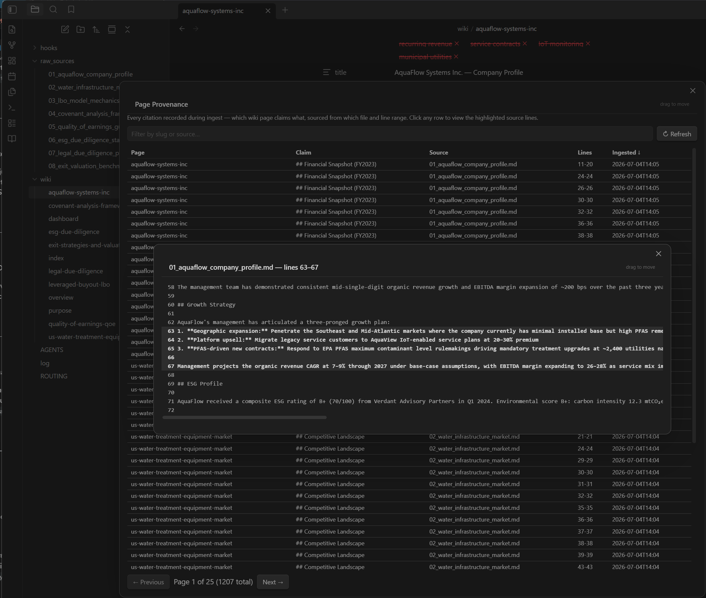
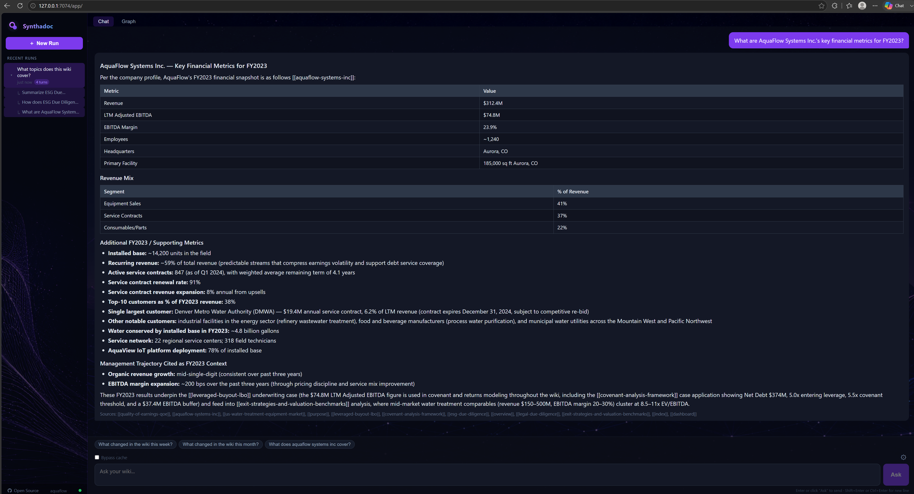
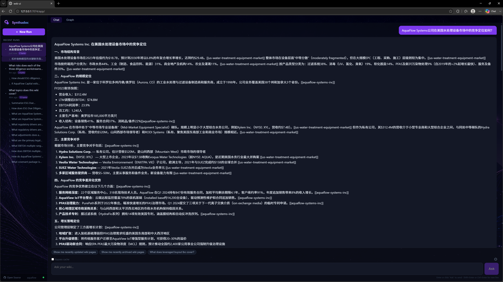

# AquaFlow Capital: Workshop Walkthrough

**Domain:** Private equity M&A due diligence — LBO modeling, quality of earnings, covenant analysis, ESG, and legal DD

The scenario: AquaFlow Capital is evaluating an LBO of AquaFlow Systems Inc., a mid-market water treatment equipment company. Eight deal documents are sitting in a folder — company profile, sector analysis, LBO mechanics, covenant framework, QoE guide, ESG standards, legal DD process, and exit benchmarks. By the end of this walkthrough, all eight are ingested into a working knowledge wiki, lint-validated, and queryable in natural language, including Chinese.

Steps 1–3 (install, configure, register) require a terminal. From Step 6 onward, ingest, scaffold, and lint can all run from either the terminal or the Obsidian plugin command palette — both paths are shown where relevant. Queries run through the Synthadoc web UI in Step 10.

---

## What this example covers


| Source file                         | Wiki page created                                           |
| ----------------------------------- | ----------------------------------------------------------- |
| `01_aquaflow_company_profile.md`    | `aquaflow-systems-inc` — company profile with financials   |
| `02_water_infrastructure_market.md` | `us-water-treatment-equipment-market` — sector analysis    |
| `03_lbo_model_mechanics.md`         | `leveraged-buyout-lbo` — LBO methodology                   |
| `04_covenant_analysis_framework.md` | `covenant-analysis-framework` — financial covenants        |
| `05_quality_of_earnings_guide.md`   | `quality-of-earnings-qoe` — QoE methodology                |
| `06_esg_due_diligence_standards.md` | `esg-due-diligence` — ESG framework                        |
| `07_legal_due_diligence_process.md` | `legal-due-diligence` — legal DD process                   |
| `08_exit_valuation_benchmarks.md`   | `exit-strategies-and-valuation-benchmarks` — exit strategy |

The ingest agent decides autonomously whether each source should create a new page or update an existing one. Company profiles and entity-specific data (financials, org structure, management team) always create dedicated pages — they are never merged into thematic or market-level pages.

---

## Prerequisites

- Synthadoc installed (`pip install synthadoc` or editable dev install — see the [main README](../../../README.md#installation))
- A supported LLM API key with sufficient quota — Anthropic, OpenAI, or MiniMax paid tiers are recommended. Free-tier models such as Gemini Free or Groq Free have daily rate limits that are too low to complete the batch ingest of eight documents in a single session and will cause jobs to fail mid-run.
- Python 3.11+

---

## Step 1 — Install the wiki domain

```bash
synthadoc install aquaflow \
  --target ~/wikis \
  --domain "Private equity M&A due diligence — LBO modeling, quality of earnings, covenant analysis, ESG, and legal DD"
```

**What this does:**

- Creates `~/wikis/aquaflow/` with the standard directory layout:
  - `wiki/` — generated wiki pages (Markdown + YAML frontmatter)
  - `raw_sources/` — your source documents
  - `.synthadoc/` — config, audit database, query cache
- Writes a default `config.toml` you will edit in Step 2
- Writes `AGENTS.md` with ingest and query guidelines for this domain
- Registers the wiki so `synthadoc use aquaflow` makes it the default

The `--domain` description is the single sentence the LLM uses to understand what belongs in this wiki. Write it as specifically as you can — it directly shapes ingest decisions and scaffold category names.

---

## Step 2 — Configure your LLM provider

Open `~/wikis/aquaflow/.synthadoc/config.toml` in any text editor. The `[agents]` section controls which LLM is used for ingest, scaffold, lint, and query. It ships with one active line and all others commented out:

```toml
[agents]
default = { provider = "gemini", model = "gemini-2.5-flash-lite" }
# Alternatives (uncomment and restart to switch):
# default = { provider = "gemini",    model = "gemini-2.5-flash" }         # free tier: 10 RPM / 250 RPD
# default = { provider = "gemini",    model = "gemini-1.5-flash" }         # free tier: 15 RPM / 1,500 RPD
# default = { provider = "minimax",   model = "MiniMax-M2.5" }             # paid, cheapest text-only ($0.15/M in)
# default = { provider = "minimax",   model = "MiniMax-M3",  thinking = "disabled" }  # paid, M3 with thinking off (faster, cheaper)
# default = { provider = "groq",      model = "llama-3.3-70b-versatile" }  # free tier, 100K tokens/day
# default = { provider = "anthropic", model = "claude-sonnet-4-6" }        # paid, high quality
# default = { provider = "anthropic", model = "claude-opus-4-8" }          # paid, highest quality (most capable)
# default = { provider = "deepseek",  model = "deepseek-chat" }            # paid, very cheap ($0.14/M in); text-only, no vision
# default = { provider = "ollama",    model = "llama3.2" }                 # fully local, no API key; requires GPU — CPU-only is too slow for interactive use
# default = { provider = "qwen",      model = "qwen-plus" }                # DashScope cloud API — set QWEN_API_KEY (https://bailian.console.aliyun.com/)
# default = { provider = "claude-code" }                                   # no API key — uses your Claude Code subscription
# default = { provider = "opencode" }                                      # no API key — uses your Opencode subscription
```

**To switch provider:**

1. Add a `#` at the start of the currently active `default = ...` line
2. Remove the `#` from the provider you want to use
3. Set the corresponding API key as an environment variable (see table below)
4. Start (or restart) the server — see Step 5

Only one `default = ...` line may be uncommented at a time.

**API key environment variables:**


| Provider               | Environment variable                          |
| ---------------------- | --------------------------------------------- |
| Anthropic              | `ANTHROPIC_API_KEY`                           |
| MiniMax                | `MINIMAX_API_KEY`                             |
| Gemini                 | `GEMINI_API_KEY`                              |
| DeepSeek               | `DEEPSEEK_API_KEY`                            |
| Groq                   | `GROQ_API_KEY`                                |
| Qwen                   | `QWEN_API_KEY`                                |
| Ollama                 | *(no key required — runs locally)*           |
| claude-code / opencode | *(no key required — uses your subscription)* |

Example — switching from the default Gemini to Anthropic Claude:

```toml
# default = { provider = "gemini", model = "gemini-2.5-flash-lite" }   ← commented out
default = { provider = "anthropic", model = "claude-sonnet-4-6" }      ← active
```

```bash
export ANTHROPIC_API_KEY="sk-ant-..."
```

> **For this workshop:** Use a paid provider (Anthropic, MiniMax, or DeepSeek). Free-tier Gemini and Groq quotas are exhausted by batch ingest of eight documents in a single session. See [Appendix C — Switching LLM providers](../../user-quick-start-guide.md#appendix-c--switching-llm-providers) for full configuration details.

---

## Step 3 — Set as the default wiki

```bash
synthadoc use aquaflow
```

This records `aquaflow` as the active wiki so subsequent commands default to it. Override at any time with `-w <wiki>` if you maintain multiple wikis.

Verify the wiki is registered and empty:

```bash
synthadoc status
```

Expected output:

```
[wiki: aquaflow]
Wiki:   ~/wikis/aquaflow
Pages:  0
```

---

## Step 4 — Copy the example raw sources

Run this from the synthadoc repository root:

```bash
cp docs/example/aquaflow/raw_sources/*.md ~/wikis/aquaflow/raw_sources/
```

Synthadoc does not watch for new files — ingestion is always an explicit command — so this copy does not trigger anything yet.

> **Bringing your own documents:** Replace or supplement these files with your own PDFs, DOCX files, Markdown notes, or URLs. The ingest pipeline accepts any format the extraction layer supports.

---

## Step 5 — Start the server

```bash
synthadoc serve
```

**What this does:** Starts the Synthadoc API server (default port 7070) and the background job worker. Ingest, scaffold, lint, and query all run as async jobs managed by this server. The web UI is served from the same process.

To run in the background and keep your terminal free:

```bash
synthadoc serve --background
```

Verify the server is up:

```bash
curl http://127.0.0.1:7070/health
# → {"status":"ok"}
```

Leave this running for the remaining steps.

---

## Step 6 — Ingest the source documents

Ingest all eight sources. You can do this from the terminal or the Obsidian plugin.

**Terminal — batch ingest the entire folder:**

```bash
synthadoc ingest raw_sources/
```

**Obsidian plugin — batch ingest from the command palette:**

1. Open the wiki vault in Obsidian — select the wiki root folder (`~/wikis/aquaflow/`)
2. Press `Cmd/Ctrl+P` → search **Synthadoc: Ingest...** → Enter
3. Select the **All raw_sources** tab → click **Run**

The plugin sends the same ingest job to the running server — behaviour is identical to the CLI.

**What happens for each source:**

1. **Extraction** — Text and metadata are pulled from the file. The page title is derived from the H1 heading in the LLM-generated body (not the filename), so `01_aquaflow_company_profile.md` produces a page titled `AquaFlow Systems Inc. — Company Profile`.
2. **Analysis** — An LLM pass identifies entities, tags, and an OKF type (e.g., `organization` for company profiles).
3. **Decision** — The agent decides whether to `create` a new page, `update` an existing one, or `flag` a contradiction. Entity profiles (companies with financials, people, products) always `create` — financial data is never silently merged into a thematic page.
4. **Key Data extraction** — Numerical facts, rates, and formulas are extracted deterministically and preserved in a Key Data section so figures like revenue and EBITDA margins survive exactly as written in the source.
5. **Citation annotation** — Each claim is annotated with a `^[filename:L-L]` marker linking back to the line range in the source file.
6. **Write** — The page is written to `wiki/` with YAML frontmatter (`status: draft`, `confidence: medium`, `sources: [...]`).

After all eight sources are ingested, confirm the pages were created:

```bash
synthadoc status
```

Expected:

```
[wiki: aquaflow]
Pages:  8
Page lifecycle:
  draft   8
```

> **Force re-ingest:** If you update a source file or want to regenerate a page, the dedup guard is bypassed and the page is regenerated. Run it from the terminal with `synthadoc ingest <file> --force`, or from the Obsidian plugin: `Cmd/Ctrl+P` → **Synthadoc: Ingest...** → **All raw_sources** tab → check **Force re-ingest** → click **Run**. The `sources` list on the page automatically deduplicates by `(file, hash)` — re-ingesting the same unchanged file never adds a duplicate source entry.

---

## Step 7 — Scaffold the index

**Terminal:**

```bash
synthadoc scaffold
```

**Obsidian plugin:** `Cmd/Ctrl+P` → **Synthadoc: Run scaffold**

**What this does:**

- Calls the scaffold LLM to organize your 8 pages into 5–8 domain-appropriate categories
- Updates `wiki/index.md` — a navigable category index with `[[wikilinks]]` to every content page. System pages (`overview`, `purpose`, `dashboard`) are automatically excluded from the index — the LLM never creates self-links or meta-page entries.
- Updates `wiki/purpose.md` — a structured statement of what belongs in this wiki, who uses it, and what questions it answers
- Updates `AGENTS.md` — domain-specific ingest and query guidelines the LLM reads on every operation
- Stamps a `categories:` field on each content page's YAML frontmatter so pages are queryable by category
- Regenerates `ROUTING.md` if it already exists, to keep BM25 routing in sync with the new index structure (first-time creation requires `synthadoc routing init` — see Step 9)

After scaffold, open `wiki/index.md` in Obsidian or your editor to review the generated category layout. You can manually edit the user zone above the `<!-- synthadoc:scaffold -->` marker — that content is preserved across scaffold re-runs.

---

## Step 8 — Run lint and promote pages to active

**Terminal:**

```bash
synthadoc lint run
```

**Obsidian plugin:** `Cmd/Ctrl+P` → **Synthadoc: Run lint**

**What this does:**

Lint runs three passes over every `draft` page:

1. **Lifecycle promotion** — Pages with sufficient citation coverage and no contradictions are promoted from `draft` → `active`.
2. **Orphan detection** — Pages with no inbound wikilinks are flagged as orphans so you can wire them into the graph.
3. **Adversarial review** — A second LLM agent independently reviews each claim and raises warnings where content is imprecise, overstated, or potentially incorrect.

After lint, check the report:

**Terminal:**

```bash
synthadoc lint report
```

**Obsidian plugin:** `Cmd/Ctrl+P` → **Synthadoc: Show lint report**

Expected outcome for this example:

```
Page lifecycle:
  active   8
  draft    0

0 contradiction(s), 0 orphan(s), 5 adversarial warning(s), 0 citation issue(s).
```

The 5 adversarial warnings in this example are content-level precision issues in the source material (e.g., EBITDA multiple ranges presented as universal market norms). They do not block lifecycle promotion — they are surfaced for your review. If you correct the source file, re-ingest with `--force` and re-run lint.

> **Lint and scaffold on a schedule:** Both `synthadoc lint run` and `synthadoc scaffold` are good candidates for recurring scheduled runs — lint keeps lifecycle state current, scaffold keeps the index and category structure in sync as new pages are added. See [Scheduling recurring operations](../../user-quick-start-guide.md#step-16--scheduling-recurring-operations) in the quick-start guide.

---

## Step 9 — Initialise and validate ROUTING.md

`ROUTING.md` groups your pages into named topic branches so queries only search the most relevant slice — instead of scoring all pages on every query. Scaffold (Step 7) keeps it in sync once it exists, but the first-time creation is a separate step.

**Why this matters for M&A due diligence:** The AquaFlow wiki spans distinctly separate workstreams — LBO modeling, covenant analysis, quality of earnings, ESG, legal DD, and exit valuation. Without routing, a query about EBITDA multiples searches ESG and legal pages too, adding noise to the ranked results. With routing, the query engine resolves the branch first and searches only the relevant pages, improving precision and reducing latency.

**Create ROUTING.md from the current index:**

```bash
synthadoc routing init
```

Or in Obsidian: `Cmd/Ctrl+P` → **Synthadoc: Routing: manage ROUTING.md** → click **Init**.

**Validate — check for dangling slugs or cross-branch duplicates:**

```bash
synthadoc routing validate
```

**Clean — remove any dangling entries after page deletions:**

```bash
synthadoc routing clean
```

> **Keeping routing in sync:** After adding new pages via ingest, re-run `synthadoc scaffold` (Step 7) — it regenerates `ROUTING.md` automatically because the file now exists. `routing init` is a one-time bootstrap command and will refuse to run if `ROUTING.md` is already present.

---

## Step 10 — Open the web UI and run queries

With the server running from Step 5, open the web UI:

```bash
synthadoc web
```

Your browser opens automatically at `http://127.0.0.1:7070`. The web UI has two entry points:

- **Chat** — type a natural-language question; the answer streams back token by token with inline citations
- **Knowledge Graph** — a D3.js visualisation of all pages and their wikilink relationships; click any node to use that page as the scoped entry point for your query

### Citations

Every answer includes inline citations in the format `^[filename:L-L]`, where `filename` is the source document and `L-L` is the line range in that file. In the web UI these render as superscripts you can hover or click to see the original passage. In Obsidian they render as footnotes. Citations give you a direct audit trail from every claim back to the source line — essential for M&A due diligence where verifiability matters.

**Review citations in Obsidian — Page Provenance:**

Open the command palette → **Synthadoc: View Page Provenance**. A sortable, paginated table shows every citation across the wiki. Filter by slug to see all claims for one page, or sort by source file to audit a single document. Click any row to open the Source Viewer at the exact source line range.

**Audit citations from the CLI:**

```bash
# All citations for one page
synthadoc audit citations --page leveraged-buyout-lbo

# Citations that failed validation across the whole wiki
synthadoc audit citations --broken
```



---

## Sample queries and expected results

Type each query into the Chat tab. The expected result tells you what to look for — specific facts, which pages get cited, and for the high-complexity queries, whether the answer correctly synthesises across multiple workstreams. If a query returns a noticeably weaker answer, the most common causes are a provider with insufficient context window, or a page that did not fully promote to `active` during lint.

### English — Medium complexity

**Q1. What are AquaFlow Systems Inc.'s key financial metrics for FY2023?**

Expected: Revenue $312.4M, LTM Adjusted EBITDA $74.8M, EBITDA margin 23.9%, ~1,240 employees, headquartered in Aurora, CO. Revenue mix: Equipment Sales 41%, Service Contracts 37%, Consumables/Parts 22%. Source cited: `aquaflow-systems-inc`.



---

**Q2. What regulatory drivers are creating near-term demand in the US water treatment equipment market?**

Expected: EPA's April 2024 PFAS National Primary Drinking Water Rule establishing maximum contaminant levels; lead service line replacement mandates; aging infrastructure replacement cycle. Evoqua's $7.5B acquisition by Xylem (2023) cited as sector consolidation signal. Source cited: `us-water-treatment-equipment-market`.

---

**Q3. What adjustments does a quality of earnings analysis make to reported EBITDA?**

Expected: Removes one-time items, normalises owner compensation, adjusts for revenue recognition timing, strips non-recurring costs. QoE is an advisory consulting service — not an audit-level attestation with PCAOB/AS standards. Framed as complementary to, not superior to, a GAAP audit. Source cited: `quality-of-earnings-qoe`.

---

**Q4. What are the primary legal workstreams in a water infrastructure LBO due diligence?**

Expected: Contract review (permits, concessions, service agreements), environmental compliance and PFAS liability exposure, litigation review, IP and regulatory licence transferability. Source cited: `legal-due-diligence`.

---

**Q5. What EBITDA multiple range is cited for water infrastructure exit valuations?**

Expected: 7–12x EBITDA depending on growth, margin quality, and revenue predictability. PFAS-exposed water treatment companies noted as commanding premiums to traditional industrial multiples given regulatory tailwinds. Sources cited: `leveraged-buyout-lbo`, `exit-strategies-and-valuation-benchmarks`.

---

### English — High complexity

**Q6. How do AquaFlow Systems' FY2023 financials compare to the valuation benchmarks, and what does that imply for entry price?**

Expected: Cross-references AquaFlow's $74.8M EBITDA against the 7–12x range, implying an enterprise value of approximately $524M–$898M. Margin quality (23.9%) and recurring service contract revenue (37% of mix, 3–7 year terms) support positioning toward the higher end. Sources cited: `aquaflow-systems-inc`, `leveraged-buyout-lbo`, `exit-strategies-and-valuation-benchmarks`.

---

**Q7. What covenant package is consistent with AquaFlow Systems' financial profile for a typical water infrastructure LBO?**

Expected: Synthesises AquaFlow's margin and revenue mix with the covenant framework — leverage ratio, interest coverage, capex limits. Recurring revenue base (3–7 year service contracts) supports tighter covenant headroom relative to a pure equipment-sales business. Sources cited: `aquaflow-systems-inc`, `covenant-analysis-framework`, `leveraged-buyout-lbo`.

---

**Q8. What risks does each of the three diligence workstreams — QoE, legal, and ESG — uniquely surface for a water treatment company?**

Expected: QoE — normalisation of service contract revenue recognition, one-time equipment sale spikes, non-recurring cost add-backs; Legal — PFAS liability exposure, permit transferability, Clean Water Act compliance; ESG — water stewardship obligations, discharge permit conditions, climate resilience of physical assets, community impact. Each sourced from its dedicated page. Sources cited: `quality-of-earnings-qoe`, `legal-due-diligence`, `esg-due-diligence`.

---

**Q9. How should ESG diligence findings on a water treatment target translate into deal structure — specifically covenants and exit multiple sensitivity?**

Expected: ESG risks (discharge permits, effluent quality, water rights) translate into covenant carve-outs or capex reserve requirements. ESG performance is linked to exit multiple through buyer universe — infrastructure funds with ESG mandates pay premiums for well-documented compliance postures. Sources cited: `esg-due-diligence`, `covenant-analysis-framework`, `exit-strategies-and-valuation-benchmarks`.

---

**Q10. If AquaFlow Capital exits AquaFlow Systems in 3–5 years, what exit pathways and valuation approach are most defensible?**

Expected: Strategic sale to industrial water majors (Xylem, Veolia comparable set), secondary buyout to infrastructure fund, or refinancing/dividend recap. Valuation anchored to EBITDA multiple with upward adjustment for PFAS remediation positioning, margin trajectory, and recurring revenue quality. Sources cited: `exit-strategies-and-valuation-benchmarks`, `aquaflow-systems-inc`, `us-water-treatment-equipment-market`.

---

### Chinese — Cross-lingual retrieval

All wiki pages are in English. These queries are in Chinese. Synthadoc's retrieval pipeline handles CJK input natively — character-level BM25 tokenisation matches Chinese query terms against English content, with cosine similarity reranking for precision. Answers come back in the language of the query; no translation step or separate index is needed.

---

**Q11：AquaFlow Systems公司在美国水处理设备市场中的竞争定位如何？**

预期答案：涵盖AquaFlow的核心产品线（膜过滤、UV消毒、反渗透、PFAS修复系统），其在38个州的覆盖范围，以及与Evoqua（已被Xylem收购，交易额75亿美元）等大型竞争对手的市场差异化定位。引用来源：`aquaflow-systems-inc`，`us-water-treatment-equipment-market`。



---

**Q12：杠杆收购模型的关键财务指标和运作机制是什么？**

预期答案：说明EBITDA倍数（7–12倍）、债务/EBITDA杠杆比率、利息覆盖率、股权IRR等核心指标，以及典型LBO的资本结构（高级担保债务、夹层融资、股权）。引用来源：`leveraged-buyout-lbo`。

---

**Q13：水务基础设施投资的ESG尽调重点关注哪些方面？**

预期答案：涵盖水资源管理、出水水质达标、排放许可合规、气候韧性、社区影响等ESG维度，以及ESG风险如何影响投资委员会批准决策和退出倍数。引用来源：`esg-due-diligence`。

---

**Q14（高复杂）：综合质量收益分析、法律尽调和ESG尽调，AquaFlow Systems作为LBO收购标的面临哪些主要风险，应如何在交易结构中加以应对？**

预期答案：跨三个尽调维度整合——QoE方面关注服务合同收入可持续性和EBITDA正常化调整；法律方面关注PFAS责任敞口和许可证可转让性；ESG方面关注排放合规和水权问题。交易结构应对：价格调整条款、托管安排、契约储备金要求。引用来源：`quality-of-earnings-qoe`，`legal-due-diligence`，`esg-due-diligence`，`aquaflow-systems-inc`。

---

**Q15（高复杂）：基于当前水务基础设施市场环境，AquaFlow Capital应采取何种退出策略，预期回报率和估值倍数范围是多少？**

预期答案：综合分析战略出售（工业水务龙头买方）、二次杠杆收购（基础设施基金）等退出路径；估值倍数参照7–12倍EBITDA区间，PFAS监管利好支持溢价；IRR目标结合进入价格、EBITDA增长和持有期分析。引用来源：`exit-strategies-and-valuation-benchmarks`，`leveraged-buyout-lbo`，`us-water-treatment-equipment-market`，`aquaflow-systems-inc`。

---

## Maintaining your wiki

Once the wiki is live, a small set of CLI commands covers all routine maintenance:


| Operation                      | Command                                                     | When to run                                       |
| ------------------------------ | ----------------------------------------------------------- | ------------------------------------------------- |
| Add a new source               | `synthadoc ingest <file>`                                   | Any time new material arrives                     |
| Regenerate a page              | `synthadoc ingest <file> --force`                           | After updating a source file                      |
| Re-index categories            | `synthadoc scaffold`                                        | After adding several new pages                    |
| Promote drafts / check quality | `synthadoc lint run`                                        | Weekly, or after bulk ingest                      |
| Review lint findings           | `synthadoc lint report`                                     | After every lint run                              |
| Check wiki health              | `synthadoc status`                                          | Any time                                          |
| Resolve a contradiction        | Edit the flagged page in Obsidian, then `synthadoc lint run` | When a new source conflicts with existing content |
| Backup                         | `synthadoc backup`                                          | Before major changes                              |

### Re-ingest and source deduplication

Running `synthadoc ingest <file> --force` is safe to repeat. The `sources` list on each page deduplicates by `(file, content-hash)` — re-ingesting an unchanged file never adds a duplicate entry. If the file content has changed (new hash), the new source record is appended alongside the original, preserving the full provenance trail.

### Lifecycle states

Pages move through five states: `draft` → `active` → `stale` → `contradicted` / `archived`. Lint promotes `draft` to `active` automatically when citation coverage and content quality thresholds are met. If a source you ingest contradicts an existing active page, the existing page is flagged `contradicted` and you are prompted to resolve it manually.

---

## Further reading

- [User Quick-Start Guide](../../user-quick-start-guide.md) — full feature walkthrough including Obsidian plugin, scheduling, ROUTING.md, context packs, export formats, MCP, and backup/restore
- [Design document](../../design.md) — architecture, data model, and system design
